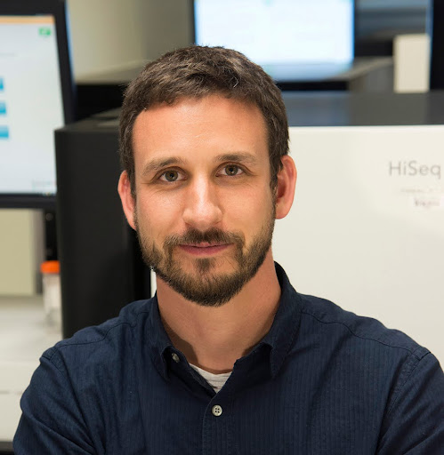
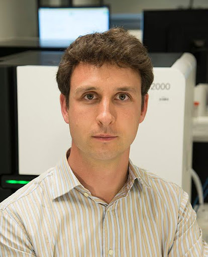
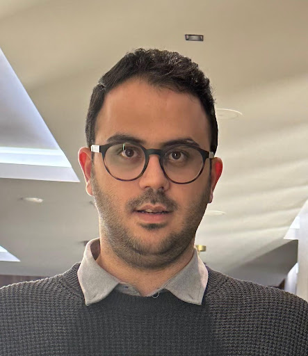

# Meet Your Faculty

#### Malachi Griffith

>Professor of Medicine  
Washington University School of Medicine  
St Louis, MO, USA  
> mgriffit@wustl.edu   
> www.griffithlab.org   

Malachi’s research is focused on the development of genomics and bioinformatics methods as they apply to the study of cancer biology and medicine. A particular focus of his work is in the translation of data from multi-omics sequencing approaches into clinically actionable observations and personalized cancer therapies. He has led the development of key online informatics resources for cancer precision medicine such DGIdb, CIViC, pVACtools and more

#### Obi Griffith

>Professor of Medicine  
Washington University School of Medicine  
St Louis, MO, USA  
> obigriffith@wustl.edu  
> www.griffithlab.org   

Obi’s research is focused on the development of personalized medicine strategies for cancer using genomic technologies. He develops and uses bioinformatics, machine learning and clinical statistics for the analysis of high throughput sequence data and identification of biomarkers for diagnostic, prognostic and drug response prediction. He has led the development of key online informatics resources such as DGIdb, CIViC, GenVisR and more.

#### Isabel Risch

<!--

>JOB TITLE  
INSTITUTION  
LOCATION
>
> --- CONTACT INFO, IF PROVIDED

BIO GOES HERE-->

#### Varinder Madhav Verma

>PhD Candidate, Molecular Biology and Genetics  
University of Alberta  
Edmonton, Alberta, Canada  
varinde2@ualberta.ca  

I am a PhD candidate at the University of Alberta. My research focuses on analyzing transcriptomic data and integrating artificial intelligence to enhance biological & clinical insights. I hold a Master's degree in Systems Biology and Bioinformatics, and am currently involved in developing a multi-omics platform to support the comprehensive analysis of complex biological datasets.

#### Mobin Khoramjoo

>PhD Candidate  
University of Alberta  
Edmonton, Alberta  
https://www.linkedin.com/in/mobin-khoramjoo/

I am a PhD candidate at the University of Alberta with a strong interest in combining computational tools with biological research. My work involves using bioinformatics, multi-omics integration, and machine learning to study complex biological systems and extract meaningful insights from large datasets.
I am especially drawn to the challenge of working with high-dimensional data—developing analysis pipelines, applying statistical models, and exploring ways to make biological findings more interpretable and impactful. 

#### Nicolas Ho

<!--

>JOB TITLE  
INSTITUTION  
LOCATION
>
> --- CONTACT INFO, IF PROVIDED

BIO GOES HERE-->

#### Melisa Acun

<!--

>JOB TITLE  
INSTITUTION  
LOCATION
>
> --- CONTACT INFO, IF PROVIDED

BIO GOES HERE-->
