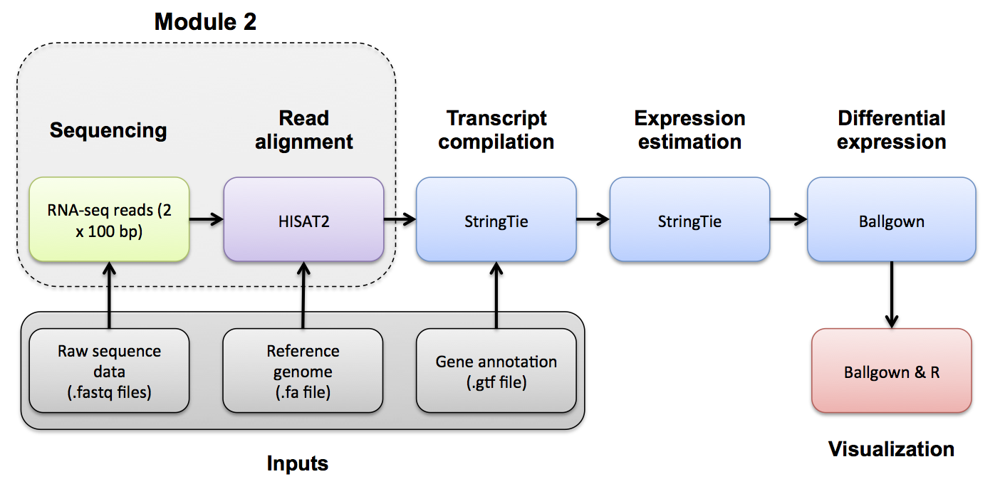

# Module 2

## Lecture

<iframe src="https://drive.google.com/file/d/1mq6bvyuTsZCa-U2qr-Otgm3-4DJA6uYS/preview" width="640" height="480" allow="autoplay"></iframe>

## Labs
[Module 2 Labs](https://rnabio.org/module-02-alignment/0002/01/01/Intro_to_Alignment/)

### Module 2 - Key concepts
* Splice-aware alignment, SAM/BAM format, SAM flags, CIGAR strings, SAM sorting, etc.

### Module 2 - Learning objectives
* RNA-seq alignment challenges and common questions
* Alignment strategies
* HISAT2
* Introduction to the BAM and BED formats
* Basic manipulation of BAMs
* Visualization of RNA-seq alignments in IGV
* Alignment QC Assessment
* BAM read counting and determination of variant allele expression status

### Lectures
* [Introduction to alignment mini lecture](https://github.com/griffithlab/rnabio.org/blob/master/assets/lectures/cbw/2025/mini/RNASeq_MiniLecture_02_01_Alignment.pdf)
* [Alignment/Assembly/kmer mini lecture](https://github.com/griffithlab/rnabio.org/blob/master/assets/lectures/cbw/2025/mini/RNASeq_MiniLecture_02_02_Alignment_vs_Assembly_vs_Kmer.pdf)
* [SAM/BAM/BED formats mini lecture](https://github.com/griffithlab/rnabio.org/blob/master/assets/lectures/cbw/2025/mini/RNASeq_MiniLecture_02_03_SAM_BAM_BED.pdf)
* [Introduction to IGV lecture](https://github.com/griffithlab/rnabio.org/blob/master/assets/lectures/cbw/2025/full/RNASeq_Module2_IGV_Tutorial_Brief.pdf)
* [Alignment QC mini lecture](https://github.com/griffithlab/rnabio.org/blob/master/assets/lectures/cbw/2025/mini/RNASeq_MiniLecture_02_04_alignmentQC.pdf)

***

\

***

**[OPTIONAL]**

Use Fastp to trim sequence adapter from the read FASTQ files and also perform basic data quality cleanup. The output of this step will be trimmed and filtered FASTQ files for each data set.

Refer to the Fastp project and manual for a more detailed explanation:

* [https://github.com/OpenGene/fastp](https://github.com/OpenGene/fastp)

Fastp basic usage:
```bash
    fastp -i in.R1.fq.gz -I in.R2.fq.gz -o out.R1.fq.gz -O out.R2.fq.gz
```
The `-i` and `-I` parameters specify input R1 and R2 data files (raw data)
The `-o` and `-O` parameters specify output R1 and R2 data files (trimmed and quality filtered) 
Extra options specified below:

* '-l 25' the minimum read length allowed after trimming is 25bp
* '--adapter_fasta' the path to the adapter FASTA file containing adapter sequences to trim
* '--trim_front1 13' trim a fixed number (13 in this case) of bases off the left end of read1
* '--trim_front2 13' trim a fixed number (13 in this case) of bases off the left end of read2
* '--json' the path to store a log file in JSON file format 
* '--html' the path to store a web report file
* '2>' use to store the information that would be printed to the screen into a file instead

### Read trimming with Fastp
First, set up some directories for output

```bash
echo $RNA_DATA_TRIM_DIR
mkdir -p $RNA_DATA_TRIM_DIR

```

Download necessary Illumina adapter sequence files.

```bash
echo $RNA_REFS_DIR
mkdir -p $RNA_REFS_DIR
cd $RNA_REFS_DIR
wget http://genomedata.org/rnaseq-tutorial/illumina_multiplex.fa

```

Use fastp to remove illumina adapter sequences (if any), trim the first 13 bases of each read, and perform default read quality filtering to remove reads that are too short, have too many low quality bases or have too many N's.

```bash
cd $RNA_HOME

export S1=UHR_Rep1_ERCC-Mix1_Build37-ErccTranscripts-chr22
fastp -i $RNA_DATA_DIR/$S1.read1.fastq.gz -I $RNA_DATA_DIR/$S1.read2.fastq.gz -o $RNA_DATA_TRIM_DIR/$S1.read1.fastq.gz -O $RNA_DATA_TRIM_DIR/$S1.read2.fastq.gz -l 25 --adapter_fasta $RNA_REFS_DIR/illumina_multiplex.fa --trim_front1 13 --trim_front2 13 --json $RNA_DATA_TRIM_DIR/$S1.fastp.json --html $RNA_DATA_TRIM_DIR/$S1.fastp.html 2>$RNA_DATA_TRIM_DIR/$S1.fastp.log

export S2=UHR_Rep2_ERCC-Mix1_Build37-ErccTranscripts-chr22
fastp -i $RNA_DATA_DIR/$S2.read1.fastq.gz -I $RNA_DATA_DIR/$S2.read2.fastq.gz -o $RNA_DATA_TRIM_DIR/$S2.read1.fastq.gz -O $RNA_DATA_TRIM_DIR/$S2.read2.fastq.gz -l 25 --adapter_fasta $RNA_REFS_DIR/illumina_multiplex.fa --trim_front1 13 --trim_front2 13 --json $RNA_DATA_TRIM_DIR/$S2.fastp.json --html $RNA_DATA_TRIM_DIR/$S2.fastp.html 2>$RNA_DATA_TRIM_DIR/$S2.fastp.log

export S3=UHR_Rep3_ERCC-Mix1_Build37-ErccTranscripts-chr22
fastp -i $RNA_DATA_DIR/$S3.read1.fastq.gz -I $RNA_DATA_DIR/$S3.read2.fastq.gz -o $RNA_DATA_TRIM_DIR/$S3.read1.fastq.gz -O $RNA_DATA_TRIM_DIR/$S3.read2.fastq.gz -l 25 --adapter_fasta $RNA_REFS_DIR/illumina_multiplex.fa --trim_front1 13 --trim_front2 13 --json $RNA_DATA_TRIM_DIR/$S3.fastp.json --html $RNA_DATA_TRIM_DIR/$S3.fastp.html 2>$RNA_DATA_TRIM_DIR/$S3.fastp.log

export S4=HBR_Rep1_ERCC-Mix2_Build37-ErccTranscripts-chr22
fastp -i $RNA_DATA_DIR/$S4.read1.fastq.gz -I $RNA_DATA_DIR/$S4.read2.fastq.gz -o $RNA_DATA_TRIM_DIR/$S4.read1.fastq.gz -O $RNA_DATA_TRIM_DIR/$S4.read2.fastq.gz -l 25 --adapter_fasta $RNA_REFS_DIR/illumina_multiplex.fa --trim_front1 13 --trim_front2 13 --json $RNA_DATA_TRIM_DIR/$S4.fastp.json --html $RNA_DATA_TRIM_DIR/$S4.fastp.html 2>$RNA_DATA_TRIM_DIR/$S4.fastp.log

export S5=HBR_Rep2_ERCC-Mix2_Build37-ErccTranscripts-chr22
fastp -i $RNA_DATA_DIR/$S5.read1.fastq.gz -I $RNA_DATA_DIR/$S5.read2.fastq.gz -o $RNA_DATA_TRIM_DIR/$S5.read1.fastq.gz -O $RNA_DATA_TRIM_DIR/$S5.read2.fastq.gz -l 25 --adapter_fasta $RNA_REFS_DIR/illumina_multiplex.fa --trim_front1 13 --trim_front2 13 --json $RNA_DATA_TRIM_DIR/$S5.fastp.json --html $RNA_DATA_TRIM_DIR/$S5.fastp.html 2>$RNA_DATA_TRIM_DIR/$S5.fastp.log

export S6=HBR_Rep3_ERCC-Mix2_Build37-ErccTranscripts-chr22
fastp -i $RNA_DATA_DIR/$S6.read1.fastq.gz -I $RNA_DATA_DIR/$S6.read2.fastq.gz -o $RNA_DATA_TRIM_DIR/$S6.read1.fastq.gz -O $RNA_DATA_TRIM_DIR/$S6.read2.fastq.gz -l 25 --adapter_fasta $RNA_REFS_DIR/illumina_multiplex.fa --trim_front1 13 --trim_front2 13 --json $RNA_DATA_TRIM_DIR/$S6.fastp.json --html $RNA_DATA_TRIM_DIR/$S6.fastp.html 2>$RNA_DATA_TRIM_DIR/$S6.fastp.log

```

### Use FastQC and multiqc to compare the impact of trimming

Optional exercise: Compare the FastQC reports for fastq files before and after trimming. All fastqc reports can be generated on the commandline.

```bash
cd $RNA_DATA_TRIM_DIR
fastqc *.fastq.gz

multiqc ./

```

The resulting html reports can be viewed by navigating to:

* http://**YOUR_PUBLIC_IPv4_ADDRESS**/rnaseq/data/
* http://**YOUR_PUBLIC_IPv4_ADDRESS**/rnaseq/data/trimmed/

### Clean up

Move the fastqc and fastp results into sub-directories to keep things tidy

```bash
cd $RNA_DATA_TRIM_DIR
mkdir fastqc
mv *_fastqc* fastqc
mkdir fastp
mv *fastp.* fastp
```

***

### PRACTICAL EXERCISE 5
Assignment: Using the approach above, trim the reads for both normal and tumor samples that you downloaded for the previous practical exercise. NOTE: try dropping the hard left trim option used above ('--trim_front1 13' and '--trim_front2 13'). Once you have trimmed the reads, compare a pre- and post- trimming FastQ file using the FastQC and multiqc tools.

* Hint: These files should have been downloaded to $RNA_HOME/practice/data/.

**Questions**

Answer these questions by examining the FastQC reports:

* After trimming, what is the range of read lengths observed for hcc1395 normal replicate 1, read 1?
* Which sections of the FastQC report are most informative for observing the effect of trimming?
* In the 'Per base sequence content section', what pattern do you see? What could explain this pattern?

Solution: When you are ready you can check your approach against the [Solutions](/module-09-appendix/0009/05/01/Practical_Exercise_Solutions/#practical-exercise-5---trim).

### Alignment mini lecture
If you would like a refresher on alignment, we have created an [alignment mini lecture](https://github.com/griffithlab/rnabio.org/blob/master/assets/lectures/cbw/2025/mini/RNASeq_MiniLecture_02_01_Alignment.pdf).

We have also provided a mini lectures describing the differences between [alignment, assembly, and pseudoalignment](https://github.com/griffithlab/rnabio.org/blob/master/assets/lectures/cbw/2025/mini/RNASeq_MiniLecture_02_02_Alignment_vs_Assembly_vs_Kmer.pdf) and describing [sam, bam, and bed file formats](https://github.com/griffithlab/rnabio.org/blob/master/assets/lectures/cbw/2025/mini/RNASeq_MiniLecture_02_03_SAM_BAM_BED.pdf).

### HISAT2 alignment
Perform alignments with HISAT2 to the genome and transcriptome.

First, begin by making the appropriate output directory for our alignment results.

```bash
echo $RNA_ALIGN_DIR
mkdir -p $RNA_ALIGN_DIR
cd $RNA_ALIGN_DIR

```

HISAT2 uses a graph-based alignment and has succeeded HISAT and TOPHAT2. The output of this step will be a SAM/BAM file for each data set.

Refer to HISAT2 manual for a more detailed explanation:

* [http://daehwankimlab.github.io/hisat2/manual/](http://daehwankimlab.github.io/hisat2/manual/)

HISAT2 basic usage:

```bash
#hisat2 [options]* -x <ht2-idx> {-1 <m1> -2 <m2> | -U <r> | --sra-acc <SRA accession number>} [-S <sam>]
```

Extra options specified below:

* '-p 4' tells HISAT2 to use 4 CPUs for bowtie alignments.
* '--rna-strandness RF' specifies strandness of RNAseq library. We will specify RF since the TruSeq strand-specific library was used to make these libraries. See here for options.
* '--rg-id $ID' specifies a read group ID that is a unique identifier.
* '--rg SM:$SAMPLE_NAME' specifies a read group sample name. This together with rg-id will allow you to determine which reads came from which sample in the merged bam later on.
* '--rg LB:$LIBRARY_NAME' specifies a read group library name. This together with rg-id will allow you to determine which reads came from which library in the merged bam later on.
* '--rg PL:ILLUMINA' specifies a read group sequencing platform.
* '--rg PU:$PLATFORM_UNIT' specifies a read group sequencing platform unit. Typically this consists of FLOWCELL-BARCODE.LANE
* '--dta' Reports alignments tailored for transcript assemblers.
* '-x /path/to/hisat2/index' The HISAT2 index filename prefix (minus the trailing .X.ht2) built earlier including splice sites and exons.
* '-1 /path/to/read1.fastq.gz' The read 1 FASTQ file, optionally gzip(.gz) or bzip2(.bz2) compressed.
* '-2 /path/to/read2.fastq.gz' The read 2 FASTQ file, optionally gzip(.gz) or bzip2(.bz2) compressed.
* '-S /path/to/output.sam' The output SAM format text file of alignments.

```bash
hisat2 -p 4 --rg-id=UHR_Rep1 --rg SM:UHR --rg LB:UHR_Rep1_ERCC-Mix1 --rg PL:ILLUMINA --rg PU:CXX1234-ACTGAC.1 -x $RNA_REF_INDEX --dta --rna-strandness RF -1 $RNA_DATA_DIR/UHR_Rep1_ERCC-Mix1_Build37-ErccTranscripts-chr22.read1.fastq.gz -2 $RNA_DATA_DIR/UHR_Rep1_ERCC-Mix1_Build37-ErccTranscripts-chr22.read2.fastq.gz -S ./UHR_Rep1.sam
hisat2 -p 4 --rg-id=UHR_Rep2 --rg SM:UHR --rg LB:UHR_Rep2_ERCC-Mix1 --rg PL:ILLUMINA --rg PU:CXX1234-TGACAC.1 -x $RNA_REF_INDEX --dta --rna-strandness RF -1 $RNA_DATA_DIR/UHR_Rep2_ERCC-Mix1_Build37-ErccTranscripts-chr22.read1.fastq.gz -2 $RNA_DATA_DIR/UHR_Rep2_ERCC-Mix1_Build37-ErccTranscripts-chr22.read2.fastq.gz -S ./UHR_Rep2.sam
hisat2 -p 4 --rg-id=UHR_Rep3 --rg SM:UHR --rg LB:UHR_Rep3_ERCC-Mix1 --rg PL:ILLUMINA --rg PU:CXX1234-CTGACA.1 -x $RNA_REF_INDEX --dta --rna-strandness RF -1 $RNA_DATA_DIR/UHR_Rep3_ERCC-Mix1_Build37-ErccTranscripts-chr22.read1.fastq.gz -2 $RNA_DATA_DIR/UHR_Rep3_ERCC-Mix1_Build37-ErccTranscripts-chr22.read2.fastq.gz -S ./UHR_Rep3.sam

hisat2 -p 4 --rg-id=HBR_Rep1 --rg SM:HBR --rg LB:HBR_Rep1_ERCC-Mix2 --rg PL:ILLUMINA --rg PU:CXX1234-TGACAC.1 -x $RNA_REF_INDEX --dta --rna-strandness RF -1 $RNA_DATA_DIR/HBR_Rep1_ERCC-Mix2_Build37-ErccTranscripts-chr22.read1.fastq.gz -2 $RNA_DATA_DIR/HBR_Rep1_ERCC-Mix2_Build37-ErccTranscripts-chr22.read2.fastq.gz -S ./HBR_Rep1.sam
hisat2 -p 4 --rg-id=HBR_Rep2 --rg SM:HBR --rg LB:HBR_Rep2_ERCC-Mix2 --rg PL:ILLUMINA --rg PU:CXX1234-GACACT.1 -x $RNA_REF_INDEX --dta --rna-strandness RF -1 $RNA_DATA_DIR/HBR_Rep2_ERCC-Mix2_Build37-ErccTranscripts-chr22.read1.fastq.gz -2 $RNA_DATA_DIR/HBR_Rep2_ERCC-Mix2_Build37-ErccTranscripts-chr22.read2.fastq.gz -S ./HBR_Rep2.sam
hisat2 -p 4 --rg-id=HBR_Rep3 --rg SM:HBR --rg LB:HBR_Rep3_ERCC-Mix2 --rg PL:ILLUMINA --rg PU:CXX1234-ACACTG.1 -x $RNA_REF_INDEX --dta --rna-strandness RF -1 $RNA_DATA_DIR/HBR_Rep3_ERCC-Mix2_Build37-ErccTranscripts-chr22.read1.fastq.gz -2 $RNA_DATA_DIR/HBR_Rep3_ERCC-Mix2_Build37-ErccTranscripts-chr22.read2.fastq.gz -S ./HBR_Rep3.sam

```

Note: in the above alignments, we are treating each library as an independent data set. If you had multiple lanes of data for a single library, you could align them all together in one HISAT2 command. Similarly you might combine technical replicates into a single alignment run (perhaps after examining them and removing outliers...). To combine multiple lanes, you would provide all the read1 files as a comma separated list for the '-1' input argument, and then all read2 files as a comma separated list for the '-2' input argument, (where both lists have the same order) : You can also use samtools merge to combine bam files after alignment. This is the approach we will take.

**HISAT2 Alignment Summary**
HISAT2 generates a summary of the alignments printed to the terminal. Notice the number of total reads, reads aligned and various metrics regarding how the reads aligned to the reference.

**SAM to BAM Conversion**
Convert HISAT2 sam files to bam files and sort by aligned position
```bash
samtools sort -@ 4 -o UHR_Rep1.bam UHR_Rep1.sam
samtools sort -@ 4 -o UHR_Rep2.bam UHR_Rep2.sam
samtools sort -@ 4 -o UHR_Rep3.bam UHR_Rep3.sam
samtools sort -@ 4 -o HBR_Rep1.bam HBR_Rep1.sam
samtools sort -@ 4 -o HBR_Rep2.bam HBR_Rep2.sam
samtools sort -@ 4 -o HBR_Rep3.bam HBR_Rep3.sam

```
### Merge HISAT2 BAM files
Make a single BAM file combining all UHR data and another for all HBR data. Note: This could be done in several ways such as 'samtools merge', 'bamtools merge', or using picard-tools (see below). We chose the third method because it did the best job at merging the bam header information. NOTE: sambamba also retains header info.

```bash
cd $RNA_HOME/alignments/hisat2
java -Xmx2g -jar $PICARD MergeSamFiles -OUTPUT UHR.bam -INPUT UHR_Rep1.bam -INPUT UHR_Rep2.bam -INPUT UHR_Rep3.bam
java -Xmx2g -jar $PICARD MergeSamFiles -OUTPUT HBR.bam -INPUT HBR_Rep1.bam -INPUT HBR_Rep2.bam -INPUT HBR_Rep3.bam

```

Count the alignment (BAM) files to make sure all were created successfully (you should have 8 total)

```bash
ls -l *.bam | wc -l
ls -l *.bam

```
***

### PRACTICAL EXERCISE 6
Assignment: Perform some alignments on additional read data sets. Align the reads using the skills you learned above. Try using the HISAT2 aligner. Also practice converting SAM to BAM files, and merging BAM files.

Hint: Do this analysis on the additional data and in the separate working directory called ‘practice’ that you created in Practical Exercise 3.
Questions

What is the difference between a .sam and .bam file?
If you sorted the resulting BAM file as we did above, is the result sorted by read name? Or position?
Which columns of the BAM file can be viewed to determine the style of sorting?
What command can you use to view only the BAM header?

Solution: When you are ready you can check your approach against the [Solutions](/module-09-appendix/0009/05/01/Practical_Exercise_Solutions/#practical-exercise-6---alignment).

***

### Introduction
**Description of the lab**
Welcome to the lab for Genome Visualization! This lab will introduce you to the [Integrative Genomics Viewer](http://www.broadinstitute.org/igv/), one of the most popular visualization tools for High Throughput Sequencing (HTS) data.

Lecture files that accompany this tutorial:

* [IGV Lecture - Brief](/assets/module_2/IGV_Tutorial_Brief.pdf)
* [IGV Lecture - Long, from Broad Institute](/assets/module_2/IGV_Tutorial_Long_BroadInstitute.pdf)

After this lab, you will be able to:

* Visualize a variety of genomic data
* Quickly navigate around the genome
* Visualize read alignments
* Validate SNP/SNV calls and structural re-arrangements by eye

Things to know before you start:

* The lab may take between **1-2 hours**, depending on your familiarity with genome browsing. Do not worry if you do not complete the lab. It will remain available to review later.

* There are a few thought-provoking **Questions** or **Notes** pertaining to sections of the lab. These are **optional**, and may take more time, but are meant to help you better understand the visualizations you are seeing. These questions will be denoted by boxes, as follows: **Question(s):**

`Thought-provoking question goes here.``

#### Requirements

* [Integrative Genomics Viewer](https://software.broadinstitute.org/software/igv/)

* Ability to run Java

* Note that while most tutorials in this course are performed on the cloud, IGV will always be run on your local machine

* Note a version of this tutorial can also be performed directly in your web browser at [sandbox.bio IGV Intro](https://sandbox.bio/tutorials?id=igv-intro).

#### Compatibility
This tutorial was most recently updated for IGV v2.16.2, which is available on the [IGV Download page](http://software.broadinstitute.org/software/igv/download). It is recommended that you use this version. Most other recent versions will work but their may be slight differences.

#### Data Set for IGV
We will be using publicly available Illumina sequence data from the HCC1143 cell line. The HCC1143 cell line was generated from a 52 year old caucasian woman with breast cancer. Additional information on this cell line can be found here: [HCC1143](https://www.atcc.org/products/all/CRL-2321.aspx) (tumor, TNM stage IIA, grade 3, primary ductal carcinoma) and [HCC1143/BL](https://www.atcc.org/products/all/CRL-2362.aspx) (matched normal EBV transformed lymphoblast cell line).

* Sequence read alignments generated from a cell line HCC1143 that have been filtered to this region:
* Chromosome 21: 19,000,000-20,000,000
* [HCC1143.normal.21.19M-20M.bam](/assets/module_2/HCC1143.normal.21.19M-20M.bam)
* [HCC1143.normal.21.19M-20M.bam.bai](/assets/module_2/HCC1143.normal.21.19M-20M.bam.bai)

***

### Visualization Part 1: Getting familiar with IGV
We will be visualizing read alignments using [IGV](http://www.broadinstitute.org/igv/), a popular visualization tool for HTS data.

First, lets familiarize ourselves with it.

#### Get familiar with the interface
##### Load a Genome and some Data Tracks
By default, IGV loads the Human GRCh38/hg38 reference genome. If you work with another version of the human genome, or another organism altogether, you can change the genome by clicking the drop down menu in the upper-left. For this lab, we will be using Human GRCh37/hg19.

We will also load additional tracks from Server using (`File` -> `Load from Server...`):

* Ensembl Genes (or your favourite source of gene annotations)
* GC Percentage
* dbSNP 1.4.7

**Load hg19 genome and additional data tracks**


#### Navigation
You should see listing of chromosomes in this reference genome. Choose 1, for chromosome 1.

**Chromosome chooser**


Navigate to **chr1:10,000-11,000** by entering this into the location field (in the top-left corner of the interface) and clicking `Go`. This shows a window of chromosome 1 that is 1,000 base pairs wide and beginning at position 10,000.

**Navigition using Location text field. Sequence displayed as thin coloured rectangles.**


IGV displays the sequence of letters in a genome as a sequence of colours (e.g. A = green, C = blue, etc.). This makes repetitive sequences, like the ones found at the start of this region, easy to identify. Zoom in a bit more using the `+` button to see the individual bases of the reference genome sequence.

You can navigate to a gene of interest by typing it in the same box the genomic coordinates are in and pressing Enter/Return. Try it for your favourite gene, or BRCA1 if you can not decide.

**Gene model**


Genes are represented as lines and boxes. Lines represent intronic regions, and boxes represent exonic regions. The arrows indicate the direction/strand of transcription for the gene. When an exon box become narrower in height, this indicates a UTR.

When loaded, tracks are stacked on top of each other. You can identify which track is which by consulting the label to the left of each track.

#### Region Lists
Sometimes, it is really useful to save where you are, or to load regions of interest. For this purpose, there is a **Region Navigator** in IGV. To access it, click `Regions` > `Region Navigator`. While you browse around the genome, you can save some bookmarks by pressing the `Add` button at any time.

**Bookmarks in IGV**


#### Loading Read Alignments
We will be using the breast cancer cell line HCC1143 to visualize alignments. For speed, only a small portion of chr21 will be loaded (19M:20M).

**HCC1143 Alignments to hg19:**

* [HCC1143.normal.21.19M-20M.bam](/assets/module_2/HCC1143.normal.21.19M-20M.bam)
* [HCC1143.normal.21.19M-20M.bam.bai](/assets/module_2/HCC1143.normal.21.19M-20M.bam.bai)

Copy the files to your local drive, and in IGV choose `File > Load from File...`, select the bam file, and click `OK`. Note that the bam and index files must be in the same directory for IGV to load these properly.

**Load BAM track from File**


#### Visualizing read alignments
Navigate to a narrow window on chromosome 21: `chr21:19,480,041-19,480,386`.

To start our exploration, right click on the read alignment track, and select the following options:

* `Sort alignments by` -> `start location`
* `Group alignments by` -> `pair orientation`

Experiment with the various settings by right clicking the read alignment track and toggling the options. Think about which would be best for specific tasks (e.g. quality control, SNP calling, CNV finding).

**Changing how read alignments are sorted, grouped, and colored**


You will see reads represented by grey or white bars stacked on top of each other, where they were aligned to the reference genome. The reads are pointed to indicate their orientation (i.e. the strand on which they are mapped). Mouse over any read and notice that a lot of information is available. To toggle read display from hover to `click`, select the yellow box and change the setting.

**Changing how read information is shown (i.e. on hover, click, never)**


Once you select a read, you will learn what many of these metrics mean, and how to use them to assess the quality of your datasets. At each base that the read sequence **mismatches** the reference, the colour of the base represents the letter that exists in the read (using the same colour legend used for displaying the reference).

**Viewing read information for a single aligned read**


***

### Visualization Part 2: Inspecting SNPs, SNVs, and SVs
In this section we will be looking in detail at 8 positions in the genome, and determining whether they represent real events or artifacts.

#### Two neighbouring SNPs

* Navigate to region `chr21:19,479,237-19,479,814`

* Note two heterozygous variants, one corresponds to a known dbSNP (`G/T` on the right) the other does not (`C/T` on the left)

* Zoom in and center on the `C/T` SNV on the left, sort by base (window `chr21:19,479,321` is the SNV position)

* Sort alignments by `base`

* Color alignments by `read strand`

**Example1. Good quality SNVs/SNPs**


**Notes:**

* High base qualities in all reads except one (where the alt allele is the last base of the read)
* Good mapping quality of reads, no strand bias, allele frequency consistent with heterozygous mutation

**Question(s):**

    * What does *Shade base by quality* do? How might this be helpful?
    * How does Color by *read strand* help?

#### Homopolymer region with indel
Navigate to position `chr21:19,518,412-19,518,497`

**Example 2a**

* Group alignments by `read strand`
* Center on the `A` within the homopolymer run (`chr21:19,518,470`), and `Sort alignments by` -> `base`


**Example 2b**

* Center on the one base deletion (`chr21:19,518,452`), and `Sort alignments by` -> `base`


**Notes:**

* The alt allele is either a deletion or insertion of one or two Ts
* The remaining bases are mismatched, because the alignment is now out of sync

#### Coverage by GC
Navigate to position `chr21:19,611,925-19,631,555`. Note that the range contains areas where coverage drops to zero in a few places.

**Example 3**

* Use `Collapsed` view
* `Color alignments by` -> `insert size and pair orientation`
* `Group alignments by` -> `none`
* Load GC track (if not already loaded above)
* See concordance of coverage with GC content


**Question:**

    * Why are there blue and red reads throughout the alignments?

#### Heterozygous SNPs on different alleles
Navigate to region `chr21:19,666,833-19,667,007`

**Example 4**

* Sort by base (at position chr21:19,666,901)


**Note:**

* There is no linkage between alleles for these two SNPs because reads covering both only contain one or the other

#### Low mapping quality
Navigate to region `chr21:19,800,320-19,818,162`

* Load repeat track (`File` -> `Load from server...`)

**Load repeats**


**Example 5**


**Notes:**

* Mapping quality plunges in all reads (white instead of grey). Once we load repeat elements, we see that there are two LINE elements that cause this.

#### Homozygous deletion
Navigate to region `chr21:19,324,469-19,331,468`

**Example 6**

* Turn on `View as Pairs` and `Expanded` view
* Use `Color alignments by` -> `insert size and pair orientation`
* Sort reads by insert size
* Click on a red read pair to pull up information on alignments


**Notes:**

* Typical insert size of read pair in the vicinity: 350bp
* Insert size of red read pairs: 2,875bp
* This corresponds to a homozygous deletion of 2.5kb

#### Mis-alignment
Navigate to region `chr21:19,102,154-19,103,108`

**Example 7**


**Notes:**

* This is a position where AluY element causes mis-alignment.
* Misaligned reads have mismatches to the reference and well-aligned reads have partners on other chromosomes where additional ALuY elements are encoded.
* Zoom out until you can clearly see the contrast between the difficult alignment region (corresponding to an AluY) and regions with clean alignments on either side

#### Translocation
Navigate to region `chr21:19,089,694-19,095,362`

**Example 8**

* Expanded view
* `Group alignments by` -> `pair orientation`
* `Color alignments by` -> `insert size and pair orientation`


**Notes:**

* Many reads with mismatches to reference
* Read pairs in RL pattern (instead of LR pattern)
* Region is flanked by reads with poor mapping quality (white instead of grey)
* Presence of reads with pairs on other chromosomes (coloured reads at the bottom when scrolling down)

***

### Visualization Part 3: Automating Tasks in IGV
We can use the Tools menu to invoke running a batch script. Batch scripts are described on the IGV website:

* Batch file requirements: [https://www.broadinstitute.org/igv/batch](https://software.broadinstitute.org/software/igv/batch)
* Commands recognized in a batch script: [https://software.broadinstitute.org/software/igv/PortCommands](https://software.broadinstitute.org/software/igv/PortCommands)
* We also need to provide sample attribute file as described here: [https://software.broadinstitute.org/software/igv/SampleInformation](https://software.broadinstitute.org/software/igv/SampleInformation)

Download the batch script and the attribute file for our dataset:

* Batch script: [Run_batch_IGV_snapshots.txt](https://github.com/griffithlab/rnabio.org/raw/master/assets/scripts/Run_batch_IGV_snapshots.txt)
* Attribute file: [Igv_HCC1143_attributes.txt](https://github.com/griffithlab/rnabio.org/raw/master/assets/scripts/Igv_HCC1143_attributes.txt)

Hint: You can use the `curl -L -O` with the above URLs to download the files using the terminal!

Now run the file from the `Tools` menu:

**Automation**


**Notes:**

* This script will navigate automatically to each location in the lab
* A screenshot will be taken and saved to the screenshots directory specified

#### Contributors/acknowledgements
Malachi Griffith, Sorana Morrissy, Jim Robinson, Ben Ainscough, Jason Walker, Obi Griffith, Kartik Singhal

***


***

Before we can view our alignments in the IGV browser we need to index our BAM files. We will use samtools index for this purpose. For convenience later, index all bam files.

### Indexing BAM files with samtools

```bash
echo $RNA_ALIGN_DIR
cd $RNA_ALIGN_DIR

samtools index -M *.bam

# flag -M interprets all filename arguments as files to be indexed, allowing multiple files to be indexed at the same time. To index individual file, use 'samtools index input.bam' 
# Note that we could have created and run a samtools index command for all files ending in .bam using the following construct:
# find *.bam -exec echo samtools index {} \; | sh

```

Optional:

Try to create an index file for one of your bam files using a samtools docker image rather than the locally installed version of samtools. Below is an example docker run command.

```bash
cp HBR.bam /tmp/
docker run -v /tmp:/docker_workspace biocontainers/samtools:v1.9-4-deb_cv1 samtools index /docker_workspace/HBR.bam
ls /tmp/HBR.bam*

```

`docker run` is how you initialize a docker container to run a command

`-v` is the parameter used to mount your workspace so that the docker container can see the files that you're working with. In the example above, `/tmp` from the EC2 instance has been mounted as `/docker_workspace` within the docker container.

`biocontainers/samtools` is the docker container name. The `:v1.9-4-deb_cv1` refers to the specific tag and release of the docker container.

In the next step we will visualize these alignment BAM files using IGV.

Now that our BAM files have been indexed with samtools we can load them and explore the RNA-seq alignments using the Integrative Genomics Viewer ([IGV](https://igv.org/)).

The exercise below assumes that you have IGV installed on your local computer. If you are unable to get IGV to run locally you may also consider a web based version of IGV that runs in your browser. The interface of the IGV Web App is different from the local install, and is missing a few features, but is conceptually very similar. To access it simply visit: [IGV Web App](https://igv.org/app/).

### Visualize alignments with IGV
Start IGV on your computer/laptop. Load the UHR.bam & HBR.bam files in IGV. If you're using AWS, you can load the necessary files in IGV directly from your web accessible amazon workspace (see below) using 'File' -> 'Load from URL'.

Make sure you select the appropriate reference genome build in IGV (top left corner of IGV): in this case `hg38`.

#### AWS links to bam files

- **UHR hisat2 alignment**: http://**YOUR_PUBLIC_IPv4_ADDRESS**/rnaseq/alignments/hisat2/UHR.bam
- **HBR hisat2 alignment**: http://**YOUR_PUBLIC_IPv4_ADDRESS**/rnaseq/alignments/hisat2/HBR.bam

#### Links to cached version of these bam files
If for some reason you do not have access to the BAM files from running through this course you can download and use these cached versions instead:

- **UHR hisat2 alignment**: [UHR.bam](https://genomedata.org/rnaseq-tutorial/results/alignments/hisat/UHR.bam) ([UHR.bam.bai](https://genomedata.org/rnaseq-tutorial/results/alignments/hisat/UHR.bam.bai))
- **HBR hisat2 alignment**: [HBR.bam](https://genomedata.org/rnaseq-tutorial/results/alignments/hisat/HBR.bam) ([HBR.bam.bai](https://genomedata.org/rnaseq-tutorial/results/alignments/hisat/HBR.bam.bai))

You may wish to customize the track names as you load them in to keep them straight. Do this by right-clicking on the alignment track and choosing 'Rename Track'.

Go to an example gene locus on chr22:

* e.g. EIF3L, NDUFA6, and RBX1 have nice coverage
* e.g. SULT4A1 and GTSE1 are differentially expressed. Are they up-regulated or down-regulated in the brain (HBR) compared to cancer cell lines (UHR)?
* Mouse over some reads and use the read group (RG) flag to determine which replicate the reads come from. What other details can you learn about each read and its alignment to the reference genome.

#### Exercise
Try to find a variant position in the RNAseq data:

* HINT: DDX17 is a highly expressed gene with several variants in its 3 prime UTR.
* Other highly expressed genes you might explore are: NUP50, CYB5R3, and EIF3L (all have at least one transcribed variant).
* Are these variants previously known (e.g., present in dbSNP)?
* How should we interpret the allele frequency of each variant? Remember that we have rather unusual samples here in that they are actually pooled RNAs corresponding to multiple individuals (genotypes).
* Take note of the genomic position of your variant. We will need this later.

##### IGV visualization example (DDX17 3 prime region)


***

### PRACTICAL EXERCISE 7
Assignment: Index your bam files from Practical Exercise 6 and visualize in IGV.

* Hint: As before, it may be simplest to just index and visualize the combined/merged bam files HCC1395_normal.bam and HCC1395_tumor.bam.
* If this works, you should have two BAM files that can be loaded into IGV from the following location on your cloud instance:
  * http://**YOUR_PUBLIC_IPv4_ADDRESS**/rnaseq/practice/alignments/hisat2/

#### Links to cached version of the practical exercise bam files
If for some reason you do not have access to the BAM files from running through this course you can download and use these cached versions instead:

- **HCC1395-normal hisat2 alignment**: [HCC1395-normal.bam](https://genomedata.org/rnaseq-tutorial/results/alignments/hisat/HCC1395_normal.bam) ([HCC1395-normal.bam.bai](https://genomedata.org/rnaseq-tutorial/results/alignments/hisat/HCC1395_normal.bam.bai))
- **HCC1395-tumor hisat2 alignment**: [HCC1395-tumor.bam](https://genomedata.org/rnaseq-tutorial/results/alignments/hisat/HCC1395_tumor.bam) ([HCC1395-tumor.bam.bai](https://genomedata.org/rnaseq-tutorial/results/alignments/hisat/HCC1395_tumor.bam.bai))


**Questions**

* Load your merged normal and tumor BAM files into IGV. Navigate to this location on chromosome 22: 'chr22:38,466,394-38,508,115'. What do you see here? How would you describe the direction of transcription for the two genes? Does the reported strand for the reads aligned to each of these genes appear to make sense? How do you modify IGV settings to see the strand clearly?
* How can we modify IGV to color reads by Read Group? How many read groups are there for each sample (tumor & normal)? What are your read group names for the tumor sample?
* What are the options for visualizing splicing or alternative splicing patterns in IGV? Navigate to this location on chromosome 22: 'chr22:40,363,200-40,367,500'. What splicing event do you see?

Solution: When you are ready you can check your approach against the [Solutions](/module-09-appendix/0009/05/01/Practical_Exercise_Solutions/#practical-exercise-7---visualize).

In this section we will demonstrate how to assess expression of specific variant alleles in the RNA-seq BAM using tools designed to interrogate read alignments and sequence base identities at particular positions.

### BAM Read Counting
Using one of the variant positions identified above, count the number of supporting reference and variant reads. First, use `samtools mpileup` to visualize a region of alignment with a variant.

```bash
cd $RNA_HOME
mkdir bam_readcount
cd bam_readcount

```

Create faidx indexed reference sequence file for use with mpileup

```bash
echo $RNA_REF_FASTA
samtools faidx $RNA_REF_FASTA

```

Run `samtools mpileup` on a region of interest
```bash
samtools mpileup -f $RNA_REF_FASTA -r 22:18918457-18918467 $RNA_ALIGN_DIR/UHR.bam $RNA_ALIGN_DIR/HBR.bam

```
Each line consists of chromosome, 1-based coordinate, reference base, the number of reads covering the site, read bases and base qualities. At the read base column, a dot stands for a match to the reference base on the forward strand, a comma for a match on the reverse strand, `ACGTN` for a mismatch on the forward strand and `acgtn` for a mismatch on the reverse strand. A pattern `\+[0-9]+[ACGTNacgtn]+` indicates there is an insertion between this reference position and the next reference position. The length of the insertion is given by the integer in the pattern, followed by the inserted sequence. See samtools pileup/mpileup documentation for more explanation of the output:

* [http://samtools.sourceforge.net/pileup.shtml](http://samtools.sourceforge.net/pileup.shtml)
* [http://samtools.sourceforge.net/mpileup.shtml](http://samtools.sourceforge.net/mpileup.shtml)


Now, use `bam-readcount` to count reference and variant bases at a specific position. First, create a bed file with some positions of interest (we will create a file called snvs.bed using the echo command).

It will contain a single line specifying a variant position on chr22 e.g.:

22:38483683-38483683

Create the bed file

```bash
echo "22 38483683 38483683"
echo "22 38483683 38483683" > snvs.bed

```

Run `bam-readcount` on this list for the tumor and normal merged bam files

```bash
bam-readcount -l snvs.bed -f $RNA_REF_FASTA $RNA_ALIGN_DIR/UHR.bam 2>/dev/null
bam-readcount -l snvs.bed -f $RNA_REF_FASTA $RNA_ALIGN_DIR/HBR.bam 2>/dev/null

```

Now, run it again, but ignore stderr and redirect stdout to a file:
```bash
bam-readcount -l snvs.bed -f $RNA_REF_FASTA $RNA_ALIGN_DIR/UHR.bam 2>/dev/null 1>UHR_bam-readcounts.txt
bam-readcount -l snvs.bed -f $RNA_REF_FASTA $RNA_ALIGN_DIR/HBR.bam 2>/dev/null 1>HBR_bam-readcounts.txt

```

From this output you could parse the read counts for each base
```bash
cat UHR_bam-readcounts.txt | perl -ne '@data=split("\t", $_); @Adata=split(":", $data[5]); @Cdata=split(":", $data[6]); @Gdata=split(":", $data[7]); @Tdata=split(":", $data[8]); print "UHR Counts\t$data[0]\t$data[1]\tA: $Adata[1]\tC: $Cdata[1]\tT: $Tdata[1]\tG: $Gdata[1]\n";'
cat HBR_bam-readcounts.txt | perl -ne '@data=split("\t", $_); @Adata=split(":", $data[5]); @Cdata=split(":", $data[6]); @Gdata=split(":", $data[7]); @Tdata=split(":", $data[8]); print "HBR Counts\t$data[0]\t$data[1]\tA: $Adata[1]\tC: $Cdata[1]\tT: $Tdata[1]\tG: $Gdata[1]\n";'

```

If reading perl code isn't your favorite thing to do, here's a [bam-readcount tutorial](https://github.com/genome/bam-readcount/tree/master/tutorial) that uses python to parse output from bam-readcount to identify a Omicron SARS-CoV-2 variant of concern from raw sequence data.

***

### PRACTICAL EXERCISE 7
Assignment: Index your bam files from Practical Exercise 6 and visualize in IGV.

* Hint: As before, it may be simplest to just index and visualize the combined/merged bam files HCC1395_normal.bam and HCC1395_tumor.bam.
* If this works, you should have two BAM files that can be loaded into IGV from the following location on your cloud instance:
  * http://**YOUR_PUBLIC_IPv4_ADDRESS**/rnaseq/practice/alignments/hisat2/

**Questions**

* Load your merged normal and tumor BAM files into IGV. Navigate to this location on chromosome 22: 'chr22:38,466,394-38,508,115'. What do you see here? How would you describe the direction of transcription for the two genes? Does the reported strand for the reads aligned to each of these genes appear to make sense? How do you modify IGV settings to see the strand clearly?
* How can we modify IGV to color reads by Read Group? How many read groups are there for each sample (tumor & normal)? What are your read group names for the tumor sample?
* What are the options for visualizing splicing or alternative splicing patterns in IGV? Navigate to this location on chromosome 22: 'chr22:40,363,200-40,367,500'. What splicing event do you see?

Solution: When you are ready you can check your approach against the [Solutions](/module-09-appendix/0009/05/01/Practical_Exercise_Solutions/#practical-exercise-7---visualize).

### Alignment QC mini lecture
If you would like a refresher on alignment QC, we have made a [mini lecture](https://github.com/griffithlab/rnabio.org/blob/master/assets/lectures/cbw/2025/mini/RNASeq_MiniLecture_02_04_alignmentQC.pdf) briefly covering the topic.

### Use samtools and FastQC to evaluate the alignments
Use `samtools view` to see the format of a SAM/BAM alignment file

```bash
cd $RNA_ALIGN_DIR
samtools view -H UHR.bam
samtools view UHR.bam | head
samtools view UHR.bam | head | column -t | less -S

```

Try filtering the BAM file to require or exclude certain flags. This can be done with `samtools view -f -F` options

-f INT required flag -F INT filtering flag

"Samtools flags explained"

* [http://broadinstitute.github.io/picard/explain-flags.html](http://broadinstitute.github.io/picard/explain-flags.html)

Try requiring that alignments are 'paired' and 'mapped in a proper pair' (=3). 

Also filter out alignments that are 'unmapped', the 'mate is unmapped', and 'not primary alignment' (=268)

```bash
samtools view -f 3 -F 268 UHR.bam | head | column -t | less -S

```

Now require that the alignments be only for 'PCR or optical duplicate'. How many reads meet this criteria? Why?

```bash
samtools view -f 1024 UHR.bam | head

```

Use `samtools flagstat` to get a basic summary of an alignment. What percent of reads are mapped? Is this realistic? Why?

```bash
cd $RNA_ALIGN_DIR
mkdir flagstat

samtools flagstat HBR_Rep1.bam > flagstat/HBR_Rep1.bam.flagstat
samtools flagstat HBR_Rep2.bam > flagstat/HBR_Rep2.bam.flagstat
samtools flagstat HBR_Rep3.bam > flagstat/HBR_Rep3.bam.flagstat
samtools flagstat UHR_Rep1.bam > flagstat/UHR_Rep1.bam.flagstat
samtools flagstat UHR_Rep2.bam > flagstat/UHR_Rep2.bam.flagstat
samtools flagstat UHR_Rep3.bam > flagstat/UHR_Rep3.bam.flagstat

# Note that we could have created and run a samtools flagstat command for all files ending in *Rep*.bam using the following construct:
# find *Rep*.bam -exec echo samtools flagstat {} \> flagstat/{}.flagstat \; | sh

# View an example
cat flagstat/UHR_Rep1.bam.flagstat

```

Details of the SAM/BAM format can be found here: [http://samtools.sourceforge.net/SAM1.pdf](http://samtools.sourceforge.net/SAM1.pdf)


### Create versions of our BAM files with only the chromosome 22 alignments
Note that our alignments contain those for the spiked in ERCC control sequences. For some QC analyses, these sequences complicate interpretation because they are not like human genes (e.g. no introns or UTRs). To allow us flexibility for the QC analysis we will create a version of each BAM file that only has the chromosome 22 alignments.

```bash
cd $RNA_ALIGN_DIR
mkdir chr22_only_bams
find *Rep*.bam -exec echo samtools view -b {} 22 -o chr22_only_bams/{} \; | sh
samtools index -M chr22_only_bams/*.bam

```


### Using FastQC
You can use FastQC to perform basic QC of your BAM file (See [Pre-alignment QC](https://rnabio.org/module-01-inputs/0001/06/01/Pre-alignment_QC/)). This will give you output very similar to when you ran FastQC on your fastq files.

```bash
cd $RNA_ALIGN_DIR
fastqc UHR_Rep1.bam UHR_Rep2.bam UHR_Rep3.bam HBR_Rep1.bam HBR_Rep2.bam HBR_Rep3.bam
mkdir fastqc
mv *fastqc.html fastqc/
mv *fastqc.zip fastqc/

```

### Using Picard
You can use Picard to generate RNA-seq specific quality metrics and figures

In this section we need to create some additional formats of our reference transcriptome files. 

Picard uses a "sequence dictionary" file for many commands (simply a list of reference sequences and their sizes)

We will also filter our transcriptome GTF to one with only ribosomal features, convert it to BED format and then to IntervalList format.
This is all done to get the IntervalList format needed for Picard CollectRnaSeqMetrics

We will also create a version of our whole transcriptome GTF in the [RefFlat](http://genome.ucsc.edu/goldenPath/gbdDescriptionsOld.html#RefFlat) format needed for Picard CollectRnaSeqMetrics. To get to the RefFlat format we will convert GTF to [GenePredExt](https://genome.ucsc.edu/goldenPath/gbdDescriptionsOld.html#GenePredExt) format and then simplify this to RefFlat.

```bash
# Generating the necessary input files for picard CollectRnaSeqMetrics
cd $RNA_HOME/refs

# Create a .dict file for our reference
java -jar $PICARD CreateSequenceDictionary -R chr22_with_ERCC92.fa -O chr22_with_ERCC92.dict

# Create a bed file of the location of ribosomal sequences in our reference (first extract them from the GTF then convert to BED format)
# Note that here we pull all the "rrna" transcripts from the GTF. This is a good strategy for the whole transcriptome ...
# ... but on chr22 there is very little "rrna" content, leading to 0 coverage for all samples, so we are also adding a single protein coding ribosomal gene "RRP7A" (normally we would not do this)

# Note the convert2bed command will convert our GTF to BED format
# "<" is used to feed the GTF file into the tool.  ">2/dev/null" is used to throw away a harmless warning. "1>" is use to save our result to a file

grep --color=none -i -P "rrna|rrp7a" chr22_with_ERCC92.gtf > ref_ribosome.gtf
convert2bed --input=gtf --output=bed < ref_ribosome.gtf 2>/dev/null 1>ref_ribosome.bed

# Create interval list file for the location of just the ribosomal sequences in our reference
java -jar $PICARD BedToIntervalList -I ref_ribosome.bed -O ref_ribosome.interval_list -SD chr22_with_ERCC92.dict

# Create a genePred file for our whole reference transcriptome
gtfToGenePred -genePredExt chr22_with_ERCC92.gtf chr22_with_ERCC92.genePredExt

# Reformat this genePred file to first add the Ensembl gene ID column to the beginning of the dataframe using "awk", and then subset it down to the first 11 columns using "cut".
cat chr22_with_ERCC92.genePredExt | awk '{print $12"\t"$0}' | cut -d$'\t' -f1-11 > chr22_with_ERCC92.refFlat.txt

# Use the "find" command to run "picard CollectRnaSeqMetrics" on all 6 BAM files. 
# The basic structure of this kind of automation is: find <search pattern> -exec command {} \;
# The "{}" will insert the file found by the "find" command using <search pattern>.  "\;" indicates the end of the command.
cd $RNA_HOME/alignments/hisat2/
mkdir picard
find *Rep*.bam -exec echo java -jar $PICARD CollectRnaSeqMetrics I={} O=picard/{}.RNA_Metrics REF_FLAT=$RNA_HOME/refs/chr22_with_ERCC92.refFlat.txt STRAND=SECOND_READ_TRANSCRIPTION_STRAND RIBOSOMAL_INTERVALS=$RNA_HOME/refs/ref_ribosome.interval_list \; | sh

```

### RSeQC [optional]
**Background:** RSeQC is a tool that can be used to generate QC reports for RNA-seq. For more information, please check: [RSeQC Tool Homepage](http://rseqc.sourceforge.net/)

Files needed:

* Aligned bam files
* Index file for each bam file.
* A transcript bed file (in bed12 format).

```bash
cd $RNA_HOME/refs/

# Convert GTF to genePred
gtfToGenePred chr22_with_ERCC92.gtf chr22_with_ERCC92.genePred

# Convert genePred to BED12
genePredToBed chr22_with_ERCC92.genePred chr22_with_ERCC92.bed12

# Create a version of the BED12 with the ERCC92 sequences removed (because they confuse the QC analysis that looks at how many reads are coding, UTR, intronic, etc.
grep -v ERCC chr22_with_ERCC92.bed12 > chr22_without_ERCC92.bed12

cd $RNA_ALIGN_DIR
mkdir rseqc
geneBody_coverage.py -i chr22_only_bams/UHR_Rep1.bam,chr22_only_bams/UHR_Rep2.bam,chr22_only_bams/UHR_Rep3.bam -r $RNA_HOME/refs/chr22_without_ERCC92.bed12 -o rseqc/UHR
geneBody_coverage.py -i chr22_only_bams/HBR_Rep1.bam,chr22_only_bams/HBR_Rep2.bam,chr22_only_bams/HBR_Rep3.bam -r $RNA_HOME/refs/chr22_without_ERCC92.bed12 -o rseqc/HBR

# Calculate the inner distance of RNA-seq fragments. 
#              RNA fragment
#  _________________||_________________
# |                                    |
# |                                    |
# ||||||||||------------------||||||||||
#   read_1    inner_distance    read_2
#
# fragment size = read_1 + inner_distance + read_2
find *Rep*.bam -exec echo inner_distance.py -i {} -r $RNA_HOME/refs/chr22_without_ERCC92.bed12 -o rseqc/{} \; | sh

# Annotate exon-exon junctions observed in RNA-seq alignments compared to know exon-exon junctions
cd $RNA_ALIGN_DIR/chr22_only_bams
find *Rep*.bam -exec echo junction_annotation.py -i {} -r $RNA_HOME/refs/chr22_without_ERCC92.bed12 -o ../rseqc/{} \; | sh

# Perform a saturation analysis using only exon-exon junction mapping reads
find *Rep*.bam -exec echo junction_saturation.py -i {} -r $RNA_HOME/refs/chr22_without_ERCC92.bed12 -o ../rseqc/{} \; | sh

# Determine the distribution of reads with respect to the parts of transcripts they align to (e.g. 5' UTR, CDS, 3'UTR, intron, etc.)
find *Rep*.bam -exec echo read_distribution.py  -i {} -r $RNA_HOME/refs/chr22_without_ERCC92.bed12 \> ../rseqc/{}.read_dist.txt \; | sh

# Calculate the RNA fragment sizes and produce statistics for each transcript
cd $RNA_ALIGN_DIR
find *Rep*.bam -exec echo RNA_fragment_size.py -i {} -r $RNA_HOME/refs/chr22_without_ERCC92.bed12 \> rseqc/{}.frag_size.txt \; | sh

# Summarizing mapping statistics of each BAM file
find *Rep*.bam -exec echo bam_stat.py -i {} \> rseqc/{}.bam_stat.txt \; | sh

rm -f log.txt

```

### MultiQC
We will now use multiQC to compile a QC report from all the QC tools above.

```bash
cd $RNA_ALIGN_DIR
multiqc ./

```

##### MultiQC screenshot


### View a pre-generated MultiQC report for full bam files
View a multiQC on QC reports from non-downsampled bam files:
```bash
mkdir $RNA_ALIGN_DIR/example_QC
cd $RNA_ALIGN_DIR/example_QC
wget http://genomedata.org/rnaseq-tutorial/multiqc_report.html

```

Below is a brief description of each of the samples included in the multiQC report.

| Name     |        Sample type         |
|----------|----------------------------|
| Sample 1 | Brain metastasis           |
| Sample 2 | Melanoma xenograft         |
| Sample 3 | Melanoma cell line         |
| Sample 4 | Melanoma                   |
| Sample 5 | Small Cell Lung Cancer FFPE|
| Sample 6 | Brain metastasis           |

The goal of the following team assignment is for students to gain hands-on experience by working on recently published RNA-seq data and apply the concepts they have learned up to RNA alignment. To complete this assignment, students will need to review commands we performed in earlier sections.

**Background on Dataset used**

In this assignment, we will be using subsets of the GSE136366 dataset (Roczniak-Ferguson A, Ferguson SM. Pleiotropic requirements for human TDP-43 in the regulation of cell and organelle homeostasis. Life Sci Alliance 2019 Oct;2(5). PMID: 31527135). This dataset consists of 6 RNA sequencing files of human cells that either express or lack the TDP-43 protein.

**Experimental Details**
- The libraries are prepared as paired end.
- The samples are sequenced on an Illumina HiSeq 2500.
- Each read is 63 bp long
- The data are RF/fr-firststrand stranded (dUTP)
- The source dataset is located here: [GSE136366](https://www.ncbi.nlm.nih.gov/geo/query/acc.cgi?acc=GSE136366)
- 3 samples are from TDP-43 Knockout HeLa cells and 3 samples wherein a wildtype TDP-43 transgene was re-expressed.
- For this exercise we will be using different subsets of the reads:
  - Team A: chr11
  - Team B: chr12
  - Team C: chr17
  - Team D: chr19
  - Team E: chr6
- The files are named based on their SRR id's, and obey the following key:
  - SRR10045016 = KO sample 1
  - SRR10045017 = KO sample 2
  - SRR10045018 = KO sample 3
  - SRR10045019 = Rescue sample 1
  - SRR10045020 = Rescue sample 2
  - SRR10045021 = Rescue sample 3

### Part I - Obtaining the dataset & reference files

**Goals:**

- Obtain the files necessary for data processing
- Review reference and annotation file formats
- Review sequence FASTQ format

As mentioned previously, we have subsetted the 6 RNA-seq samples into 5 different chromosome regions. Each team can download their corresponding dataset using the following commands.
```bash
cd $RNA_HOME/
mkdir -p team_exercise/untrimmed
cd team_exercise/untrimmed

# Fill in the "XX" below with your team's letter (A, B, C...)
wget -c http://genomedata.org/seq-tec-workshop/read_data/rna_alignment-de_exercise/dataset_XX/dataset.tar.gz
tar -xzvf dataset.tar.gz

```

Additionally, teams will need to create a separate directory and download the corresponding reference files needed for RNA alignment & further expression analysis. Don't forget to modify the below commands to **use your team's chromosome**.
```bash
mkdir -p $RNA_HOME/team_exercise/references
cd $RNA_HOME/team_exercise/references

## Adapter trimming
wget -c http://genomedata.org/seq-tec-workshop/references/RNA/illumina_multiplex.fa

## Reference fasta corresponding to your team's assigned chromosome (e.g. chr6)
wget -c http://genomedata.org/seq-tec-workshop/references/RNA/chrXX.fa

## Obtain annotated reference gtf file corresponding to your team's assigned chromosome (e.g. chr6)
wget -c http://genomedata.org/seq-tec-workshop/references/RNA/chrXX_Homo_sapiens.GRCh38.95.gtf

```


### Part II - Data Preprocessing (QC & Trimming)

**Goals:**

- Perform adapter trimming on your data and also pre-trim 5 bases from **end (right)** of reads
- Perform QC on your data with `fastqc` and `multiqc` before and after trimming your data

**Q1.** What is the average percentage of reads that are trimmed?

**Q2.** How do you expect the sequence length distribution to look prior to and after trimming? Is your answer confirmed by the multiqc report results?

**Q3.** Are there any metrics where the sample(s) failed?


### Part III - Alignment

**Goals:**

- Create HISAT2 index files **for your chromosome**
- Review HISAT2 alignment options
- Perform alignments
- Obtain an alignment summary
- Sort and convert your alignments into compressed BAM format

*A useful option to add to the end of your commands is `2>`, which redirects the stderr from any command into a specific file. This can be used to redirect your stderr into a summary file, and can be used as follows: `my_alignment_command 2> alignment_metrics.txt`. The advantage of this is being able to view the alignment metrics later on.*

**Q4.** What were the percentages of reads that aligned to the reference for each sample?

**Q5.** By compressing your sam format to bam, approximately how much space is saved (fold change in size)?


### Part IV - Post-alignment QC & IGV Visualization

**Goals:**

- Perform post-alignment QC analysis using `fastqc` and `multiqc`
- Merge bam files (one for each condition) for easier visualization in IGV
- Index the bam files
- Explore the alignments using IGV

**Q6.** How does the information from your post-alignment QC report differ from pre-alignment QC?

**Q7.** IGV: Can you identify certain exons that have significantly more/less coverage in one of your KO/RESCUE samples compared to the other? What is happening here?

**Q8.** IGV: Can you identify regions where the RNAseq reads are mapping to unexpected regions? What do you think is the reason for this phenomenon?

**Q9.** IGV: Can you identify a gene region that has RNA sequencing support for multiple isoforms?


### Presenting Your Results
At the end of this team exercise, groups will present findings from their QC reports and IGV analysis to the class for specific questions listed below.

Team A: Present IGV findings regarding question 9.

Team B: Present multiqc report on pre- and post-alignment qc files (question 6).

Team C: Present IGV findings regarding question 7.

Team D: Present IGV findings regarding question 8.

Team E: Present multiqc report on pre- and post-trimming qc files (Data Preprocessing section).
