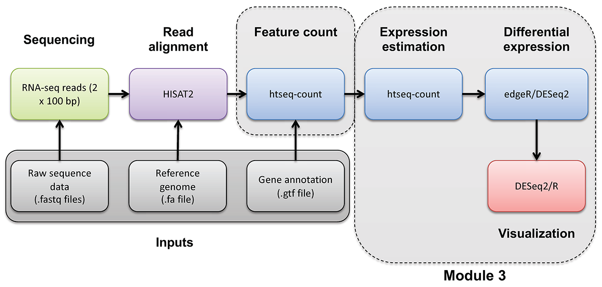
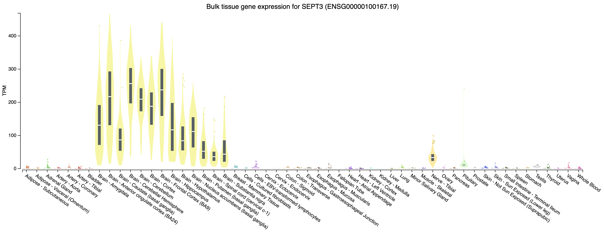
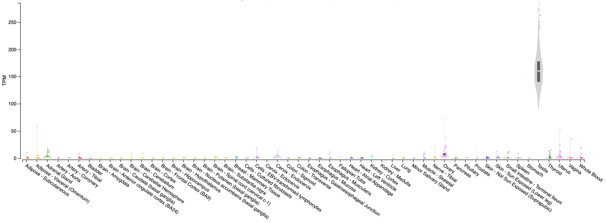
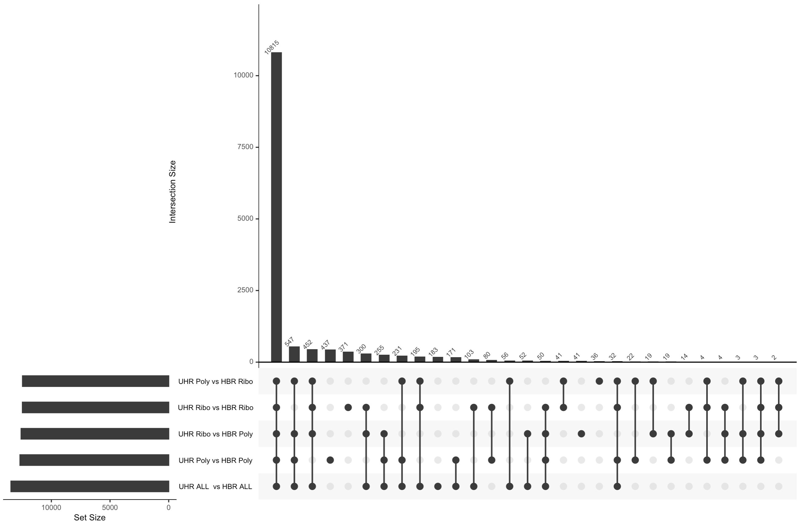

# Module 3

## Labs

### Module 3 - Key concepts
* Expression estimation, FPKM, TPM, StringTie overview, BallGown overview, multiple testing correction, etc.

### Module 3 - Learning objectives
* Expression estimation for known genes and transcripts
* FPKM/TPM expression estimates vs. raw counts
* Differential expression methods
* Downstream interpretation of expression and differential estimates

### Lectures
* [Abundance Estimations lecture](https://github.com/griffithlab/rnabio.org/blob/master/assets/lectures/cbw/2025/mini/RNASeq_MiniLecture_03_01_AbundanceEstimation.pdf)
* [HTSEQ lecture](https://github.com/griffithlab/rnabio.org/blob/master/assets/lectures/cbw/2025/mini/RNASeq_MiniLecture_03_02_HTSEQ.pdf)
* [Differential expression lecture](https://github.com/griffithlab/rnabio.org/blob/master/assets/lectures/cbw/2025/mini/RNASeq_MiniLecture_03_03_DifferentialExpression.pdf)

### Expression mini lecture
If you would like a refresher on expression and abundance estimations, we have made a [mini lecture](https://github.com/griffithlab/rnabio.org/blob/master/assets/lectures/cbw/2025/mini/RNASeq_MiniLecture_03_01_AbundanceEstimation.pdf).

### Use Stringtie to generate expression estimates from the SAM/BAM files generated by HISAT2 in the previous module


#### Note on de novo transcript discovery and differential expression using Stringtie:
In this module, we will run Stringtie in 'reference only' mode. For simplicity and to reduce run time, it is sometimes useful to perform expression analysis with only known transcript models. However, Stringtie can predict the transcripts present in each library instead (by dropping the '-G' option in stringtie commands as described in the next module). Stringtie will then assign arbitrary transcript IDs to each transcript assembled from the data and estimate expression for those transcripts. One complication with this method is that in each library a different set of transcripts is likely to be predicted for each library. There may be a lot of similarities but the number of transcripts and their exact structure will differ in the output files for each library. Before you can compare across libraries you therefore need to determine which transcripts correspond to each other across the libraries.

* Stringtie provides a merge command to combine predicted transcript GTF files from across different libraries
* Once you have a merged GTF file you can run Stringtie **again** with this instead of the known transcripts GTF file we used above
* Stringtie also provides 'gffcompare' to compare predicted transcripts to known transcripts
* Refer to the Stringtie manual for a more detailed explanation:
* [https://ccb.jhu.edu/software/stringtie/index.shtml?t=manual](https://ccb.jhu.edu/software/stringtie/index.shtml?t=manual)

Stringtie basic usage:

```bash
    stringtie <aligned_reads.bam> [options]*
```

Extra options specified below:

* '--rf' tells StringTie that our data is stranded and to use the correct strand specific mode (i.e. assume a stranded library fr-firststrand).
* '-p 4' tells StringTie to use 4 CPUs
* '-G <known transcripts file>' reference annotation to use for guiding the assembly process (GTF/GFF3)
* '-e' only estimate the abundance of given reference transcripts (requires -G)
* '-B' enable output of Ballgown table files which will be created in the same directory as the output GTF (requires -G, -o recommended)
* '-o' output path/file name for the assembled transcripts GTF (default: stdout)
* '-A' output path/file name for gene abundance estimates

```bash
cd $RNA_HOME/
mkdir -p expression/stringtie/ref_only/
cd expression/stringtie/ref_only/

stringtie --rf -p 4 -G $RNA_REF_GTF -e -B -o HBR_Rep1/transcripts.gtf -A HBR_Rep1/gene_abundances.tsv $RNA_ALIGN_DIR/HBR_Rep1.bam
stringtie --rf -p 4 -G $RNA_REF_GTF -e -B -o HBR_Rep2/transcripts.gtf -A HBR_Rep2/gene_abundances.tsv $RNA_ALIGN_DIR/HBR_Rep2.bam
stringtie --rf -p 4 -G $RNA_REF_GTF -e -B -o HBR_Rep3/transcripts.gtf -A HBR_Rep3/gene_abundances.tsv $RNA_ALIGN_DIR/HBR_Rep3.bam

stringtie --rf -p 4 -G $RNA_REF_GTF -e -B -o UHR_Rep1/transcripts.gtf -A UHR_Rep1/gene_abundances.tsv $RNA_ALIGN_DIR/UHR_Rep1.bam
stringtie --rf -p 4 -G $RNA_REF_GTF -e -B -o UHR_Rep2/transcripts.gtf -A UHR_Rep2/gene_abundances.tsv $RNA_ALIGN_DIR/UHR_Rep2.bam
stringtie --rf -p 4 -G $RNA_REF_GTF -e -B -o UHR_Rep3/transcripts.gtf -A UHR_Rep3/gene_abundances.tsv $RNA_ALIGN_DIR/UHR_Rep3.bam

```

What does the raw output from Stringtie look like? For details on the Stringtie output files refer to [Stringtie manual](http://ccb.jhu.edu/software/stringtie/index.shtml?t=manual) ([outputs section](http://ccb.jhu.edu/software/stringtie/index.shtml?t=manual#output))

```bash
less -S UHR_Rep1/transcripts.gtf
```

View transcript records only and improve formatting
```bash
grep -v "^#" UHR_Rep1/transcripts.gtf | grep -w "transcript" | column -t | less -S

```

Limit the view to transcript records and their expression values (FPKM and TPM values)

```bash
awk '{if ($3=="transcript") print}' UHR_Rep1/transcripts.gtf | cut -f 1,4,9 | less -S

```

Press 'q' to exit the 'less' display

Gene and transcript level expression values can also be viewed in these two files:

```bash
column -t UHR_Rep1/t_data.ctab | less -S

less -S -x20 UHR_Rep1/gene_abundances.tsv

```

Create a tidy expression matrix files for the StringTie results. This will be done at both the gene and transcript level and also will take into account the various expression measures produced: coverage, FPKM, and TPM.

```bash
cd $RNA_HOME/expression/stringtie/ref_only/
wget https://raw.githubusercontent.com/griffithlab/rnabio.org/master/assets/scripts/stringtie_expression_matrix.pl
chmod +x stringtie_expression_matrix.pl

./stringtie_expression_matrix.pl --expression_metric=TPM --result_dirs='HBR_Rep1,HBR_Rep2,HBR_Rep3,UHR_Rep1,UHR_Rep2,UHR_Rep3' --transcript_matrix_file=transcript_tpm_all_samples.tsv --gene_matrix_file=gene_tpm_all_samples.tsv

./stringtie_expression_matrix.pl --expression_metric=FPKM --result_dirs='HBR_Rep1,HBR_Rep2,HBR_Rep3,UHR_Rep1,UHR_Rep2,UHR_Rep3' --transcript_matrix_file=transcript_fpkm_all_samples.tsv --gene_matrix_file=gene_fpkm_all_samples.tsv

./stringtie_expression_matrix.pl --expression_metric=Coverage --result_dirs='HBR_Rep1,HBR_Rep2,HBR_Rep3,UHR_Rep1,UHR_Rep2,UHR_Rep3' --transcript_matrix_file=transcript_coverage_all_samples.tsv --gene_matrix_file=gene_coverage_all_samples.tsv

column -t transcript_tpm_all_samples.tsv | less -S
column -t gene_tpm_all_samples.tsv | less -S

```

Later we will use these files to perform various comparisons of expression estimation tools (e.g. stringtie, kallisto, raw counts) and metrics (e.g. FPKM vs TPM).

***

### PRACTICAL EXERCISE 8
Assignment: Use StringTie to Calculate transcript-level expression estimates for the alignments (bam files) you created in Practical Exercise 6.

* Hint: You should have six commands for 3 replicates each of tumor and normal samples.

Solution: When you are ready you can check your approach against the [Solutions](/module-09-appendix/0009/05/01/Practical_Exercise_Solutions/#practical-exercise-8---expression)

***



***


#### Mini-lecture

For more on the differences between abundance estimates like FPKM and count data with HTSeq-count, see this [mini lecture](https://github.com/griffithlab/rnabio.org/blob/master/assets/lectures/cbw/2025/mini/RNASeq_MiniLecture_03_02_HTSEQ.pdf).

***

#### HTSEQ-COUNT
Run htseq-count on alignments instead to produce raw counts instead of FPKM/TPM values for differential expression analysis

Refer to the HTSeq documentation for a more detailed explanation:

* [https://htseq.readthedocs.io/en/release_0.11.1/count.html](https://htseq.readthedocs.io/en/release_0.11.1/count.html)

htseq-count basic usage:

```bash
htseq-count [options] <sam_file> <gff_file>
```

Extra options specified below:

* '--format' specify the input file format one of BAM or SAM. Since we have BAM format files, select 'bam' for this option.
* '--order' provide the expected sort order of the input file. Previously we generated position sorted BAM files so use 'pos'.
* '--mode' determines how to deal with reads that overlap more than one feature. We believe the 'intersection-strict' mode is best.
* '--stranded' specifies whether data is stranded or not. The TruSeq strand-specific RNA libraries suggest the 'reverse' option for this parameter.
* '--minaqual' will skip all reads with alignment quality lower than the given minimum value
* '--type' specifies the feature type (3rd column in GFF file) to be used. (default, suitable for RNA-Seq and Ensembl GTF files: exon)
* '--idattr' The feature ID used to identify the counts in the output table. The default, suitable for RNA-SEq and Ensembl GTF files, is gene_id.

Run htseq-count and calculate gene-level counts:

```bash
cd $RNA_HOME/
mkdir -p expression/htseq_counts
cd expression/htseq_counts

htseq-count --format bam --order pos --mode intersection-strict --stranded reverse --minaqual 1 --type exon --idattr gene_id $RNA_ALIGN_DIR/UHR_Rep1.bam $RNA_REF_GTF > UHR_Rep1_gene.tsv
htseq-count --format bam --order pos --mode intersection-strict --stranded reverse --minaqual 1 --type exon --idattr gene_id $RNA_ALIGN_DIR/UHR_Rep2.bam $RNA_REF_GTF > UHR_Rep2_gene.tsv
htseq-count --format bam --order pos --mode intersection-strict --stranded reverse --minaqual 1 --type exon --idattr gene_id $RNA_ALIGN_DIR/UHR_Rep3.bam $RNA_REF_GTF > UHR_Rep3_gene.tsv

htseq-count --format bam --order pos --mode intersection-strict --stranded reverse --minaqual 1 --type exon --idattr gene_id $RNA_ALIGN_DIR/HBR_Rep1.bam $RNA_REF_GTF > HBR_Rep1_gene.tsv
htseq-count --format bam --order pos --mode intersection-strict --stranded reverse --minaqual 1 --type exon --idattr gene_id $RNA_ALIGN_DIR/HBR_Rep2.bam $RNA_REF_GTF > HBR_Rep2_gene.tsv
htseq-count --format bam --order pos --mode intersection-strict --stranded reverse --minaqual 1 --type exon --idattr gene_id $RNA_ALIGN_DIR/HBR_Rep3.bam $RNA_REF_GTF > HBR_Rep3_gene.tsv

```
Merge results files into a single matrix for use in edgeR. The following joins the results for each replicate together, adds a header, reformats the result as a tab delimited file, and shows you the first 10 lines of the resulting file :
```bash
cd $RNA_HOME/expression/htseq_counts/
join UHR_Rep1_gene.tsv UHR_Rep2_gene.tsv | join - UHR_Rep3_gene.tsv | join - HBR_Rep1_gene.tsv | join - HBR_Rep2_gene.tsv | join - HBR_Rep3_gene.tsv > gene_read_counts_table_all.tsv
echo "GeneID UHR_Rep1 UHR_Rep2 UHR_Rep3 HBR_Rep1 HBR_Rep2 HBR_Rep3" > header.txt
cat header.txt gene_read_counts_table_all.tsv | grep -v "__" | awk -v OFS="\t" '$1=$1' > gene_read_counts_table_all_final.tsv
rm -f gene_read_counts_table_all.tsv header.txt
head gene_read_counts_table_all_final.tsv | column -t

```

-`grep -v "__"` is being used to filter out the summary lines at the end of the files that `ht-seq count` gives to summarize reads that had no feature, were ambiguous, did not align at all, did not align due to poor alignment quality, or the alignment was not unique.

-`awk -v OFS="\t" '$1=$1'` is using `awk` to replace the single space characters that were in the concatenated version of our `header.txt` and `gene_read_counts_table_all.tsv` with a tab character. `-v` is used to reset the variable `OFS`, which stands for Output Field Separator. By default, this is a single space. By specifying `OFS="\t"`, we are telling `awk` to replace the single space with a tab. The `'$1=$1'` tells awk to reevaluate the input using the new output variable.


#### Prepare for DE analysis using htseq-count results

Create a directory for the DEseq analysis based on the htseq-count results:

```bash
cd $RNA_HOME/
mkdir -p de/htseq_counts
cd de/htseq_counts

```

Note that the htseq-count results provide counts for each gene but uses only the Ensembl Gene ID (e.g. ENSG00000054611).  This is not very convenient for biological interpretation.  This next step creates a mapping file that will help us translate from ENSG IDs to Symbols. It does this by parsing the GTF transcriptome file we got from Ensembl. That file contains both gene names and IDs. Unfortunately, this file is a bit complex to parse. Furthermore, it contains the ERCC transcripts, and these have their own naming convention which also complicates the parsing.

```bash

# cut the 9th column with all the gene annotation information
# delete all the double quotes from this string
# use perl to search for the pattern "gene_id" or "gene_name" followed by space character and then some non-space characters. 
# the non-space characters are the actual gene ID or Name. Store these in variables $gid and $gname and then print them out
# use sort and unique commands to produce a unique list of gene_name, gene_id combinations
 
cut -f 9 $RNA_REF_GTF | tr -d '"' | perl -ne 'chomp; if ($_ =~ /gene_id\s+(\S+);/){$gid = $1}; if ($_ =~ /gene_name\s+(\S+);/){$gname = $1}; print "$gid\t$gname\n"' | sort | uniq > ENSG_ID2Name.txt

head ENSG_ID2Name.txt

```

Determine the number of unique Ensembl Gene IDs and symbols. What does this tell you?
```bash

#count unique gene ids
cut -f 1 ENSG_ID2Name.txt | sort | uniq | wc -l

#count unique gene names
cut -f 2 ENSG_ID2Name.txt | sort | uniq | wc -l

#show the most repeated gene names
cut -f 2 ENSG_ID2Name.txt | sort | uniq -c | sort -r | head

```

***

#### ERCC expression analysis
Based on the above read counts, plot the linearity of the ERCC spike-in read counts observed in our RNA-seq data versus the expected concentration of the ERCC spike-in Mix. 

First download a file describing the expected concentrations and fold-change differences for the ERCC spike-in reagent. 

```bash
mkdir $RNA_HOME/expression/ercc_spikein_analysis/
cd $RNA_HOME/expression/ercc_spikein_analysis/
wget http://genomedata.org/rnaseq-tutorial/ERCC_Controls_Analysis.txt
cat ERCC_Controls_Analysis.txt

```

We will then merge our experimental RNA-seq read counts, determined for the ERCC transcripts, onto the table of expected concentrations. Finally, we will produce an x-y scatter plot that compares the expected and observed values.


First, start an R session:

```R
R
```

Now combine the ERCC expected concentration data with the observed RNA-seq expression values and produce x-y scatter plots that compare the expected and observed values for HTSEQ raw counts and StringTie TPM abundance estimates.

```R
library("ggplot2")
library("data.table")

#load in the reference/expected concentration and fold change values for each ERCC transcript
ercc_ref = read.table("ERCC_Controls_Analysis.txt", header=TRUE, sep="\t")
names(ercc_ref) = c("id", "ercc_id", "subgroup", "ref_conc_mix_1", "ref_conc_mix_2", "ref_fc_mix1_vs_mix2", "ref_log2_mix1_vs_mix2")
head(ercc_ref)
dim(ercc_ref)

#load the RNA-seq raw counts values for all samples and combined with the expected ERCC values
rna_counts_file = "~/workspace/rnaseq/expression/htseq_counts/gene_read_counts_table_all_final.tsv";
rna_counts = read.table(rna_counts_file, header=TRUE, sep="\t")
dim(rna_counts)

#combine the ERCC expected concentration information with the observed RNA-seq counts
ercc_ref_counts = merge(x = ercc_ref, y = rna_counts, by.x = "ercc_id", by.y = "GeneID", all.x = TRUE)

#convert UHR data to "long" format
uhr_data = ercc_ref_counts[,c("ercc_id","subgroup","ref_conc_mix_1","UHR_Rep1","UHR_Rep2","UHR_Rep3")]
uhr_data_long = melt(setDT(uhr_data), id.vars = c("ercc_id","subgroup","ref_conc_mix_1"), variable.name = "sample")
uhr_data_long$mix = "mix 1"
names(uhr_data_long) = c("ercc_id", "subgroup", "concentration", "sample", "count", "mix")

#convert HBR data to "long" format
hbr_data = ercc_ref_counts[,c("ercc_id","subgroup","ref_conc_mix_2","HBR_Rep1","HBR_Rep2","HBR_Rep3")]
hbr_data_long = melt(setDT(hbr_data), id.vars = c("ercc_id","subgroup","ref_conc_mix_2"), variable.name = "sample")
hbr_data_long$mix = "mix 2"
names(hbr_data_long) = c("ercc_id", "subgroup", "concentration", "sample", "count", "mix")

#rejoin the UHR and HBR tpm data
ercc_ref_counts_long <- rbind(uhr_data_long, hbr_data_long)
head(ercc_ref_counts_long)
dim(ercc_ref_counts_long)

#fit a linear model and calculate correlation between expected concentations and observed TPM values

min_nonzero_count = min(ercc_ref_counts_long$count[ercc_ref_counts_long$count > 0])
ercc_ref_counts_long$log_count = log2(ercc_ref_counts_long$count + min_nonzero_count)

min_nonzero_conc = min(ercc_ref_counts_long$concentration[ercc_ref_counts_long$concentration > 0])
ercc_ref_counts_long$log_concentration= log2(ercc_ref_counts_long$concentration + min_nonzero_conc)

count_model <- lm(log_count ~ log_concentration, data=ercc_ref_counts_long)
count_r_squared = summary(count_model)[["r.squared"]]
count_slope = coef(count_model)["log_concentration"]

p1 = ggplot(ercc_ref_counts_long, aes(x=log_concentration, y=log_count))
p1 = p1 + geom_point(aes(shape=mix, color=sample))
p1 = p1 + geom_smooth(method=lm) 
p1 = p1 + annotate("text", 10, 5, label=paste("R^2 =", round(count_r_squared, digits=2), sep=" ")) 
p1 = p1 + annotate("text", 10, 4, label=paste("Slope =", round(count_slope, digits=2), sep=" "))
p1 = p1 + xlab("Log2 (expected concentration [amol/uL] + min non-zero value)") + ylab("Log2 (observed count + min non-zero value)")

pdf("ERCC_Count_Expression_vs_SpikeInConcentration.pdf")
print(p1)
dev.off()

#load the RNA-seq TPM values for all samples and combine with expected ERCC values
rna_tpms_file = "~/workspace/rnaseq/expression/stringtie/ref_only/gene_tpm_all_samples.tsv"
rna_tpms = read.table(rna_tpms_file, header=TRUE, sep="\t")
dim(rna_tpms)

#combine the ERCC expected concentration information with the observed RNA-seq TPM values
ercc_ref_tpms = merge(x = ercc_ref, y = rna_tpms, by.x = "ercc_id", by.y = "Gene_ID", all.x = TRUE)
dim(ercc_ref_tpms)

#convert UHR data to "long" format
uhr_data = ercc_ref_tpms[,c("ercc_id","subgroup","ref_conc_mix_1","UHR_Rep1","UHR_Rep2","UHR_Rep3")]
uhr_data_long = melt(setDT(uhr_data), id.vars = c("ercc_id","subgroup","ref_conc_mix_1"), variable.name = "sample")
uhr_data_long$mix = "mix 1"
names(uhr_data_long) = c("ercc_id", "subgroup", "concentration", "sample", "tpm", "mix")

#convert HBR data to "long" format
hbr_data = ercc_ref_tpms[,c("ercc_id","subgroup","ref_conc_mix_2","HBR_Rep1","HBR_Rep2","HBR_Rep3")]
hbr_data_long = melt(setDT(hbr_data), id.vars = c("ercc_id","subgroup","ref_conc_mix_2"), variable.name = "sample")
hbr_data_long$mix = "mix 2"
names(hbr_data_long) = c("ercc_id", "subgroup", "concentration", "sample", "tpm", "mix")

#rejoin the UHR and HBR tpm data
ercc_ref_tpms_long <- rbind(uhr_data_long, hbr_data_long)
head(ercc_ref_tpms_long)
dim(ercc_ref_tpms_long)

#fit a linear model and calculate correlation between expected concentations and observed TPM values
min_nonzero_tpm = min(ercc_ref_tpms_long$tpm[ercc_ref_tpms_long$tpm > 0])
ercc_ref_tpms_long$log_tpm = log2(ercc_ref_tpms_long$tpm + min_nonzero_tpm)

min_nonzero_conc = min(ercc_ref_tpms_long$concentration[ercc_ref_tpms_long$concentration > 0])
ercc_ref_tpms_long$log_concentration= log2(ercc_ref_tpms_long$concentration + min_nonzero_conc)

tpm_model <- lm(log_tpm ~ log_concentration, data=ercc_ref_tpms_long)
tpm_r_squared = summary(tpm_model)[["r.squared"]]
tpm_slope = coef(tpm_model)["log_concentration"]

p2 = ggplot(ercc_ref_tpms_long, aes(x=log_concentration, y=log_tpm))
p2 = p2 + geom_point(aes(shape=mix, color=sample))
p2 = p2 + geom_smooth(method=lm) 
p2 = p2 + annotate("text", 10, 5, label=paste("R^2 =", round(tpm_r_squared, digits=2), sep=" ")) 
p2 = p2 + annotate("text", 10, 4, label=paste("Slope =", round(tpm_slope, digits=2), sep=" "))
p2 = p2 + xlab("Log2 (expected concentration [amol/uL] + min non-zero value)") + ylab("Log2 (observed TPM estimate + min non-zero value)")

pdf("ERCC_TPM_Expression_vs_SpikeInConcentration.pdf")
print(p2)
dev.off()

# Exit the R session
quit(save="no")

```

To view the resulting figures, navigate to the below URL replacing YOUR_IP_ADDRESS with your amazon instance IP address:
$RNA_HOME/ercc_spikein_analysis/

* http://**YOUR_PUBLIC_IPv4_ADDRESS**/rnaseq/expression/ercc_spikein_analysis/ERCC_Count_Expression_vs_SpikeInConcentration.pdf
* http://**YOUR_PUBLIC_IPv4_ADDRESS**/rnaseq/expression/ercc_spikein_analysis/ERCC_TPM_Expression_vs_SpikeInConcentration.pdf

Which expression estimation (read counts or TPM values) are better representing the known/expected ERCC concentrations?  Why?

Some notes of interpretation

- In general the expression estimates for ERCC transcripts we are getting from our data are highly correlated with the expected concentrations for the ERCC spike-in reagent
- There are some ERRC transcripts that were not detected in our data at all (count and TPM of 0). These correspond to a range of expected concentrations in the spile-in reagent but they are all at the lower end. Essentially this indicates a sensitivity limitation. With our downsampled RNAseq data, we are failing to detect some of the less abundant spiked-in ERCC transcripts. This is probably hurting our R squared values slightly.
- We observed a wide range of observed expression values for ERCC transcripts in both mixes. Remember that both mixes have ERCCs at low, medium, high levels (spread over 5-6 orders of magnitude).  But between the two mixes the ERCCs at each expected concentration are different.
- Details on the [ERCC spike-in reagent](https://rnabio.org/assets/module_1/ERCC.pdf)

### Differential Expression mini lecture
If you would like a brief refresher on differential expression analysis, please refer to the [mini lecture](https://github.com/griffithlab/rnabio.org/blob/master/assets/lectures/cbw/2025/mini/RNASeq_MiniLecture_03_03_DifferentialExpression.pdf).


### Ballgown DE Analysis
Use Ballgown to compare the UHR and HBR conditions. Refer to the Ballgown manual for a more detailed explanation:

* [https://www.bioconductor.org/packages/release/bioc/html/ballgown.html](https://www.bioconductor.org/packages/release/bioc/html/ballgown.html)

Create and change to ballgown ref-only results directory:

```bash
mkdir -p $RNA_HOME/de/ballgown/ref_only/
cd $RNA_HOME/de/ballgown/ref_only/
```

Perform UHR vs. HBR comparison, using all replicates, for known (reference only mode) transcripts:

First, start an R session:

```bash
R
```

Run the following R commands in your R session.

```R
# load the required libraries
library(ballgown)
library(genefilter)
library(dplyr)
library(devtools)

# Create phenotype data needed for ballgown analysis
ids = c("UHR_Rep1", "UHR_Rep2", "UHR_Rep3", "HBR_Rep1", "HBR_Rep2", "HBR_Rep3")
type = c("UHR", "UHR", "UHR", "HBR", "HBR", "HBR")
inputs = "/home/ubuntu/workspace/rnaseq/expression/stringtie/ref_only/"
path = paste(inputs, ids, sep="")
pheno_data = data.frame(ids, type, path)

# Load ballgown data structure and save it to a variable "bg"
bg = ballgown(samples = as.vector(pheno_data$path), pData = pheno_data)

# Display a description of this object
bg

# Load all attributes including gene name
bg_table = texpr(bg, 'all')
bg_gene_names = unique(bg_table[, 9:10])
bg_transcript_names = unique(bg_table[, c(1, 6)])

# Save the ballgown object to a file for later use
save(bg, file = 'bg.rda')

# Pull the gene and transcript expression data frame from the ballgown object
gene_expression = as.data.frame(gexpr(bg))
transcript_expression = as.data.frame(texpr(bg))

# Perform differential expression (DE) analysis with no filtering, at both gene and transcript level
# Then add on transcript/gene names and sample level fpkm values for export
results_transcripts = stattest(bg, feature = "transcript", covariate = "type", getFC = TRUE, meas = "FPKM")
results_transcripts = merge(results_transcripts, bg_transcript_names, by.x = c("id"), by.y = c("t_id"))
results_transcripts = merge(results_transcripts, transcript_expression, by.x = c("id"), by.y = c("row.names"))

results_genes = stattest(bg, feature = "gene", covariate = "type", getFC = TRUE, meas = "FPKM")
results_genes = merge(results_genes, bg_gene_names, by.x = c("id"), by.y = c("gene_id"))
results_genes = merge(results_genes, gene_expression, by.x = c("id"), by.y = c("row.names"))

# Save a tab delimited file for both the transcript and gene results
write.table(results_transcripts, "UHR_vs_HBR_transcript_results.tsv", sep = "\t", quote = FALSE, row.names = FALSE)
write.table(results_genes, "UHR_vs_HBR_gene_results.tsv", sep = "\t", quote = FALSE, row.names = FALSE)

# Filter low-abundance genes. Here we remove all transcripts with a variance across the samples of less than one
bg_filt = subset (bg, "SparseArray::rowVars(texpr(bg)) > 1", genomesubset = TRUE)

# Load all attributes including gene name
bg_filt_table = texpr(bg_filt , 'all')
bg_filt_gene_names = unique(bg_filt_table[, 9:10])
bg_filt_transcript_names = unique(bg_filt_table[, c(1,6)])

# Perform DE analysis now using the filtered data
results_transcripts = stattest(bg_filt, feature = "transcript", covariate = "type", getFC = TRUE, meas = "FPKM")
results_transcripts = merge(results_transcripts, bg_filt_transcript_names, by.x = c("id"), by.y = c("t_id"))
results_transcripts = merge(results_transcripts, transcript_expression, by.x = c("id"), by.y = c("row.names"))

results_genes = stattest(bg_filt, feature = "gene", covariate = "type", getFC = TRUE, meas = "FPKM")
results_genes = merge(results_genes, bg_filt_gene_names, by.x = c("id"), by.y = c("gene_id"))
results_genes = merge(results_genes, gene_expression, by.x = c("id"), by.y = c("row.names"))

# Output the filtered list of genes and transcripts and save to tab delimited files
write.table(results_transcripts, "UHR_vs_HBR_transcript_results_filtered.tsv", sep = "\t", quote = FALSE, row.names = FALSE)
write.table(results_genes, "UHR_vs_HBR_gene_results_filtered.tsv", sep = "\t", quote = FALSE, row.names = FALSE)

# Identify the significant genes with p-value < 0.05
sig_transcripts = subset(results_transcripts, results_transcripts$pval<0.05)
sig_genes = subset(results_genes, results_genes$pval<0.05)

# Output the significant gene results to a pair of tab delimited files
write.table(sig_transcripts, "UHR_vs_HBR_transcript_results_sig.tsv", sep = "\t", quote = FALSE, row.names = FALSE)
write.table(sig_genes, "UHR_vs_HBR_gene_results_sig.tsv", sep = "\t", quote = FALSE, row.names = FALSE)

# Exit the R session
quit(save = "no")
```

Once you have completed the Ballgown analysis in R, exit the R session and continue with the steps below. A copy of the above R code is located [here](https://github.com/griffithlab/rnabio.org/blob/master/assets/scripts/Tutorial_Part1_ballgown.R).

What does the raw output from Ballgown look like?

```bash
head UHR_vs_HBR_gene_results.tsv
```

How many genes are there on this chromosome?

```bash
grep -v feature UHR_vs_HBR_gene_results.tsv | wc -l

```

How many passed filter in UHR or HBR?

```bash
grep -v feature UHR_vs_HBR_gene_results_filtered.tsv | wc -l

```

How many differentially expressed genes were found on this chromosome (p-value < 0.05)?

```bash
grep -v feature UHR_vs_HBR_gene_results_sig.tsv | wc -l

```

Display the top 20 DE genes. Look at some of those genes in IGV - do they make sense?

In the following commands we use `grep -v feature` to remove lines that contain "feature". Then we use `sort` to sort the data in various ways. The `k` option specifies that we want to sort on a particular column (`3` in this case which has the DE fold change values). The `n` option tells `sort` to sort numerically. The `r` option tells `sort` to reverse the sort.
```bash
grep -v feature UHR_vs_HBR_gene_results_sig.tsv | sort -rnk 3 | head -n 20 | column -t #Higher abundance in UHR
grep -v feature UHR_vs_HBR_gene_results_sig.tsv | sort -nk 3 | head -n 20 | column -t #Higher abundance in HBR

```

Save all genes with P<0.05 to a new file.

```bash
grep -v feature UHR_vs_HBR_gene_results_sig.tsv | cut -f 6 | sed 's/\"//g' > DE_genes.txt
head DE_genes.txt

```

***

### PRACTICAL EXERCISE 9
Assignment: Use Ballgown to identify differentially expressed genes from the StringTie expression estimates (i.e., Ballgown table files) which you created in Practical Exercise 8.

* Hint: Follow the example R code above. 
* Hint: You will need to change how the `pheno_data` object is created to point to the correct sample ids, type, and path to your inputs (the StringTie results files).
* Hint: Make sure to save your ballgown data object to file (e.g., `bg.rda`) for use in subsequent practical exercises.
* Hint: You may wish to save both a complete list of genes with differential expression results as well as a subset which are filtered and pass a significance test

Solution: When you are ready you can check your approach against the [Solutions](/module-09-appendix/0009/05/01/Practical_Exercise_Solutions/#practical-exercise-9---differential-expression)

***

### ERCC DE Analysis
This section will compare the differential expression estimates obtained by the RNAseq analysis against the expected differential expression results for the ERCC spike-in RNAs (mix1-UHR vs mix2-HBR):

First set up a directory to store the results of this analysis.

```bash
mkdir $RNA_HOME/de/ercc_spikein_analysis/
cd $RNA_HOME/de/ercc_spikein_analysis/
wget http://genomedata.org/rnaseq-tutorial/ERCC_Controls_Analysis.txt
cat ERCC_Controls_Analysis.txt
```

Using R load the expected and observed ERCC DE results and produce a visualization.

First, start an R session:

```R
R
```

Work through the following R commands

```R

library(ggplot2)

#load the ERCC expected fold change values for mix1 vs mix2
ercc_ref = read.table("ERCC_Controls_Analysis.txt", header=TRUE, sep="\t")
names(ercc_ref) = c("id", "ercc_id", "subgroup", "ref_conc_mix_1", "ref_conc_mix_2", "ref_fc_mix1_vs_mix2", "ref_log2_mix1_vs_mix2")
head(ercc_ref)
dim(ercc_ref)

#load the observed fold change values determined by our RNA-seq analysis
rna_de_file = "~/workspace/rnaseq/de/ballgown/ref_only/UHR_vs_HBR_gene_results.tsv";
rna_de = read.table(rna_de_file, header=TRUE, sep="\t")
tail(rna_de)
dim(rna_de)

#combine the expected and observed data into a single data table
ercc_ref_de = merge(x = ercc_ref, y = rna_de, by.x = "ercc_id", by.y = "id", all.x = TRUE)
head(ercc_ref_de)
dim(ercc_ref_de)

#convert fold change values to log2 scale
ercc_ref_de$observed_log2_fc = log2(ercc_ref_de$fc)
ercc_ref_de$expected_log2_fc = ercc_ref_de$ref_log2_mix1_vs_mix2

#fit a linear model and calculate R squared between the observed and expected fold change values
model = lm(observed_log2_fc ~ expected_log2_fc, data=ercc_ref_de)
r_squared = summary(model)[["r.squared"]]

#create a scatterplot to compare the observed and expected fold change values
p = ggplot(ercc_ref_de, aes(x = expected_log2_fc, y = observed_log2_fc))
p = p + geom_point(aes(color = subgroup)) 
p = p + geom_smooth(method = lm) 
p = p + annotate("text", 1, 2, label=paste("R^2 =", r_squared, sep=" "))
p = p + xlab("Expected Fold Change (log2 scale)") 
p = p + ylab("Observed Fold Change in RNA-seq data (log2 scale)")

#save the plot to a PDF
pdf("ERCC_Ballgown-DE_vs_SpikeInDE.pdf")
print(p)
dev.off()

# Exit the R session
quit(save="no")

```

View the results here:

* http://**YOUR_PUBLIC_IPv4_ADDRESS**/rnaseq/de/ercc_spikein_analysis/ERCC_Ballgown-DE_vs_SpikeInDE.pdf

### Differential Expression mini lecture
If you would like a brief refresher on differential expression analysis, please refer to the [mini lecture](https://github.com/griffithlab/rnabio.org/blob/master/assets/lectures/cbw/2025/mini/RNASeq_MiniLecture_03_03_DifferentialExpression.pdf).


### edgeR DE Analysis
In this tutorial you will:

* Make use of the raw counts you generated previously using htseq-count
* edgeR is a bioconductor package designed specifically for differential expression of count-based RNA-seq data
* This is an alternative to using stringtie/ballgown to find differentially expressed genes

First, create a directory for results:

```bash
cd $RNA_HOME/
mkdir -p de/htseq_counts
cd de/htseq_counts

```

Note that the htseq-count results provide counts for each gene but uses only the Ensembl Gene ID (e.g. ENSG00000054611).  This is not very convenient for biological interpretation.  This next step creates a mapping file that will help us translate from ENSG IDs to Symbols. It does this by parsing the GTF transcriptome file we got from Ensembl. That file contains both gene names and IDs. Unfortunately, this file is a bit complex to parse. Furthermore, it contains the ERCC transcripts, and these have their own naming convention which also complicated the parsing.

```bash
perl -ne 'if ($_ =~ /gene_id\s\"(ENSG\S+)\"\;/) { $id = $1; $name = undef; if ($_ =~ /gene_name\s\"(\S+)"\;/) { $name = $1; }; }; if ($id && $name) {print "$id\t$name\n";} if ($_=~/gene_id\s\"(ERCC\S+)\"/){print "$1\t$1\n";}' $RNA_REF_GTF | sort | uniq > ENSG_ID2Name.txt
head ENSG_ID2Name.txt

```

Determine the number of unique Ensembl Gene IDs and symbols. What does this tell you?
```bash
#count unique gene ids
cut -f 1 ENSG_ID2Name.txt | sort | uniq | wc -l
#count unique gene names
cut -f 2 ENSG_ID2Name.txt | sort | uniq | wc -l

#show the most repeated gene names
cut -f 2 ENSG_ID2Name.txt | sort | uniq -c | sort -r | head

```

Launch R:

```bash
R
```

R code has been provided below. If you wish to have a script with all of the code, it can be found [here](https://github.com/griffithlab/rnabio.org/blob/master/assets/scripts/Tutorial_edgeR.R). Run the R commands below.

```R

# set working directory where output will go
working_dir = "~/workspace/rnaseq/de/htseq_counts"
setwd(working_dir)

# read in gene mapping
mapping = read.table("~/workspace/rnaseq/de/htseq_counts/ENSG_ID2Name.txt", header = FALSE, stringsAsFactors = FALSE, row.names = 1)

# read in count matrix
rawdata = read.table("~/workspace/rnaseq/expression/htseq_counts/gene_read_counts_table_all_final.tsv", header = TRUE, stringsAsFactors = FALSE, row.names = 1)

# Check dimensions
dim(rawdata)

# Require at least 1/6 of samples to have expressed count >= 10
sample_cutoff = (1/6)
count_cutoff = 10

#Define a function to calculate the fraction of values expressed above the count cutoff
getFE = function(data,count_cutoff){
 FE = (sum(data >= count_cutoff) / length(data))
 return(FE)
}

#Apply the function to all genes, and filter out genes not meeting the sample cutoff
fraction_expressed = apply(rawdata, 1, getFE, count_cutoff)
keep = which(fraction_expressed >= sample_cutoff)
rawdata = rawdata[keep, ]

# Check dimensions again to see effect of filtering
dim(rawdata)

#################
# Running edgeR #
#################

# load edgeR
library("edgeR")

# make class labels
class = c(rep("UHR", 3), rep("HBR", 3))

# Get common gene names
Gene = rownames(rawdata)
Symbol = mapping[Gene, 1]
gene_annotations = cbind(Gene, Symbol)

# Make DGEList object
y = DGEList(counts = rawdata, genes = gene_annotations, group = class)
nrow(y)

# TMM Normalization
y = calcNormFactors(y)

# Estimate dispersion
y = estimateCommonDisp(y, verbose = TRUE)
y = estimateTagwiseDisp(y)

# Differential expression test
et = exactTest(y)

# Extract raw counts to add back onto DE results
counts = getCounts(y)

# Print top genes
topTags(et)

# Print number of up/down significant genes at FDR = 0.05  significance level
summary(de <- decideTests(et, adjust.method = "BH", p = 0.05))

#Get output with BH-adjusted FDR values - all genes, any p-value, unsorted
out = topTags(et, n = "Inf", adjust.method = "BH", sort.by = "none", p.value = 1)$table

#Add raw counts back onto results for convenience (make sure sort and total number of elements allows proper join)
out2 = cbind(out, counts)

#Limit to significantly DE genes
out3 = out2[as.logical(de), ]

# Order by p-value
o = order(et$table$PValue[as.logical(de)], decreasing=FALSE)
out4 = out3[o, ]

# Save table
write.table(out4, file = "DE_genes.txt", quote = FALSE, row.names = FALSE, sep = "\t")

#To exit R type the following
quit(save = "no")
```

Once you have run the edgeR tutorial, compare the sigDE genes to those saved earlier from ballgown:
```bash
head $RNA_HOME/de/ballgown/ref_only/DE_genes.txt
head $RNA_HOME/de/htseq_counts/DE_genes.txt

```

Pull out the gene IDs
```bash
cd $RNA_HOME/de/

cut -f 1 $RNA_HOME/de/ballgown/ref_only/DE_genes.txt | sort | uniq > ballgown_DE_gene_symbols.txt
cut -f 2 $RNA_HOME/de/htseq_counts/DE_genes.txt | sort | uniq | grep -v Gene_Name > htseq_counts_edgeR_DE_gene_symbols.txt

```

Visualize overlap with a venn diagram. This can be done with simple web tools like:

* [https://www.biovenn.nl/](https://www.biovenn.nl/)
* [http://bioinfogp.cnb.csic.es/tools/venny/](http://bioinfogp.cnb.csic.es/tools/venny/)

To get the two gene lists you could use `cat` to print out each list in your terminal and then copy/paste.

```bash
cat ballgown_DE_gene_symbols.txt
cat htseq_counts_edgeR_DE_gene_symbols.txt

```

Alternatively you could view both lists in a web browser as you have done with other files. These two files should be here:

* http://**YOUR_PUBLIC_IPv4_ADDRESS**/rnaseq/de/ballgown_DE_gene_symbols.txt
* http://**YOUR_PUBLIC_IPv4_ADDRESS**/rnaseq/de/htseq_counts_edgeR_DE_gene_symbols.txt

##### Example Venn Diagram (DE genes from StringTie/Ballgown vs HTSeq/EdgeR)

<br>


### Differential Expression mini lecture
If you would like a brief refresher on differential expression analysis, please refer to the [mini lecture](https://github.com/griffithlab/rnabio.org/blob/master/assets/lectures/cbw/2025/mini/RNASeq_MiniLecture_03_03_DifferentialExpression.pdf).


### DESeq2 DE Analysis
In this tutorial you will:

* Make use of the raw counts you generated previously using htseq-count
* DESeq2 is a bioconductor package designed specifically for differential expression of count-based RNA-seq data
* This is an alternative to using stringtie/ballgown to find differentially expressed genes

### Setup

First, create a directory for results. Then start R:

```bash
cd $RNA_HOME/
mkdir -p de/deseq2
cd de/deseq2

R

```

Once we start from R, the relevant packages should already be installed. We will load the libraries, set working directories, and read in the raw read counts data. Two pieces of information are required to perform analysis with DESeq2. A matrix of raw counts, such as was generated previously while running [HTseq](https://htseq.readthedocs.io/en/release_0.9.0/) previously in this course. This is important as DESeq2 normalizes the data, correcting for differences in library size using using this type of data. DESeq2 also requires the experimental design which can be supplied as a data.frame, detailing the samples and conditions.

```R
# define working dir paths
datadir = "/home/ubuntu/workspace/rnaseq/expression/htseq_counts"
outdir = "/home/ubuntu/workspace/rnaseq/de/deseq2"

# load R libraries we will use in this section
library(DESeq2)
library(data.table)
library(ggplot2)

# set working directory to data dir
setwd(datadir)

# read in the RNAseq read counts for each gene (produced by htseq-count)
htseqCounts = fread("gene_read_counts_table_all_final.tsv")
```

### Format htseq counts data to work with DESeq2
DESeq2 has a number of options for data import and has a function to read HTseq output files directly. Here the most universal option is used, reading in raw counts from a matrix in simple TSV format (one row per gene, one column per sample). The HTseq count data that was read in above is stored as an object of class "data.table", this can be verified with the `class()` function. Before use in this exercise it is required to convert this object to an appropriate matrix format with gene names as rows and samples as columns.

It should be noted that while the replicate samples are technical replicates (i.e. the same library was sequenced), herein they are treated as biological replicates for illustrative purposes. DESeq2 does have a function to collapse technical replicates though.

```R

# view the class of the data
class(htseqCounts)

# convert the data.table to matrix format
htseqCounts = as.matrix(htseqCounts)
class(htseqCounts)

# set the gene ID values to be the row names for the matrix
rownames(htseqCounts) = htseqCounts[, "GeneID"]

# now that the gene IDs are the row names, remove the redundant column that contains them
htseqCounts = htseqCounts[, colnames(htseqCounts) != "GeneID"]

# convert the count values from strings (with spaces) to integers, because originally the gene column contained characters, the entire matrix was set to character
class(htseqCounts) = "integer"

# view the first few lines of the gene count matrix
head(htseqCounts)

```

### Filter raw counts

Before running DESeq2 (or any differential expression analysis) it is useful to pre-filter data. There are computational benefits to doing this as the memory size of the objects within R will decrease and DESeq2 will have less data to work through and will be faster. By removing "low quality" data, it is also reduces the number of statistical tests that will be performed, which in turn reduces the impact of multiple test correction and can lead to more significant genes. 

The amount of pre-filtering is up to the analyst however, it should be done in an unbiased way. DESeq2 recommends removing any gene with less than 10 reads across all samples. Below, we filter a gene if at least 1 sample does not have at least 10 reads. Either way, mostly what is being removed here are genes with very little evidence for expression in any sample (in many cases gene with 0 counts in all samples).

```R
# run a filtering step
# i.e. require that for every gene: at least 1 of 6 samples must have counts greater than 10
# get index of rows that meet this criterion and use that to subset the matrix
# note the dimensions of the matrix before and after filtering with dim()

# breaking apart the command below to understand it's outcome
tail(htseqCounts) # look at the raw counts
tail(htseqCounts >= 10) # determine which cells have counts greater than 10
tail(rowSums(htseqCounts >= 10)) # determine for which genes how many samples have counts greater than 10
tail(rowSums(htseqCounts >= 10) >= 1) # filter to those entries/genes for which at least one sample has counts greater than 10
tail(which(rowSums(htseqCounts >= 10) >= 1)) #obtain the index for the above filter criteria

dim(htseqCounts)
htseqCounts = htseqCounts[which(rowSums(htseqCounts >= 10) >= 1), ]
dim(htseqCounts)
```

### Specifying the experimental design

As mentioned above DESeq2 also needs to know the experimental design, that is which samples belong to which condition to test. The experimental design for the example dataset herein is quite simple as there are 6 samples with two conditions to compare (UHR vs HBR), as such we can just create the experimental design right within R. There is one important thing to note, DESeq2 does not check sample names, it expects that the column names in the counts matrix we created correspond exactly to the row names we specify in the experimental design.

```R
# construct a mapping of the meta data for our experiment (comparing UHR cell lines to HBR brain tissues)
# this is defining the biological condition/label for each experimental replicate
# create a simple one column dataframe to start
metaData <- data.frame("Condition" = c("UHR", "UHR", "UHR", "HBR", "HBR", "HBR"))

# convert the "Condition" column to a factor data type
# the arbitrary order of these factors will determine the direction of log2 fold-changes for the genes (i.e. up or down regulated)
metaData$Condition = factor(metaData$Condition, levels = c("HBR", "UHR"))

# set the row names of the metaData dataframe to be the names of our sample replicates from the read counts matrix
rownames(metaData) = colnames(htseqCounts)

# view the metadata dataframe
head(metaData)

# check that names of htseq count columns match the names of the meta data rows
# use the "all" function which tests whether an entire logical vector is TRUE
all(rownames(metaData) == colnames(htseqCounts))
```

### Construct the DESeq2 object piecing all the data together
With all the data properly formatted it is now possible to combine all the information required to run differental expression in one object. This object will hold the input data, and intermediary calculations. It is also where the condition to test is specified.

```R
# make deseq2 data sets
# here we are setting up our experiment by supplying: (1) the gene counts matrix, (2) the sample/replicate for each column, and (3) the biological conditions we wish to compare.
# this is a simple example that works for many experiments but these can also get more complex
# for example, including designs with multiple variables such as "~ group + condition",
# and designs with interactions such as "~ genotype + treatment + genotype:treatment".

dds = DESeqDataSetFromMatrix(countData = htseqCounts, colData = metaData, design = ~Condition)

# the design formula above is often a point of confussion, it is useful to put in words what is happening, when we specify "design = ~Condition" we are saying
# regress gene expression on condition, or put another way model gene expression on condition
# gene expression is the response variable and condition is the explanatory variable
# you can put words to formulas using this [cheat sheet](https://www.econometrics.blog/post/the-r-formula-cheatsheet/)
```

### Running DESeq2
With all the data now in place, DESeq2 can be run. Calling DESeq2 will perform the following actions:
- Estimation of size factors. i.e. accounting for differences in sequencing depth (or library size) across samples.
- Estimation of dispersion. i.e. estimate the biological variability (over and above the expected variation from sampling) in gene expression across biological replicates. This is needed to assess the significance of differences across conditions. Additional work is performed to correct for higher dispersion seen for genes with low expression.
- Perform "independent filtering" to reduce the number of statistical tests performed (see `?results` and [this paper](https://doi.org/10.1073/pnas.0914005107) for details)
- Negative Binomial GLM fitting and performing the Wald statistical test
- Correct p values for multiple testing using the Benjamini and Hochberg method

```R
# run the DESeq2 analysis on the "dds" object
dds = DESeq(dds)

# view the first 5 lines of the DE results
res = results(dds)
head(res, 5)

```

### Log-fold change shrinkage
It is good practice to shrink the log-fold change values, this does exactly what it sounds like, reducing the amount of log-fold change for genes where there are few counts which create huge variability that is not truly biological signal. Consider for example a gene for two samples, one sample has 1 read, and and one sample has 6 reads, that is a 6 fold change, that is likely not accurate. There are a number of algorithms that can be used to shrink log2 fold change, here we will use the apeglm algorithm, which does require the apeglm package to be installed.

```R
# shrink the log2 fold change estimates
#   shrinkage of effect size (log fold change estimates) is useful for visualization and ranking of genes

#   In simplistic terms, the goal of calculating "dispersion estimates" and "shrinkage" is also to account for the problem that
#   genes with low mean counts across replicates tend to have higher variability than those with higher mean counts.
#   Shrinkage attempts to correct for this. For a more detailed discussion of shrinkage refer to the DESeq2 vignette

# first get the name of the coefficient (log fold change) to shrink
resultsNames(dds)

# now apply the shrinkage approach
resLFC = lfcShrink(dds, coef = "Condition_UHR_vs_HBR", type = "apeglm")

# make a copy of the shrinkage results to manipulate
deGeneResult = resLFC

# contrast the values before and after shrinkage
# create a temporary, simplified data structure with the values before/after shrinkage, and create a new column called "group" with this label
res_before = res
res_before$group = "before shrinkage"
res_after = deGeneResult
res_after$group = "after shrinkage"
res_combined = rbind(res_before[,c("log2FoldChange","group")], res_after[,c("log2FoldChange","group")])

# adjust the order so that the legend has "before shrinkage" listed first
res_combined$group = factor(res_combined$group, levels = c("before shrinkage", "after shrinkage"))

# look at the fold change values
head(res_before)
head(res_after)

p <- ggplot(res_combined, aes(x = log2FoldChange, color = group)) + geom_density() + theme_bw() +
  scale_color_manual(values = c("before shrinkage" = "tomato4", "after shrinkage" = "slategray")) +
  labs(color = "Shrinkage status")
ggsave(plot=p, filename = "before_after_shrinkage.pdf", device="pdf", width=6, height=4, units="in")

```

How did the results change before and after shinkage? What direction is each log2 fold change value moving? 

Note that for these data, the impact of shrinkage is very subtle but the pattern is that fold change values move towards 0.

### Annotate gene symbols onto the DE results
DESeq2 was run with ensembl gene IDs as identifiers, this is not the most human friendly way to interpret results. Here gene symbols are merged onto the differential expressed gene list to make the results a bit more interpretable.

```R
# read in gene ID to name mappings (using "fread" an alternative to "read.table")
gene_id_mapping <- fread("/home/ubuntu/workspace/rnaseq/de/htseq_counts/ENSG_ID2Name.txt", header = FALSE)

# add names to the columns in the "gene_id_mapping" dataframe
setnames(gene_id_mapping, c("ensemblID", "Symbol"))

# view the first few lines of the gene ID to name mappings
head(gene_id_mapping)

# merge on gene names
deGeneResult$ensemblID = rownames(deGeneResult)
deGeneResult = as.data.table(deGeneResult)
deGeneResult = merge(deGeneResult, gene_id_mapping, by = "ensemblID", all.x = TRUE)

# merge the original raw count values onto this final dataframe to aid interpretation
original_counts = as.data.frame(htseqCounts)
original_counts[,"ensemblID"] = rownames(htseqCounts)
deGeneResult = merge(deGeneResult, original_counts, by = 'ensemblID', all.x = TRUE)

# view the final merged dataframe
# based on the raw counts and fold change values what does a negative fold change mean with respect to our two conditions HBR and UHR?
head(deGeneResult)
```

### Data manipulation
With the DE analysis complete it is useful to view and filter the data frames to only the relevant genes. Here some basic data manipulation is performed, filtering to significant genes at specific thresholds.

```R
# view the top genes according to adjusted p-value
deGeneResult[order(deGeneResult$padj), ]

# view the top genes according to fold change
deGeneResult[order(deGeneResult$log2FoldChange), ]

# determine the number of up/down significant genes at FDR < 0.05 significance level
dim(deGeneResult)[1] # number of genes tested
dim(deGeneResult[deGeneResult$padj < 0.05])[1] #number of significant genes

# order the DE results by adjusted p-value
deGeneResultSorted = deGeneResult[order(deGeneResult$padj), ]

# create a filtered data frame that limits to only the significant DE genes (adjusted p.value < 0.05)
deGeneResultSignificant = deGeneResultSorted[deGeneResultSorted$padj < 0.05]
```

### Save results to files
The data generated is now written out as tab separated files. Some of the DESeq2 objects are also saved as serialized R (RDS) objects which can be read back into R later for visualization.

```R
# set the working directory to the output dir where we will store any results files
setwd(outdir)

# save the final DE result (all genes)  to an output file
fwrite(deGeneResultSorted, file="DE_all_genes_DESeq2.tsv", sep="\t")

# save the final DE result (significant genes only)  to an output file
fwrite(deGeneResultSignificant, file="DE_sig_genes_DESeq2.tsv", sep="\t")

# save the DESeq2 objects for the data visualization section
saveRDS(dds, "dds.rds")
saveRDS(res, "res.rds")
saveRDS(resLFC, "resLFC.rds")
```

### Briefly examine the top over-expressed genes

For both conditions (HBR and UHR) lets take a look at the top n genes but this time according to fold-change instead of p-value.

```R

# use the dplyr library to manipulate the dataframe
library(dplyr)

# create a new copy of the data frame, sorted by log2 fold change
deGeneResultSortedFoldchange = arrange(deGeneResultSignificant, log2FoldChange)

# create a convenient data structure with just the top n genes from each condition
top_bottom = bind_rows(
  head(deGeneResultSortedFoldchange, 10) %>% mutate(Set = "Bottom 10"),
  tail(deGeneResultSortedFoldchange, 10) %>% mutate(Set = "Top 10")
)

# visualize data for the top n genes. Simplify the output a bit
print(top_bottom[,c("log2FoldChange","padj","Symbol","UHR_Rep1","UHR_Rep2","UHR_Rep3","HBR_Rep1","HBR_Rep2","HBR_Rep3","Set")])

#To exit R type the following
quit(save = "no")

```

### Perform some preliminary exploration of DE genes using webtools

Download the file: `outdir/DE_sig_genes_DESeq2.tsv`. Open this spreadsheet, sort on "log2FoldChange" column and find the top 100 significant genes with higher expression in HBR (brain). Also download the file: `outdir/DE_all_genes_DESeq2.tsv` (to be used as a list of background genes or where we want the fold-change value for every gene).

- Try querying with the top 100 HBR over-expressed genes using: [g:Profiler](https://biit.cs.ut.ee/gprofiler/gost)
- Try querying with the top 100 HBR over-expressed genes using: [TissueEnrich](https://tissueenrich.gdcb.iastate.edu/). Use the Tissue Enrichment tool. This tool also requires a Background Gene List.  Use all genes in `DE_all_genes_DESeq2.tsv` for this purpose. You can also manually explore some individual genes over-expressed in UHR with the Tissue-Specific Genes tool.  For example, try *PRAME* and *SERPIND1*, two of the top UHR genes.

**g:Profiler example result**


**TissueEnrich summary for top 100 HBR over-expressed genes**


**TissueEnrich result for Cerebral Cortex tissue**


**TissueEnrich example for UHR over-expressed gene: *PRAME***


**TissueEnrich example for UHR over-expressed gene: *SERPIND1***


Does all of this make sense when we think about the makeup of the HBR and UHR samples? Refer back to the [description of the samples](module-01-inputs/0001/05/01/RNAseq_Data/).

In this section we will compare the DE gene lists obtained from different DE methods (e.g. Ballgown, EdgeR, DESeq2)

### Visualize overlap with a venn diagram. This can be done with simple web tools like:

* [https://www.biovenn.nl/](https://www.biovenn.nl/)
* [http://bioinfogp.cnb.csic.es/tools/venny/](http://bioinfogp.cnb.csic.es/tools/venny/)

Once you have run the DESeq2 tutorial, compare the sigDE genes to those saved earlier from ballgown and/or edgeR:

```bash
head $RNA_HOME/de/ballgown/ref_only/DE_genes.txt
head $RNA_HOME/de/htseq_counts/DE_genes.txt
head $RNA_HOME/de/deseq2/DE_sig_genes_DESeq2.tsv

```

Pull out the gene IDs
```bash
cd $RNA_HOME/de/

cut -f 1 $RNA_HOME/de/ballgown/ref_only/DE_genes.txt | sort | uniq > ballgown_DE_gene_symbols.txt
cut -f 2 $RNA_HOME/de/htseq_counts/DE_genes.txt | sort | uniq | grep -v Gene_Name > htseq_counts_edgeR_DE_gene_symbols.txt
cut -f 7 $RNA_HOME/de/deseq2/DE_sig_genes_DESeq2.tsv | sort | uniq | grep -v Symbol > DESeq2_DE_gene_symbols.txt

```

To get the two gene lists you could use `cat` to print out each list in your terminal and then copy/paste.

```bash
cat ballgown_DE_gene_symbols.txt
cat htseq_counts_edgeR_DE_gene_symbols.txt
cat DESeq2_DE_gene_symbols.txt

```

Alternatively you could view both lists in a web browser as you have done with other files. These two files should be here:

* http://**YOUR_PUBLIC_IPv4_ADDRESS**/rnaseq/de/ballgown_DE_gene_symbols.txt
* http://**YOUR_PUBLIC_IPv4_ADDRESS**/rnaseq/de/DESeq2_DE_gene_symbols.txt
* http://**YOUR_PUBLIC_IPv4_ADDRESS**/rnaseq/de/htseq_counts_edgeR_DE_gene_symbols.txt

##### Example Venn Diagram (Two-way comparison: DE genes from StringTie/Ballgown vs HTSeq/DESeq2)

<br>



##### Example Venn Diagram (Three-way comparison: DE genes from StringTie/Ballgown vs HTSeq/DESeq2 vs HTSeq/EdgeR)

<br>


### Ballgown DE Visualization

Navigate to the correct directory and then launch R:

```bash
cd $RNA_HOME/de/ballgown/ref_only
R
```

A separate R tutorial file has been provided below. Run the R commands detailed in the R script. All results are directed to pdf file(s). The output pdf files can be viewed in your browser at the following urls. Note, you must replace **YOUR_PUBLIC_IPv4_ADDRESS** with your own amazon instance IP (e.g., 101.0.1.101)).

* http://**YOUR_PUBLIC_IPv4_ADDRESS**/rnaseq/de/ballgown/ref_only/Tutorial_Part2_ballgown_output.pdf

First you'll need to load the libraries needed for this analysis and define a path for the output PDF to be written.

```R
#load libraries
library(ballgown)
library(genefilter)
library(dplyr)
library(devtools)

# set the working directory
setwd("~/workspace/rnaseq/de/ballgown/ref_only")

```

Next we'll load our data into R.

```R

# Define the conditions being compared for use later
condition = c("UHR", "UHR", "UHR", "HBR", "HBR", "HBR")

# Load the ballgown object from file
load("bg.rda")

# The load command, loads an R object from a file into memory in our R session.
# You can use ls() to view the names of variables that have been loaded
ls()

# Print a summary of the ballgown object
bg

# Load gene names for lookup later in the tutorial
bg_table = texpr(bg, "all")
bg_gene_names = unique(bg_table[, 9:10])

# Pull the gene and transcript expression data frame from the ballgown object
gene_expression = as.data.frame(gexpr(bg))
transcript_expression = as.data.frame(texpr(bg))

#View expression values for the transcripts of a particular gene symbol of chromosome 22.  e.g. 'TST'
#First determine the transcript_ids in the data.frame that match 'TST', aka. ENSG00000128311, then display only those rows of the data.frame
i = bg_table[, "gene_name"] == "TST"
bg_table[i,]

# Display the transcript ID for a single row of data
ballgown::transcriptNames(bg)[2763]

# Display the gene name for a single row of data
ballgown::geneNames(bg)[2763]

#What if we want to view values for a list of genes of interest all at once?
genes_of_interest = c("TST", "MMP11", "LGALS2", "ISX")
i = bg_table[, "gene_name"] %in% genes_of_interest

bg_table[i,]

# Load the transcript to gene index from the ballgown object
transcript_gene_table = indexes(bg)$t2g
head(transcript_gene_table)

#Each row of data represents a transcript. Many of these transcripts represent the same gene. Determine the numbers of transcripts and unique genes
length(unique(transcript_gene_table[, "t_id"])) #Transcript count
length(unique(transcript_gene_table[, "g_id"])) #Unique Gene count

# Extract FPKM values from the 'bg' object
fpkm = texpr(bg, meas = "FPKM")

# View the last several rows of the FPKM table
tail(fpkm)

# Transform the FPKM values by adding 1 and convert to a log2 scale
fpkm = log2(fpkm + 1)

# View the last several rows of the transformed FPKM table
tail(fpkm)

```

Now we'll start to generate figures with the following R code.

```R

#### Plot #1 - the number of transcripts per gene.
#Many genes will have only 1 transcript, some genes will have several transcripts
#Use the 'table()' command to count the number of times each gene symbol occurs (i.e. the # of transcripts that have each gene symbol)
#Then use the 'hist' command to create a histogram of these counts
#How many genes have 1 transcript?  More than one transcript?  What is the maximum number of transcripts for a single gene?
pdf(file="TranscriptCountDistribution.pdf")
counts=table(transcript_gene_table[, "g_id"])
c_one = length(which(counts == 1))
c_more_than_one = length(which(counts > 1))
c_max = max(counts)
hist(counts, breaks = 50, col = "bisque4", xlab = "Transcripts per gene", main = "Distribution of transcript count per gene")
legend_text = c(paste("Genes with one transcript =", c_one), paste("Genes with more than one transcript =", c_more_than_one), paste("Max transcripts for single gene = ", c_max))
legend("topright", legend_text, lty = NULL)
dev.off()

#### Plot #2 - the distribution of transcript sizes as a histogram
#In this analysis we supplied StringTie with transcript models so the lengths will be those of known transcripts
#However, if we had used a de novo transcript discovery mode, this step would give us some idea of how well transcripts were being assembled
#If we had a low coverage library, or other problems, we might get short "transcripts" that are actually only pieces of real transcripts
pdf(file = "TranscriptLengthDistribution.pdf")
hist(bg_table$length, breaks = 50, xlab = "Transcript length (bp)", main = "Distribution of transcript lengths", col = "steelblue")
dev.off()

#### Plot #3 - distribution of gene expression levels for each sample
# Create boxplots to display summary statistics for the FPKM values for each sample
# set color based on condition which is UHR vs. HBR
# set labels perpendicular to axis (las=2)
# set ylab to indicate that values are log2 transformed
pdf(file = "All_samples_FPKM_boxplots.pdf")
boxplot(fpkm, col = as.numeric(as.factor(condition)) + 1,las = 2,ylab = "log2(FPKM + 1)")
dev.off()

#### Plot 4 - BoxPlot comparing the expression of a single gene for all replicates of both conditions
# set border color for each of the boxplots
# set title (main) to gene : transcript
# set x label to Type
# set ylab to indicate that values are log2 transformed

pdf(file = "TST_ENST00000249042_boxplot.pdf")
transcript = which(ballgown::transcriptNames(bg) == "ENST00000249042")[[1]]
boxplot(fpkm[transcript,] ~ condition, border = c(2, 3), main = paste(ballgown::geneNames(bg)[transcript],": ", ballgown::transcriptNames(bg)[transcript]), pch = 19, xlab = "Type", ylab = "log2(FPKM+1)")

# Add the FPKM values for each sample onto the plot
# set plot symbol to solid circle, default is empty circle
points(fpkm[transcript,] ~ jitter(c(2,2,2,1,1,1)), col = c(2,2,2,1,1,1)+1, pch = 16)
dev.off()


#### Plot 5 - Plot of transcript structures observed and expression level for UHR vs HBR with representative replicate

pdf(file = "TST_transcript_structures_expression.pdf")
par(mfrow = c(2, 1))
plotTranscripts(ballgown::geneIDs(bg)[transcript], bg, main = c("TST in HBR"), sample = c("HBR_Rep1"), labelTranscripts = TRUE)
plotTranscripts(ballgown::geneIDs(bg)[transcript], bg, main = c("TST in UHR"), sample = c("UHR_Rep1"), labelTranscripts = TRUE)
dev.off()

# Exit the R session
quit(save = "no")
```

Remember that you can view the output graphs of this step on your instance by navigating to this location in a web browser window:

http://**YOUR_PUBLIC_IPv4_ADDRESS**/rnaseq/de/ballgown/ref_only/Tutorial_Part2_ballgown_output.pdf

### Differential Expression Visualization
In this section we will be going over some basic visualizations of the DESeq2 results generated in the "Differential Expression with DESeq2" section of this course. Our goal is to quickly obtain some interpretable results using built-in visualization functions from DESeq2 or recommended packages. For a very extensive overview of DESeq2 and how to visualize and interpret the results, refer to the DESeq2 vignette.

#### Setup
Navigate to the correct directory and then launch R:

```bash
cd $RNA_HOME/de/deseq2
R
```

If it is not already in your R environment, load the DESeqDataSet object and the results table into the R environment.

```R
# set the working directory
setwd("/home/ubuntu/workspace/rnaseq/de/deseq2")

# view the contents of this directory
dir()

# load libs
library(DESeq2)
library(data.table)
library(pheatmap)

# Load in the DESeqDataSet object (http://genomedata.org/cri-workshop/deseq2/dds.rds)
dds = readRDS("dds.rds")

# Load in the results object before shrinkage (http://genomedata.org/cri-workshop/deseq2/res.rds)
res = readRDS("res.rds")

# Load in the results object after shrinkage (http://genomedata.org/cri-workshop/deseq2/resLFC.rds)
resLFC = readRDS("resLFC.rds")

# Load in the final results file with all sorted DE results (http://genomedata.org/cri-workshop/deseq2/DE_all_genes_DESeq2.tsv)
deGeneResultSorted = fread("DE_all_genes_DESeq2.tsv") 
```

#### MA-plot before LFC shrinkage
MA-plots were originally used to evaluate microarray expression data where M is the log ratio and A is the mean intensity for a gene (both based on scanned intensity measurements from the microarray). 

These types of plots are still usefull in RNAseq DE experiments with two conditions, as they can immediately give us information on the number of signficantly differentially expressed genes, the ratio of up vs down regulated genes, and any outliers. To interpret these plots it is important to keep a couple of things in mind. The Y axis (M) is the log2 fold change between the two conditions tested, a higher fold-change indicates greater difference between condition A and condition B. The X axis (A) is a measure of read alignment to a gene, so as you go higher on on the X axis you are looking at regions which have higher totals of aligned reads, in other words the gene is "more" expressed overall (with the caveat that gene length is not being taken into account by raw read counts here). 

Using the built-in `plotMA` function from DESeq2 we also see that the genes are color coded by a significance threshold (e.g., adjusted p-value < 0.1). Genes with higher expression values and higher fold-changes are more often significant as one would expect.
})

```R
# use DESeq2 built in MA-plot function
pdf("maplot_preShrink.pdf")
plotMA(res, alpha = 0.1, ylim=c(-2, 2), cex=1.5, main = "MA-plot before LFC shrinkage")
dev.off()

```

#### MA-plot after LFC shrinkage
When we ran DESeq2 we obtained two results, one with and one without log-fold change shrinkage. When you have genes with low hits you can get some very large fold changes. For example 1 hit on a gene vs 6 hits on a gene is a 6x fold change. This high level of variance though is probably quantifying noise instead of real biology. Running `plotMA` on our results where we applied an algorithm for log fold change shrinkage we can see that this "effect" is somewhat controlled for. I do want to note that while shrinking LFC is part of a typical DE workflow there are cases where you would not want to perform this, namely when there is already low variation amongst samples (i.e. from technical replicates) as most shrinkage algorithms rely on some variability to build a prior distribution.
```R
# ma plot
pdf("maplot_postShrink.pdf")
plotMA(resLFC, alpha = 0.1, ylim = c(-2, 2), cex=1.5, main = "MA-plot after LFC shrinkage")
dev.off()
```

The effect is very subtle here due to the focused nature of our dataset (chr22 genes only), but if you toggle between the two plots and look in the upper left and bottom left corners you can see some fold change values are moving closer to 0.

#### Viewing individual gene counts between two conditions
Often it may be useful to view the normalized counts for a gene amongst our samples. DESeq2 provides a built in function for that which works off of the dds object. Here we view SEPT3 which we can see in our DE output is significantly higher in the HBR cohort and PRAME which is significantly higher in the UHR cohort. This is useful as we can see the per-sample distribution of our corrected counts, we can immediately determine if there are any outliers within each group and investigate further if need be.

```R

# hint! you defined intgroup when creating the dds object, you can view the name by printing the dds objct in your R session
# dds

pdf("normalized_count_examples.pdf")

# view SEPT3 normalized counts
plotCounts(dds, gene = "ENSG00000100167", intgroup = "Condition", main = "SEPT3")

# view PRAME normalized counts
plotCounts(dds, gene = "ENSG00000185686", intgroup = "Condition", main = "PRAME")

dev.off()

```

### Viewing pairwise sample clustering
It may often be useful to view inter-sample relatedness. In other words, how similar or disimilar samples are to one another overall. While not part of the DESeq2 package, there is a convenient library that can easily construct a hierarchically clustered heatmap from our DESeq2 data. It should be noted that when doing a distance calculation using "raw count" data is not ideal, the count data should be transformed using `vst()` or `rlog()` which can be performed directly on the dds object. The reason for this is described in detail in the DESeq2 manuscript, suffice it to say that transforming gene variance to be more homoskedastic will make inferences of sample relatedness more interpretable. 

```R
# note that we use rlog because we don't have a large number of genes, for a typical DE experiment with 1000's of genes use the vst() function
rld <- rlog(dds, blind = FALSE)

# view the structure of this object
rld

# compute sample distances (the dist function uses the euclidean distance metric by default)
# in this command we will pull the rlog transformed data ("regularized" log2 transformed, see ?rlog for details) using "assay"
# then we transpose that data using t()
# then we calculate distance values using dist() 
# the distance is calculated for each vector of sample gene values, in a pairwise fashion comparing all samples

# view the first few lines of raw data
head(assay(dds))

# see the rlog transformed data
head(assay(rld))

# see the impact of transposing the matrix
t(assay(rld))[1:6, 1:5]

# see the distance values
dist(t(assay(rld)))

# put it all together and store the result
sampleDists <- dist(t(assay(rld)))

# convert the distance result to a matrix
sampleDistMatrix <- as.matrix(sampleDists)

# view the distance numbers directly in the pairwise distance matrix
head(sampleDistMatrix)

pdf("distance_sample_heatmap.pdf", width = 8, height = 8)

# construct clustered heatmap, important to use the computed sample distances for clustering
pheatmap(sampleDistMatrix, clustering_distance_rows = sampleDists, clustering_distance_cols = sampleDists)

dev.off()
```

Instead of a distance metric we could also use a similarity metric such as a Peason correlation

There are many correlation and distance options:

Correlation: "pearson", "kendall", "spearman"
Distance: "euclidean", "maximum", "manhattan", "canberra", "binary" or "minkowski"

```R
sampleCorrs = cor(assay(rld), method = "pearson")
sampleCorrMatrix = as.matrix(sampleCorrs)
head(sampleCorrMatrix)

pdf("similarity_sample_heatmap.pdf", width = 8, height = 8)

pheatmap(sampleCorrMatrix)

dev.off()

``` 

Instead of boiling all the gene count data for each sample down to a distance metric you can 
get a similar sense of the pattern by just visualizing all the genes at once

```R

pdf("all_gene_heatmap.pdf", width = 10, height = 10)

# because there are so many gene we choose not to display them

pheatmap(mat = t(assay(rld)), show_colnames = FALSE)

dev.off()


quit(save="no")

```

#### Supplementary R DE Visualization

Occasionally you may wish to reformat and work with expression estimates in R in an ad hoc way. Here, we provide an optional/advanced tutorial on how to visualize your results for R and perform "old school" (non-ballgown, non-DESeq2) visualization of your data.

In this tutorial you will:

* Learn basic R usage and commands (common plots, and data manipulation tasks)
* Examine the expression estimates
* Create an MDS plot to visualize the differences between/among replicates, library prep methods and UHR versus HBR
* Examine the differential expression estimates
* Visualize the expression estimates and highlight those genes that appear to be differentially expressed
* Ask how reproducible technical replicates are.

Expression and differential expression files will be read into R. The R analysis will make use of the gene-level expression estimates from HISAT2/Stringtie (TPM values) and differential expression results from HISAT2/htseq-count/DESeq2 (fold-changes and p-values).

Start RStudio, or launch a posit Cloud session, or if you are using AWS, navigate to the correct directory and then launch R:

```bash
mkdir $RNA_HOME/de/visualization_advanced
cd $RNA_HOME/de/visualization_advanced

R
```

First you'll load your libraries and your data.

```R
#Load your libraries
library(ggplot2)
library(gplots)
library(GenomicRanges)
library(ggrepel)

#Set a base working directory
setwd("/home/ubuntu/workspace/rnaseq/de/visualization_advanced/")

#Import expression results (TPM values) from the HISAT2/Stringtie pipeline (https://genomedata.org/cri-workshop/gene_tpm_all_samples.tsv)
gene_expression = read.table("~/workspace/rnaseq/expression/stringtie/ref_only/gene_tpm_all_samples.tsv", header = TRUE, stringsAsFactors = FALSE, row.names = 1)
#gene_expression = read.table("data/bulk_rna/gene_tpm_all_samples.tsv", header = TRUE, stringsAsFactors = FALSE, row.names = 1)

#Import gene name mapping file (https://genomedata.org/cri-workshop/ENSG_ID2Name.txt)
gene_names=read.table("~/workspace/rnaseq/de/htseq_counts/ENSG_ID2Name.txt", header = TRUE, stringsAsFactors = FALSE)
#gene_names=read.table("data/bulk_rna/ENSG_ID2Name.txt", header = TRUE, stringsAsFactors = FALSE)

colnames(gene_names) = c("gene_id", "gene_name")

#Import DE results from the HISAT2/htseq-count/DESeq2 pipeline (http://genomedata.org/cri-workshop/deseq2/DE_all_genes_DESeq2.tsv)
results_genes = read.table("~/workspace/rnaseq/de/deseq2/DE_all_genes_DESeq2.tsv", sep = "\t", header = TRUE, stringsAsFactors = FALSE)
#results_genes = read.table("outdir/DE_all_genes_DESeq2.tsv", sep = "\t", header = TRUE, stringsAsFactors = FALSE)

#Set a directory for the output to go to
# output_dir = "/cloud/project/outdir/visualization_advanced/"
# if (!dir.exists(output_dir)) {
#   dir.create(output_dir, recursive = TRUE)
# }
# setwd(output_dir)

```

Let's briefly explore the imported data

```R

#### Working with 'dataframes'
#View the first five rows of data (all columns) in the gene_expression (Stringtie TPM) dataframe
head(gene_expression)

#View the column names
colnames(gene_expression)

#View the row names
row.names(gene_expression)

#Determine the dimensions of the dataframe.  'dim()' will return the number of rows and columns
dim(gene_expression)

#Get the first 3 rows of data and a selection of columns
gene_expression[1:3, c(1:3, 6)]

#Do the same thing, but using the column names instead of numbers
gene_expression[1:3, c("HBR_Rep1", "HBR_Rep2", "HBR_Rep3", "UHR_Rep3")]

#Now, exlore the differential expression (DESeq2 results) 
head(results_genes)
dim(results_genes)

#Assign some colors for use later.  You can specify color by RGB, Hex code, or name
#To get a list of color names:
colours()
data_colors = c("tomato1", "tomato2", "tomato3", "royalblue1", "royalblue2", "royalblue3")

```

The following code blocks are to generate various plots using the above data set.

```R

#### Plot #1 - View the range of values and general distribution of TPM values for all 6 libraries
#Create boxplots for this purpose
#Display on a log2 scale and set a minimum non-zero value to avoid log2(0)
min_nonzero = 1

# Set the columns for finding TPM and create shorter names for figures
data_columns = c(1:6)
short_names = c("HBR_1", "HBR_2", "HBR_3", "UHR_1", "UHR_2", "UHR_3")

pdf(file = "All_samples_TPM_boxplots.pdf")
boxplot(log2(gene_expression[, data_columns] + min_nonzero), col = data_colors, names = short_names, las = 2, ylab = "log2(TPM)", main = "Distribution of TPMs for all 6 libraries")
#Note that the bold horizontal line on each boxplot is the median
dev.off()

#### Plot #2 - plot a pair of replicates to assess reproducibility of technical replicates
#Tranform the data by converting to log2 scale after adding an arbitrary small value to avoid log2(0)
x = gene_expression[, "UHR_Rep1"]
y = gene_expression[, "UHR_Rep2"]
pdf(file = "UHR_Rep1_vs_Rep2_scatter.pdf")
plot(x = log2(x + min_nonzero), y = log2(y + min_nonzero), pch = 16, col = "blue", cex = 0.25, xlab = "TPM (UHR, Replicate 1)", ylab = "TPM (UHR, Replicate 2)", main = "Comparison of expression values for a pair of replicates")

#Add a straight line of slope 1, and intercept 0
abline(a = 0, b = 1)

#Calculate the correlation coefficient and display in a legend
rs = cor(x, y)^2
legend("topleft", paste("R squared = ", round(rs, digits = 3), sep = ""), lwd = 1, col = "black")
dev.off()

#### Plot #3 - Scatter plots with a large number of data points can be misleading ... regenerate this figure as a density scatter plot
pdf(file = "UHR_Rep1_vs_Rep2_SmoothScatter.pdf")
colors = colorRampPalette(c("white", "blue", "#007FFF", "cyan","#7FFF7F", "yellow", "#FF7F00", "red", "#7F0000"))
smoothScatter(x = log2(x + min_nonzero), y = log2(y + min_nonzero), xlab = "TPM (UHR, Replicate 1)", ylab = "TPM (UHR, Replicate 2)", main = "Comparison of expression values for a pair of replicates", colramp = colors, nbin = 200)
dev.off()

#### Plot #4 - Scatter plots of all sets of replicates on a single plot
#Create a function that generates an R plot.  This function will take as input the two libraries to be compared and a plot name
plotCor = function(lib1, lib2, name){
	x = gene_expression[, lib1]
	y = gene_expression[, lib2]
	colors = colorRampPalette(c("white", "blue", "#007FFF", "cyan", "#7FFF7F", "yellow", "#FF7F00", "red", "#7F0000"))
	smoothScatter(x = log2(x + min_nonzero), y = log2(y + min_nonzero), xlab = lib1, ylab = lib2, main = name, colramp = colors, nbin = 275)
	abline(a = 0, b = 1)
        zero_count = length(which(x == 0)) + length(which(y == 0))
	rs = cor(x, y, method = "pearson")^2
	legend_text = c(paste("R squared = ", round(rs, digits = 3), sep=""), paste("Zero count = ", zero_count, sep = ""))
	legend("topleft", legend_text, lwd = c(1, NA), col = "black", bg = "white", cex = 0.8)
}

#Now make a call to our custom function created above, once for each library comparison
pdf(file = "UHR_All_Reps_SmoothScatter.pdf")
par(mfrow = c(1, 3))
plotCor("UHR_Rep1", "UHR_Rep2", "UHR_1 vs UHR_2")
plotCor("UHR_Rep2", "UHR_Rep3", "UHR_2 vs UHR_3")
plotCor("UHR_Rep1", "UHR_Rep3", "UHR_1 vs UHR_3")

#### Compare the correlation between all replicates
#Do we see the expected pattern for all eight libraries (i.e. replicates most similar, then tumor vs. normal)?

#Calculate the TPM sum for all 6 libraries
gene_expression[,"sum"] = apply(gene_expression[,data_columns], 1, sum)

#Identify the genes with a grand sum TPM of at least 5 - we will filter out the genes with very low expression across the board
i = which(gene_expression[,"sum"] > 5)

#Calculate the correlation between all pairs of data
r = cor(gene_expression[i,data_columns], use = "pairwise.complete.obs", method = "pearson")

#Print out these correlation values
r

dev.off()


#### Plot #5 - Convert correlation to 'distance', and use 'multi-dimensional scaling' to display the relative differences between libraries
#This step calculates 2-dimensional coordinates to plot points for each library
#Libraries with similar expression patterns (highly correlated to each other) should group together
#What pattern do we expect to see, given the types of libraries we have (technical replicates, biologal replicates, tumor/normal)?
pdf(file = "UHR_vs_HBR_MDS.pdf")
d = 1 - r
mds = cmdscale(d, k = 2, eig = TRUE)
par(mfrow = c(1,1))
plot(mds$points, type = "n", xlab = "", ylab = "", main = "MDS distance plot (all non-zero genes)", xlim = c(-0.12, 0.12), ylim = c(-0.12, 0.12))
points(mds$points[, 1], mds$points[, 2], col = "grey", cex = 2, pch = 16)
text(mds$points[, 1], mds$points[, 2], short_names, col = data_colors)
dev.off()


#### Plot #6 - View the distribution of differential expression values as a histogram
#Display only those results that are significant according to DESeq2 (loaded above)
pdf(file = "UHR_vs_HBR_DE_FC_distribution.pdf")
sig = which(results_genes$pvalue < 0.05)
hist(results_genes[sig, "log2FoldChange"], breaks = 50, col = "seagreen", xlab = "log2(Fold change) UHR vs HBR", main = "Distribution of differential expression values")
abline(v = -2, col = "black", lwd = 2, lty = 2)
abline(v = 2, col = "black", lwd = 2, lty = 2)
legend("topleft", "Fold-change > 2", lwd = 2, lty = 2)
dev.off()

#### Plot #7 - Display the mean expression values from UHR and HBR and mark those that are significantly differentially expressed
pdf(file="UHR_vs_HBR_mean_TPM_scatter.pdf")

gene_expression[, "HBR_mean"] = apply(gene_expression[,c(1:3)], 1, mean)
gene_expression[, "UHR_mean"] = apply(gene_expression[,c(4:6)], 1, mean)

x = log2(gene_expression[, "UHR_mean"] + min_nonzero)
y = log2(gene_expression[, "HBR_mean"] + min_nonzero)
plot(x = x, y = y, pch = 16, cex = 0.25, xlab = "UHR TPM (log2)", ylab = "HBR TPM (log2)", main = "UHR vs HBR TPMs")
abline(a = 0, b = 1)
xsig = x[sig]
ysig = y[sig]
points(x = xsig, y = ysig, col = "magenta", pch = 16, cex = 0.5)
legend("topleft", "Significant", col = "magenta", pch = 16)

#Get the gene symbols for the top N (according to corrected p-value) and display them on the plot
topn = order(results_genes[sig,"padj"])[1:25]
text(x[topn], y[topn], results_genes[topn, "Symbol"], col = "black", cex = 0.75, srt = 45)

dev.off()

#### Plot #8 - Create a heatmap to vizualize expression differences between the six samples
#Define custom dist and hclust functions for use with heatmaps
mydist = function(c) {dist(c, method = "euclidian")}
myclust = function(c) {hclust(c, method = "average")}

#Create a subset of significant genes with p-value<0.05 and log2 fold-change >= 2
sigpi = which(results_genes[, "pvalue"] < 0.05)
sigp = results_genes[sigpi, ]
sigfc = which(abs(sigp[, "log2FoldChange"]) >= 2)
sigDE = sigp[sigfc, ]

pdf(file = "UHR_vs_HBR_heatmap.pdf")
main_title = "sig DE Genes"
par(cex.main = 0.8)
sigDE_genes = sigDE[, "ensemblID"]
sigDE_genenames = sigDE[, "Symbol"]

data = log2(as.matrix(gene_expression[as.vector(sigDE_genes), data_columns]) + 1)
heatmap.2(data, hclustfun = myclust, distfun = mydist, na.rm = TRUE, scale = "none", dendrogram = "both", margins = c(10,4), Rowv = TRUE, Colv = TRUE, symbreaks = FALSE, key = TRUE, symkey = FALSE, density.info = "none", trace = "none", main = main_title, cexRow = 0.3, cexCol = 1, labRow = sigDE_genenames, col = rev(heat.colors(75)))
dev.off()

#### Plot #9 - Volcano plot

# Set differential expression status for each gene - default all genes to "no change"
results_genes$diffexpressed = "No"

# if log2Foldchange > 2 and pvalue < 0.05, set as "Up regulated"
results_genes$diffexpressed[results_genes$log2FoldChange >= 2 & results_genes$pvalue < 0.05] = "Higher in UHR"

# if log2Foldchange < -2 and pvalue < 0.05, set as "Down regulated"
results_genes$diffexpressed[results_genes$log2FoldChange <= -2 & results_genes$pvalue < 0.05] = "Higher in HBR"

# write the gene names of those significantly upregulated/downregulated to a new column
results_genes$gene_label = NA
results_genes$gene_label[results_genes$diffexpressed != "No"] = results_genes$Symbol[results_genes$diffexpressed != "No"]

pdf(file = "UHR_vs_HBR_volcano.pdf")

ggplot(data = results_genes[results_genes$diffexpressed != "No",], aes(x = log2FoldChange, y = -log10(pvalue), label = gene_label, color = diffexpressed)) +
             xlab("log2Foldchange") +
             scale_color_manual(name = "Differentially expressed", values=c("blue", "red")) +
             geom_point() +
             theme_minimal() +
             geom_text_repel() +
             geom_vline(xintercept = c(-0.6, 0.6), col = "red") +
             geom_hline(yintercept = -log10(0.05), col = "red") +
             guides(colour = guide_legend(override.aes = list(size=5))) +
             geom_point(data = results_genes[results_genes$diffexpressed == "No",], aes(x = log2FoldChange, y = -log10(pvalue)), colour = "black")
dev.off()

#To exit R type:
quit(save = "no")

```

The output file can be viewed in your browser at the following url. Note, you must replace **YOUR_PUBLIC_IPv4_ADDRESS** with your own amazon instance IP (e.g., 101.0.1.101)).

* http://**YOUR_PUBLIC_IPv4_ADDRESS**/rnaseq/de/ballgown/ref_only/Tutorial_Part3_Supplementary_R_output.pdf

#### Visual comparison of example genes from the volcano plot
One can manually explore interesting looking genes from the volcano plot. In this case our analysis involves comparison of RNA isolated from tissues of different types (HBR -> brain tissue, UHR -> a collection of cancer cell lines).  So, in this analysis it might make sense to explore candidates in a tissue expression atlas such as [GTEX](https://www.gtexportal.org/).

Looking at our gene plot, two example genes we could look at are: SEPT3 (significantly higher in HBR) and PRAME (significantly higher in UHR).

*Expression of SEPT3 across tissues according to GTEX*

Note that this gene appears to be highly expressed in brain tissues.

*Expression of PRAME across tissues according to GTEX*

Note that this gene appears to be almost uniquely expressed in testis tissue. Since one of the cell lines in the UHR sample is a testicular cancer cell line, this makes sense.

***

#### PRACTICAL EXERCISE 10 (ADVANCED)
Assignment: Use R to create a volcano plot for the differentially expressed genes you identified with Ballgown in Practical Exercise 9.

* Hint: Follow the example R code above.
* Hint: You could import the ballgown data object (e.g., `bg.rda`) that you should have saved in Practical Exercise 9 as a source of DE results.
 
Solution: When you are ready you can check your approach against the [Solutions](/module-09-appendix/0009/05/01/Practical_Exercise_Solutions/#practical-exercise-10---volcano-plot)

***

In this section we will use the GAGE tool in R to test for significantly enriched sets of genes within those genes found to be significantly "up" and "down" in our UHR vs HBR differential gene expression analysis. Do we see enrichment for genes associated with brain related cell types and processes in the list of DE genes that have significant differential expression beween the UHR samples compared to the HBR samples?

#### What is gage?
The Generally Applicable Gene-set Enrichment tool ([GAGE](https://bioconductor.org/packages/release/bioc/html/gage.html)) is a popular bioconductor package used to  perform gene-set enrichment and pathway analysis. The package works independent of sample sizes, experimental designs, assay platforms, and is applicable to both microarray and RNAseq data sets. In this section we will use [GAGE](https://bioconductor.org/packages/release/bioc/html/gage.html) and gene sets from the "Gene Ontology" ([GO](http://www.geneontology.org/)) and the [MSigDB](https://www.gsea-msigdb.org/gsea/msigdb) databases to perform pathway analysis. 

Now, we will start a docker session to run the analysis in this section
```bash
docker run -it -v /home/ubuntu/workspace:/workspace cnithin7/bioc-custom:1.0 /bin/bash
```

Launch R at the commandline, start RStudio, or launch a posit Cloud session:

```bash
R
```

#### Importing DE results for gage
Before we perform the pathway analysis we need to read in our differential expression results from the previous DE analysis.

```R

# Define working dir paths and load in data
datadir = "/workspace/rnaseq/de/deseq2"
#datadir = "/cloud/project/outdir/"

setwd(datadir)

# Load in the DE results file with only significant genes (e.g., http://genomedata.org/cri-workshop/deseq2/DE_sig_genes_DESeq2.tsv)
DE_genes = read.table("DE_sig_genes_DESeq2.tsv", sep = "\t", header = TRUE, stringsAsFactors = FALSE)

output_dir = "/workspace/rnaseq/de/deseq2/pathway/"
#output_dir = "/cloud/project/outdir/pathway/"
if (!dir.exists(output_dir)) {
  dir.create(output_dir, recursive = TRUE)
}

setwd(output_dir)

```

Now let's go ahead and load [GAGE](https://bioconductor.org/packages/release/bioc/html/gage.html) and some other useful packages. 

```R
library(AnnotationDbi)
library(org.Hs.eg.db)
library(GO.db)
library(gage)

```

#### Setting up gene set databases
In order to perform our pathway analysis we need a list of pathways and their respective genes. There are many databases that contain collections of genes (or gene sets) that can be used to understand whether a set of mutated or differentially expressed genes are functionally related.  Some of these resources include: [GO](http://www.geneontology.org/), [KEGG](https://www.kegg.jp), [MSigDB](https://www.gsea-msigdb.org/gsea/msigdb), and [WikiPathways](https://www.wikipathways.org/index.php/WikiPathways). For this exercise we are going to investigate [GO](http://www.geneontology.org/) and [MSigDB](https://www.gsea-msigdb.org/gsea/msigdb).  The [GAGE](https://bioconductor.org/packages/release/bioc/html/gage.html) package has a function for querying [GO](http://www.geneontology.org/) in real time: [go.gsets()](https://www.rdocumentation.org/packages/gage/versions/2.22.0/topics/go.gsets). This function takes a species as an argument and will return a list of gene sets and some helpful meta information for subsetting these lists. If you are unfamiliar with [GO](http://www.geneontology.org/), it is helpful to know that GO terms are categorized into three gene ontologies: "Biological Process", "Molecular Function", and "Cellular Component". This information will come in handy later in our exercise. GAGE does not provide a similar tool to investigate the gene sets available in MSigDB. Fortunately, MSigDB provides a  download-able `.gmt` file for all gene sets. This format is easily read into GAGE using a function called [readList()](https://www.rdocumentation.org/packages/gage/versions/2.22.0/topics/readList). If you check out [MSigDB](https://www.gsea-msigdb.org/gsea/msigdb) you will see that there are 8 unique gene set collections, each with slightly different features. For this exercise we will use the [C8 - cell type signature gene sets collection](https://www.gsea-msigdb.org/gsea/msigdb/collection_details.jsp#C8), which is a collection of gene sets that contain cluster markers for cell types identified from single-cell sequencing studies of human tissue.

```R
# Set up go database
go.hs = go.gsets(species = "human")
go.bp.gs = go.hs$go.sets[go.hs$go.subs$BP]
go.mf.gs = go.hs$go.sets[go.hs$go.subs$MF]
go.cc.gs = go.hs$go.sets[go.hs$go.subs$CC]

# Here we will read in an MSigDB gene set that was selected for this exercise and saved to the course website. 
c8 = "http://genomedata.org/rnaseq-tutorial/c8.all.v7.2.entrez.gmt"
all_cell_types = readList(c8)

```

#### Annotating genes
OK, so we have our differentially expressed genes and we have our gene sets. However, if you look at one of the objects containing the gene sets you'll notice that each gene set contains a series of integers. These integers are [Entrez](https://www.ncbi.nlm.nih.gov/gquery/) gene identifiers. But do we have comparable information in our DE gene list? Right now, no. Our previous results use Ensembl IDs as gene identifiers. We will need to convert our gene identifiers to the format used in the GO and MSigDB gene sets before we can perform the pathway analysis. Fortunately, Bioconductor maintains genome wide annotation data for many species, you can view these species with the [OrgDb bioc view](https://bioconductor.org/packages/release/BiocViews.html#___OrgDb). This makes converting the gene identifiers relatively straightforward, below we use the [mapIds()](https://www.rdocumentation.org/packages/OrganismDbi/versions/1.14.1/topics/MultiDb-class) function to query the OrganismDb object for the Entrez id based on the Ensembl id. Because there might not be a one-to-one relationship with these identifiers we also use `multiVals="first"` to specify that only the first identifier should be returned. Another option would be to use `multiVals="asNA"` to ignore one-to-many mappings.

```R
DE_genes$entrez = mapIds(org.Hs.eg.db, column = "ENTREZID", keys = DE_genes$ensemblID, keytype = "ENSEMBL", multiVals = "first")
```

#### Some clean-up and identifier mapping
After completing the annotation above you will notice that some of our Ensembl gene IDs were not mapped to an Entrez gene ID. Why did this happen?  Well, this is actually a complicated point and gets at some nuanced concepts of how to define and annotate a gene. The short answer is that we are using two different resources that have annotated the human genome and there are some differences in how these resources have completed this task. Therefore, it is expected that there are some discrepencies. In the next few steps we will clean up what we can by first removing the ERCC spike-in genes and then will use a different identifier for futher mapping.  

```R
#Remove spike-in
DE_genes_clean = DE_genes[!grepl("ERCC", DE_genes$ensemblID), ]

##Just so we know what we have removed 
ERCC_gene_count = nrow(DE_genes[grepl("ERCC", DE_genes$ensemblID), ])
ERCC_gene_count

###Deal with genes that we do not have an Entrez ID for 
missing_ensembl_key = DE_genes_clean[is.na(DE_genes_clean$entrez), ]
DE_genes_clean = DE_genes_clean[!DE_genes_clean$ensemblID %in% missing_ensembl_key$ensemblID, ]

###Try mapping using a different key
missing_ensembl_key$entrez = mapIds(org.Hs.eg.db, column = "ENTREZID", keys = missing_ensembl_key$Symbol, keytype = "SYMBOL", multiVal = "first")

#Remove remaining genes 
missing_ensembl_key_update = missing_ensembl_key[!is.na(missing_ensembl_key$entrez),]

#Create a Final Gene list of all genes where we were able to find an Entrez ID (using two approaches)
DE_genes_clean = rbind(DE_genes_clean, missing_ensembl_key_update)

#Reduce to only the unique set of entrez genes in case different genes were mapped to the same entrez ID using the two approaches
DE_genes_clean=DE_genes_clean[!duplicated(DE_genes_clean$entrez),]
```

#### Final preparation of DESeq2 results for gage
OK, last step.  Let's format the differential expression results into a format suitable for the [GAGE]() package. Basically this means obtaining the log2 fold change values and assigning entrez gene identifiers to these values.

```R
# grab the log fold changes for everything
De_gene.fc = DE_genes_clean$log2FoldChange

# set the name for each row to be the Entrez Gene ID
names(De_gene.fc) = DE_genes_clean$entrez
```

#### Running pathway analysis
We can now use the [gage()](https://www.rdocumentation.org/packages/gage/versions/2.22.0/topics/gage) function to obtain the significantly perturbed pathways from our differential expression experiment. 

Note on the abbreviations below: "bp" refers to biological process, "mf" refers to molecular function, and "cc" refers to cellular process. These are the three main categories of gene ontology terms/annotations that were mentioned above. 

```R
#Run GAGE
#go 
fc.go.bp.p = gage(De_gene.fc, gsets = go.bp.gs)
fc.go.mf.p = gage(De_gene.fc, gsets = go.mf.gs)
fc.go.cc.p = gage(De_gene.fc, gsets = go.cc.gs)

#msigdb
fc.c8.p = gage(De_gene.fc, gsets = all_cell_types)

###Convert to dataframes 
#Results for testing for GO terms which are up-regulated
fc.go.bp.p.up = as.data.frame(fc.go.bp.p$greater)
fc.go.mf.p.up = as.data.frame(fc.go.mf.p$greater)
fc.go.cc.p.up = as.data.frame(fc.go.cc.p$greater)

#Results for testing for GO terms which are down-regulated
fc.go.bp.p.down = as.data.frame(fc.go.bp.p$less)
fc.go.mf.p.down = as.data.frame(fc.go.mf.p$less)
fc.go.cc.p.down = as.data.frame(fc.go.cc.p$less)

#Results for testing for MSigDB C8 gene sets which are up-regulated
fc.c8.p.up = as.data.frame(fc.c8.p$greater)

#Results for testing for MSigDB C8 gene sets which are down-regulated
fc.c8.p.down = as.data.frame(fc.c8.p$less)
```

#### Explore significant results
Alright, now we have results with accompanying p-values (yay!). 

What does "up-" or "down-regulated" mean here, in the context of our UHR vs HBR comparison? It may help to open and review the data in your DE_genes_DESeq2.tsv file. 

Look at the cellular process results from our GO analysis. Do the results match your expectation?

```R

#Try doing something like this to find some significant results:
#View the top 20 significantly up- or down-regulated GO terms from the Cellular Component Ontology
head(fc.go.cc.p.up[order(fc.go.cc.p.up$p.val),], n = 20)
head(fc.go.cc.p.down[order(fc.go.cc.p.down$p.val),], n = 20)

#You can do the same thing with your results from MSigDB
head(fc.c8.p.up)
head(fc.c8.p.down)

#What if we want to know which specific genes from our DE gene result were found in a specific significant pathway?
#For example, one significant pathway from fc.go.cc.p.down was "GO:0045202 synapse" with set.size = 22 genes.
#Let's extract the postsynapse DE gene results
synapse = DE_genes_clean[which(DE_genes_clean$entrez %in% go.cc.gs$`GO:0045202 synapse`),]

#How many total synapse genes are there in GO? How many total DE genes? How many overlap?
length(go.cc.gs$`GO:0045202 synapse`)
length(DE_genes_clean$entrez)
length(synapse$entrez)

#Are the synapse DE genes consistently down-regulated? Let's print out a subset of columns from the DE result for synapse genes
synapse[,c("Symbol", "entrez", "log2FoldChange", "padj", "UHR_Rep1", "UHR_Rep2", "UHR_Rep3", "HBR_Rep1", "HBR_Rep2", "HBR_Rep3")]

```

#### More exploration
At this point, it will be helpful to move out of R and further explore our results locally. We will use an online tool to visualize how the GO terms we uncovered are related to each other. 

```R
write.table(fc.go.cc.p.up, "fc.go.cc.p.up.tsv", quote = FALSE, sep = "\t", col.names = TRUE, row.names = TRUE)
write.table(fc.go.cc.p.down, "fc.go.cc.p.down.tsv", quote = FALSE, sep = "\t", col.names = TRUE, row.names = TRUE)
```

#### Visualize
For this next step we will do a very brief introduction to visualizing our results. We will use a tool called [GOView](https://2019.webgestalt.org/2017/GOView/), which is part of the [WEB-based Gene Set Ananlysis ToolKit (WebGestalt)](http://www.webgestalt.org/) suite of tools. 

**Step One**
 * Use a web browser to download your results

 * For AWS: Navigate to the URL below replacing YOUR_IP_ADDRESS with your amazon instance IP address:
     http://**YOUR_IP_ADDRESS**/rnaseq/de/deseq2

 * Download the linked files by right clicking on the two saved result files: `fc.go.cc.p.up.tsv` and `fc.go.cc.p.down.tsv`.

 * For posit Cloud: Navigate to the `outdir` folder in the 'Files' pane. Select `fc.go.cc.p.up.tsv` and `fc.go.cc.p.down.tsv` then 'More' -> 'Export...'. You may need to unzip the downloaded files. 

 * Open the result file in your text editor of choice. We like [text wrangler](https://www.barebones.com/products/textwrangler/).
   You should also be able to open the file in excel, google sheets, or another spreadsheet tool. This might help you visualize the data in rows and columns (NB: There might be a small amount of formatting necessary to get the header to line up properly).
  
  * You can either create an input file using [this file](http://genomedata.org/rnaseq-tutorial/fc.go.cc.p.down_web_ges.tsv) as a guide, or you can simply use your downloaded data to cut and paste your GO terms of interest directly into GOView.
 
**Step Two**

* Navigate to the [WEB-based Gene Set Analysis ToolKit (WebGestalt)](http://www.webgestalt.org/) 

**Step Three**

* Navigate to the [GOView](http://www.webgestalt.org/2017/GOView/) tool 

* Then, input the GO terms you would like to explore into the [GOView](http://www.webgestalt.org/2017/GOView/) interface by following the steps described in the "Beginning an analysis" section of the webpage.  We will walk through a sample analysis. 

* Explore the outputs! 

#### Alternative Pathway analysis tools and strategies!
At this point, to generate additional visualizations and gain more insight from our enrichment analysis, we can turn to two powerful functions in the clusterProfiler package: gseGO and enrichKEGG. These tools allow us to go beyond simply identifying enriched pathways and give us the ability to visualize and explore these pathways in a much more detailed way.

First, to use gseGO and enrichKEGG effectively, we need a ranked list of DE genes based on their log2 fold change values. This ranked list allows us to analyze and visualize enrichment based on the degree of differential expression, rather than just a binary presence or absence in a pathway.

```R
# Create a named vector of log2 fold changes with Entrez IDs as names
ranked_genes <- setNames(DE_genes_clean$log2FoldChange, DE_genes_clean$entrez)

# Sort the genes by log2 fold change
ranked_genes <- sort(ranked_genes, decreasing = TRUE)
```
Using gseGO, we can analyze the ranked DE genes list to create classic GSEA enrichment plots. These plots help us see how gene expression levels are distributed across the pathways that were identified as significant in our initial analysis. By examining the ranking of gene expression within these pathways, we can get a clearer picture of how specific pathways are activated or suppressed in our data set.
```R
# Install a package missing from the template
#if (!requireNamespace("BiocManager", quietly = TRUE))
#    install.packages("BiocManager", quiet = TRUE)
#BiocManager::install("pathview", update = FALSE, ask = FALSE, quiet = TRUE)

# Load relevant packages
library(enrichplot)
library(clusterProfiler)
library(pathview)
library(ggnewscale)
library(ggplot2)

gsea_res <- gseGO(
  geneList = ranked_genes,       # Ranked list of genes
  OrgDb = org.Hs.eg.db,          # Specify organism database
  ont = "CC",                    # Use "BP" for Biological Process, "MF" for Molecular Function, "CC" for Cellular Component
  keyType = "ENTREZID",          # Ensure your gene IDs match the key type in OrgDb
  pvalueCutoff = 0.05,           # Set a p-value cutoff for significant pathways
  verbose = TRUE
)
```
Generate the classic GSEA enrichment plot
```R
# Plot the enrichment plot for a specific GO term or pathway - Synapse
gsea_plot <- gseaplot2(gsea_res, geneSetID = "GO:0045202", title = "Enrichment Plot for Synapse")
ggsave("gsea_go_synapse_plot.pdf", plot=gsea_plot, width = 8, height = 8)

```
We can use additional visualizations, such as dot plots, ridge plots, and concept network plots, to gain further insights into the enriched pathways.
```R
# Dotplot for top GO pathways enriched with DE genes
gsea_dot_plot <- dotplot(gsea_res, showCategory = 30) + ggtitle("GSEA Dotplot - Top 30 GO Categories")
ggsave("gsea_dot_plot.pdf", plot=gsea_dot_plot, width = 8, height = 8)

#Ridgeplot for top GO pathways enriched with DE genes
gsea_ridge_plot <-ridgeplot(gsea_res)
ggsave("gsea_ridge_plot.pdf", plot=gsea_ridge_plot, width = 8, height = 8)

# Concept network plot to illustrate relationships between the top enriched GO terms and DE genes
gsea_cnetplot <- cnetplot(gsea_res, foldChange = ranked_genes, showCategory = 10)
ggsave("gsea_cnetplot.pdf", plot=gsea_cnetplot, width = 8, height = 6)
```

The enrichKEGG function can be used to visualize KEGG pathways, showing detailed diagrams with our DE genes highlighted. This approach is especially useful for understanding the biological roles of up- and down-regulated genes within specific metabolic or signaling pathways. By using the pathview package, we can generate pathway diagrams where each DE gene is displayed in its functional context and color-coded by expression level. This makes it easy to see which parts of a pathway are impacted and highlights any potential regulatory or metabolic shifts in a clear, intuitive format. We will start by downloading and installing the KEGG database and then run the `enrichKEGG` function.
```R
# Download KEGG DB file and install
download.file('https://www.bioconductor.org/packages/3.11/data/annotation/src/contrib/KEGG.db_3.2.4.tar.gz', destfile='KEGG.db_3.2.4.tar.gz')
install.packages("KEGG.db_3.2.4.tar.gz", repos = NULL, type = "source")

# Run enrichKEGG with local database option
pathways <- enrichKEGG(gene = names(ranked_genes), organism = "hsa", keyType = "kegg", use_internal_data=TRUE)
head(pathways@result)
```
Let's choose one of the pathways above, for example `hsa04010 - MAPK signaling pathway` to visualize.
```R
# Define the KEGG pathway ID based on above, and run pathview (note this automatically generates and saves plots to your current directory)
pathway_id <- "hsa04010"  # Replace with the KEGG pathway ID of interest
pathview(
  gene.data = ranked_genes,    # DE gene data with Entrez IDs
  pathway.id = pathway_id,  # KEGG pathway ID
  species = "hsa",          # Species code for human
  limit = list(gene = c(-2, 2)),  # Set color scale limits for log2 fold changes
  low = "blue",             # Color for down-regulated genes
  mid = "white",            # Color for neutral genes
  high = "red"              # Color for up-regulated genes
)

#To exit R type:
quit(save = "no")
```

Leave the docker session
```bash
exit
```

In this section we will obtain a dataset to allow demonstration of batch correction using the ComBat-Seq tool in R (Bioconductor).

##### Download and prepare some test data where some batch effects are expected

For this exercise we will obtain public RNA-seq data from an extensive multi-platform comparison of sequencing platforms that also examined the impact of generating data at multiple sites, using polyA vs ribo-reduction for enrichment, and the impact of RNA degradation ([PMID: 25150835](https://pubmed.ncbi.nlm.nih.gov/25150835/)): "Multi-platform and cross-methodological reproducibility of transcriptome profiling by RNA-seq in the ABRF Next-Generation Sequencing Study".

This publication used the same UHR (cancer cell lines) and HBR (brain tissue) samples we have been using throughout this course. To examine a strong batch effect, we will consider a DE analysis of UHR vs HBR where we compare Ribo-depleted ("Ribo") and polyA-enriched ("Poly") samples.

The entire RNA-seq dataset [PMID: 25150835](https://pubmed.ncbi.nlm.nih.gov/25150835/) used for this module has been deposited in GEO. In GEO, these data are organized as a `superseries`: [GSE46876](https://www.ncbi.nlm.nih.gov/geo/query/acc.cgi?acc=GSE46876) which has data for several sequencing platforms. The data from the Illumina Platform are part of this `subseries`: [GSE48035](https://www.ncbi.nlm.nih.gov/geo/query/acc.cgi?acc=GSE48035).

To do this analysis quickly, we will download pre-computed raw read counts for this dataset: [GSE48035_ILMN.counts.txt.gz](https://www.ncbi.nlm.nih.gov/geo/download/?acc=GSE48035&format=file&file=GSE48035%5FILMN%2Ecounts%2Etxt%2Egz)

Set up a working directory and download the RNA-seq counts file needed for the following exercise as follows:

```bash
cd $RNA_HOME
mkdir batch_correction
cd batch_correction
wget http://genomedata.org/rnaseq-tutorial/batch_correction/GSE48035_ILMN.counts.txt.gz

```

Create a simplified version of this file that has only the counts for the samples we wish to use for this analysis as follows:

```bash
cd $RNA_HOME/batch_correction

#remove all quotes from file
zcat GSE48035_ILMN.counts.txt.gz | tr -d '"' > GSE48035_ILMN.counts.tmp.txt

#create a fixed version of the header and store for later
head -n 1 GSE48035_ILMN.counts.tmp.txt | perl -ne 'print "Gene\tChr\t$_"' > header.txt

#split the chromosome and gene names on each line, sort the file by gene name
perl -ne 'chomp; if ($_ =~ /^(chr\w+)\!(\S+)(.*)/){print "$2\t$1$3\n"}else{print "$_\n"}' GSE48035_ILMN.counts.tmp.txt | sort > GSE48035_ILMN.counts.tmp2.txt

#remove the old header line
grep -v --color=never ABRF GSE48035_ILMN.counts.tmp2.txt > GSE48035_ILMN.counts.clean.txt

#cut out only the columns for the UHR (A) and HBR (B) samples, replicates 1-4, and PolyA vs Enrichment 
cut -f 1-2,3-6,7-10,19-22,23-26 GSE48035_ILMN.counts.clean.txt > GSE48035_ILMN.Counts.SampleSubset.txt
cut -f 1-2,3-6,7-10,19-22,23-26 header.txt > header.SampleSubset.txt

#how many gene lines are we starting with?
wc -l GSE48035_ILMN.Counts.SampleSubset.txt

#cleanup intermediate files created above
rm -f GSE48035_ILMN.counts.txt.gz GSE48035_ILMN.counts.tmp.txt GSE48035_ILMN.counts.tmp2.txt GSE48035_ILMN.counts.clean.txt header.txt

```

Further limit these counts to those that correspond to **known protein coding genes**:

```bash
cd $RNA_HOME/batch_correction

#download complete Ensembl GTF file
wget ftp://ftp.ensembl.org/pub/release-101/gtf/homo_sapiens/Homo_sapiens.GRCh38.101.gtf.gz

#grab all the gene records, limit to gene with "protein_coding" biotype, create unique gene name list
zcat Homo_sapiens.GRCh38.101.gtf.gz | grep -w gene | grep "gene_biotype \"protein_coding\"" | cut -f 9 | cut -d ";" -f 3 | tr -d " gene_name " | tr -d '"' | sort | uniq > Ensembl101_ProteinCodingGeneNames.txt

#how many unique protein coding genes names does Ensembl have?
wc -l Ensembl101_ProteinCodingGeneNames.txt

#filter our gene count matrix down to only the protein coding genes
join -j 1 -t $'\t' Ensembl101_ProteinCodingGeneNames.txt GSE48035_ILMN.Counts.SampleSubset.txt | cat header.SampleSubset.txt - > GSE48035_ILMN.Counts.SampleSubset.ProteinCodingGenes.tsv

#how many lines of RNA-seq counts do we still have?
wc -l GSE48035_ILMN.Counts.SampleSubset.ProteinCodingGenes.tsv

#clean up 
rm -f header.SampleSubset.txt GSE48035_ILMN.Counts.SampleSubset.txt

#take a look at the final filtered read count matrix to be used for the following analysis
column -t GSE48035_ILMN.Counts.SampleSubset.ProteinCodingGenes.tsv | less -S

```

Note that filtering gene lists by gene name as we have done above is generally not advised as we usually can't guarantee that gene names from two different lists are compatible. Mapping between unique identifiers would be preferable.  But for demonstrating the batch analysis below this should be fine...

In this section we will use the ComBat-Seq tool in R (Bioconductor) to demonstrate the principles and application of batch correction. Due to the way our test data was generated (at a single center, at one time, with consistent methodology) we do NOT expect batch effects in these data. Therefore we will use a different (but highly related) dataset to demonstrate the impact of Batch correction in this module.

#### Introduction to batch correction

We highly recommend reading the entire [ComBat-Seq manuscript](https://www.ncbi.nlm.nih.gov/pmc/articles/PMC7518324/) by Yuqing Zhang, Giovanni Parmigiani, and W Evan Johnson. This manuscript does a beautiful job of briefly introducing the concept of batch correction and the differences between `normalization` and `batch correction`. If you find this exercise helpful in your research, please cite the ComBat-Seq paper ([PMID: 33015620](https://pubmed.ncbi.nlm.nih.gov/33015620/)).

In particular, this excerpt covers the basics:
> Genomic data are often produced in batches due to logistical or practical restrictions, but technical variation and differences across batches, often called batch effects, can cause significant heterogeneity across batches of data. Batch effects often result in discrepancies in the statistical distributions across data from different technical processing batches, and can have unfavorable impact on downstream biological analysis ... Batch effects often cannot be fully addressed by normalization methods and procedures. The differences in the overall expression distribution of each sample across batch may be corrected by normalization methods, such as transforming the raw counts to (logarithms of) CPM, TPM or RPKM/FPKM, the trimmed mean of M values (TMM), or relative log expression (RLE). However, batch effects in composition, i.e. the level of expression of genes scaled by the total expression (coverage) in each sample, cannot be fully corrected with normalization. ... While the overall distribution of samples may be normalized to the same level across batches, individual genes may still be affected by batch-level bias.

#### Introduction to this demonstration of a batch correction approach

For this exercise we have obtained public RNA-seq data from an extensive multi-platform comparison of sequencing platforms that also examined the impact of: (1) generating data at multiple sites, (2) using polyA vs ribo-reduction for enrichment, and (3) different levels of RNA degradation ([PMID: 25150835](https://pubmed.ncbi.nlm.nih.gov/25150835/)): "Multi-platform and cross-methodological reproducibility of transcriptome profiling by RNA-seq in the ABRF Next-Generation Sequencing Study".

This publication used the same UHR (cancer cell lines) and HBR (brain tissue) samples we have been using throughout this course. To examine a strong batch effect, we will consider a DE analysis of UHR vs HBR where we compare Ribo-depleted ("Ribo") and polyA-enriched ("Poly") samples.

**Questions**
If we do DE analysis of UHR vs. HBR for replicates that are consistent with respect to Ribo-depletion or PolyA-enrichment, how does the result compare to when we mix the Ribo-depleted data and PolyA-enriched data together?  

If you do batch correction and redo these comparisons does it make the results more comparable? i.e. can we correct for the technical differences introduced by the library construction approach and see the same biological differences? Can we improve our statistical power by then benefitting from more samples?

This is a bit contrived because there really are true biological differences expected for polyA vs. Ribo-depleted data. To counter this, we will limit the analysis to only know protein coding genes. For those genes we expect essentially the same biological answer when comparing UHR vs HBR expression patterns.

This exercise is also a bit simplistic in the sense that we have perfectly balanced conditions and batches. Our conditions of interest are: HBR (brain) vs. UHR (cancer cell line) expression patterns.  Our batches are the two methods of processing: Riboreduction and PolyA enrichment. And we have 4 replicates of both conditions in both batches.  To perform this kind of batch correction you need at least some representation of each of your conditions of interest in each batch.  So, for example, if we processed all the HBR samples with Riboreduction and all the UHR samples with PolyA enrichment, we would be unable to model the batch effect vs the condition effect.  

There are also other experiments from this published dataset we could use instead. For example, different levels of degradation?, data generated by different labs? [Figure 1](https://www.ncbi.nlm.nih.gov/pmc/articles/PMC4167418/) and [Figure 2](https://www.ncbi.nlm.nih.gov/pmc/articles/PMC4167418/) give a nice high level summary of all the data generated. We chose the Ribo-reduction and PolyA enrichment data for this exercise because we expect this would introduce a very strong batch effect. It is also the kind of thing that one could imagine really coming up in a meta-analysis where one you are pooling data from multiple studies.  For example, imagine we find three published studies from three labs that all assayed some number of normal breast tissue and breast tumor.  Each used a different approach to generate their data but they all involved this same biological comparison and by combining the three datasets we hope to substantially increase our power. If we can correct for batch effects arising from the three labs, this may be successful.

#### Samples abbreviations used in the following analysis

- HBR -> Human Brain Reference, Biological condition (pool of adult brain tissues)
- UHR -> Universal Human Reference, Biological condition (pool of cancer cell lines)
- Ribo -> Library preparation method using ribosomal reduction, Batch group
- Poly -> Library preparation method using polyA enrichment, Batch group
- 1-4 -> Replicate number: 1, 2, 3, 4.

#### Perform principal component analysis (PCA) on the uncorrected counts

PCA analysis can be used to identify potential batch effects in your data. The general strategy is to use PCA to identify patterns of similarity/difference in the expression signatures of your samples and to ask whether it appears to be driven by the expected biological conditions of interest.  The PCA plot can be labeled with the biological conditions and also with potential sources of batch effects such as: sequencing source, date of data generation, lab technician, library construction kit batches, matrigel batches, mouse litters, software or instrumentation versions, etc.

[Principal component analysis](https://en.wikipedia.org/wiki/Principal_component_analysis) is a [dimensionality-reduction](https://en.wikipedia.org/wiki/Dimensionality_reduction) method that can be applied to large datasets (e.g. thousands of gene expression values for many samples). PCA tries to represent a large set of variables as a smaller set of variables that maximally capture the information content of the larger set. PCA is a general exploratory data analysis approach with many applications and nuances, the details of which are beyond the scope of this demonstration of batch effect correction. However, in the context of this module, PCA provides a way to visualize samples as "clusters" based on their overall pattern of gene expression values. The composition and arrangement of these clusters (usually visualized in 2D or interactive 3D plots) can be helpful in interpreting high level differences between samples and testing prior expectations about the similarity between conditions, replicates, etc.

We will perform PCA analysis before AND after batch correction. Samples will be labelled according to biological condition (UHR vs HBR) and library preparation type (Ribo vs PolyA).

Does the analysis below suggest that sample grouping according to PCA is being influenced by batch?

Perform the following analyses in `R`:

```R

#Define working dir paths
# datadir = "/cloud/project/data/bulk_rna"
# outdir = "/cloud/project/outdir"

datadir = "~/workspace/rnaseq/batch_correction"
outdir = "~/workspace/rnaseq/batch_correction/outputs"

if (!dir.exists(outdir)) dir.create(outdir)


#load neccessary libraries
library("sva") #Note this exercise requires sva (>= v3.36.0) which is only available for R (>= v4.x)
library("ggplot2")
library("gridExtra")
library("edgeR")
library("UpSetR")
library(grid)

#load in the uncorrected data as raw counts
setwd(datadir)
uncorrected_data = read.table("GSE48035_ILMN.Counts.SampleSubset.ProteinCodingGenes.tsv", header = TRUE, sep = "\t", as.is = c(1,2))
setwd(outdir)

#simplify the names of the data columns
# (A = Universal Human Reference RNA and B = Human Brain Reference RNA)
# RNA = polyA enrichment and RIBO = ribosomal RNA depletion
# 1, 2, 3, 4 are replicates
names(uncorrected_data) = c("Gene", "Chr", "UHR_Ribo_1", "UHR_Ribo_2", "UHR_Ribo_3", "UHR_Ribo_4", "HBR_Ribo_1", "HBR_Ribo_2", "HBR_Ribo_3", "HBR_Ribo_4", 
                            "UHR_Poly_1", "UHR_Poly_2", "UHR_Poly_3", "UHR_Poly_4", "HBR_Poly_1", "HBR_Poly_2", "HBR_Poly_3", "HBR_Poly_4")
sample_names = names(uncorrected_data)[3:length(names(uncorrected_data))]

#review data structure
head(uncorrected_data)
dim(uncorrected_data)

#define conditions, library methods, and replicates
conditions = c("UHR", "UHR", "UHR", "UHR", "HBR", "HBR", "HBR", "HBR", "UHR", "UHR", "UHR", "UHR", "HBR", "HBR", "HBR", "HBR")
library_methods = c("Ribo", "Ribo", "Ribo", "Ribo", "Ribo", "Ribo", "Ribo", "Ribo", "Poly", "Poly", "Poly", "Poly", "Poly", "Poly", "Poly", "Poly")
replicates = c(1, 2, 3, 4, 1, 2, 3, 4, 1, 2, 3, 4, 1, 2, 3, 4)

#calculate principal components for the uncorrected data
pca_uncorrected_obj = prcomp(uncorrected_data[,sample_names])

#pull PCA values out of the PCA object
pca_uncorrected = as.data.frame(pca_uncorrected_obj[2]$rotation)

#assign labels to the data frame
pca_uncorrected[,"condition"] = conditions
pca_uncorrected[,"library_method"] = library_methods
pca_uncorrected[,"replicate"] = replicates

#plot the PCA
#create a classic 2-dimension PCA plot (first two principal components) with conditions and library methods indicated
cols <- c("UHR" = "#481567FF", "HBR" = "#1F968BFF")
p1 = ggplot(data = pca_uncorrected, aes(x = PC1, y = PC2, color = condition, shape = library_method))
p1 = p1 + geom_point(size = 3)
p1 = p1 + stat_ellipse(type = "norm", linetype = 2)
p1 = p1 + labs(title = "PCA, RNA-seq counts for 16 HBR/UHR and Ribo/PolyA samples (uncorrected data)", color = "Condition", shape="Library Method")
p1 = p1 + scale_colour_manual(values = cols)

```

#### Introduction to Bioconductor SVA and ComBat-Seq in R

The ComBat-Seq package is made available as part of the [SVA package](https://www.bioconductor.org/packages/release/bioc/html/sva.html) for Surrogate Variable Analysis. This package is a collection of methods for removing batch effects and other unwanted variation in large datasets. It includes the ComBat method that has been widely used for batch correction of gene expression datasets, especially those generated on microarray platforms. ComBat-Seq is a modification of the ComBat approach. ComBat-Seq has been tailored to the count based data of bulk RNA-seq datasets. Particular advantages of the ComBat-Seq approach are that it: (1) uses a negative binomial regression model (the negative binomial distribution is thought to model the characteristics of bulk RNA-seq count data), and (2) allows the output of corrected data that retain the count nature of the data and can be safely fed into many existing methods for DE analysis (such as EdgeR and DESeq2).

ComBat-Seq has a relatively short list of arguments, and for several of these we will use the default setting. Very basic documentation of these arguments can be found [here](https://rdrr.io/bioc/sva/man/ComBat_seq.html) and [here](https://github.com/zhangyuqing/ComBat-seq).

Our attempt to explain each of the ComBat-Seq arguments (for optional arguments, default is shown):

- `counts`. This is your matrix of gene expression read counts (raw counts). Each row is a gene, each column is a sample, and each cell has an integer count for the number of RNA-seq counts observed for that gene/sample combination. In R we want this data to be passed into ComBat-Seq in matrix format (use `as.matrix()` if neccessary).
- `batch`. This is a vector describing the batches you are concerned about. For example, if you have eight samples that you created RNA-seq data for, but for the first four you used library kit (A) and for the last four samples you used library kit (B). In this situation you would define your `batch` vector as: `c(1,1,1,1,2,2,2,2)`.
- `group = NULL`. This is a vector describing your biological condition of interest. For example, if your experiment involved *pairs* of drug treated and untreated cells, and you did 4 biological replicates. You would define your `group` vector as: c(1,2,1,2,1,2,1,2).
- `covar_mod = NULL`. If you have multiple biological conditions of interest, you can define these with `covar_mod` (covariates) instead of `group`.  For example, lets assume we have the same experiment as described above, except that we did four replicates (treated vs untreated pairs), but we alternated use of male and female cells for each of the replicates.  You then would define a covariate matrix to supply to `covar_mod` as follows:

```R
  #treatment_group = c(1,2,1,2,1,2,1,2)
  #sex_group = c(1,1,2,2,1,1,2,2)
  #covariate_matrix = cbind(treatment_group, sex_group)
```

- `full_mod = TRUE`. If TRUE include the condition of interest in model. Generally we believe this should be set to the default TRUE. We have yet to find a cohesive explanation for a situation where one would want this to be FALSE.
- `shrink = FALSE`. Whether to apply shrinkage on parameter estimation.  
- `shrink.disp = FALSE`. Whether to apply shrinkage on dispersion.  
- `gene.subset.n = NULL`. Number of genes to use in empirical Bayes estimation, only useful when shrink = TRUE.

A detailed discussion of *shrinkage* (related to the `shrink`, `shrink.disp`, and `gene_subset.n` arguments is beyond the scope of this tutorial. Briefly, shrinkage refers to a set of methods that attempt to correct for gene-specific variability in the counts observed in RNA-seq datasets. More specifically, it relates to the *dispersion parameter* of the [negative binomial distribution](https://en.wikipedia.org/wiki/Negative_binomial_distribution) used to model RNA-seq count data that can suffer from [overdispersion](https://en.wikipedia.org/wiki/Overdispersion). The dispersion parameter describes how much variance deviates from the mean. In simple terms, shrinkage methods are an attempt to correct for problematic dispersion. A more detailed discussion of these statistical concepts can be found in the [DESeq2 paper](https://pubmed.ncbi.nlm.nih.gov/25516281/). However, for our purposes here, the bottom line is that the ComBat-Seq authors state that "We have shown that applying empirical Bayes shrinkage is not necessary for ComBat-seq because the approach is already sufficiently robust due to the distributional assumption." So we will leave these arguments at their default `FALSE` settings.

#### Demonstration of ComBat-Seq on the UHR/HBR data with two library types (Ribo/Poly)

Continuing the R session started above, use ComBat-Seq to perform batch correction as follows:

```R

#perform the batch correction

#first we need to transform the format of our groups and batches from names (e.g. "UHR", "HBR", etc.) to numbers (e.g. 1, 2, etc.)
#in the command below "sapply" is used to apply the "switch" command to each element and convert names to numbers as we define
groups = sapply(as.character(conditions), switch, "UHR" = 1, "HBR" = 2, USE.NAMES = FALSE)
batches = sapply(as.character(library_methods), switch, "Ribo" = 1, "Poly" = 2, USE.NAMES = FALSE)

#now run ComBat_seq
corrected_data = ComBat_seq(counts = as.matrix(uncorrected_data[,sample_names]), batch = batches, group = groups)

#join the gene and chromosome names onto the now corrected counts from ComBat_seq
corrected_data = cbind(uncorrected_data[, c("Gene", "Chr")], corrected_data)

#compare dimensions of corrected and uncorrected data sets
dim(uncorrected_data)
dim(corrected_data)

#visually compare values of corrected and uncorrected data sets
head(uncorrected_data)
head(corrected_data)

```

#### Perform PCA analysis on the batch corrected data and contrast with the uncorrected data

As performed above, use PCA to examine whether batch correction changes the grouping of samples by the expression patterns.  Does the corrected data cluster according to biological condition (UHR vs HBR) better now regardless of library preparation type (Ribo vs PolyA)?

```R

#calculate principal components for the uncorrected data
pca_corrected_obj = prcomp(corrected_data[, sample_names])

#pull PCA values out of the PCA object
pca_corrected = as.data.frame(pca_corrected_obj[2]$rotation)

#assign labels to the data frame
pca_corrected[,"condition"] = conditions
pca_corrected[,"library_method"] = library_methods
pca_corrected[,"replicate"] = replicates

#as above, create a PCA plot for comparison to the uncorrected data
cols <- c("UHR" = "#481567FF", "HBR" = "#1F968BFF")
p2 = ggplot(data = pca_corrected, aes(x = PC1, y = PC2, color = condition, shape = library_method))
p2 = p2 + geom_point(size = 3)
p2 = p2 + stat_ellipse(type = "norm", linetype = 2)
p2 = p2 + labs(title = "PCA, RNA-seq counts for 16 HBR/UHR and Ribo/PolyA samples (batch corrected data)", color = "Condition", shape = "Library Method")
p2 = p2 + scale_colour_manual(values = cols)

pdf(file = "Uncorrected-vs-BatchCorrected-PCA.pdf")
grid.arrange(p1, p2, nrow = 2)
dev.off()

```

If the above analysis worked you should have an image that looks like this:


Note that prior to correction the UHR samples are separate from the HBR samples.  Note that the PolyA and Ribo-reduction samples are also separated. The 16 samples group into 4 fairly distinct clusters. In other words, the overall expression signatures of these samples seem to reflect both the biological condition (UHR vs HBR) and library construction approach (Ribo vs PolyA).

However, after correcting for the batch effect of library construction approach, we see a marked improvement.  The library construction approach still seems to be noticeable, but the 16 samples now essentially group into two distinct clusters: HBR and UHR.

#### Perform differential expression analysis of the corrected and uncorrected data

How does batch correction influence differential gene expression results?  Use UpSet plots to examine the overlap of significant DE genes found for the following comparisons:

- UHR-Ribo vs HBR-Ribo (same library type, 4 vs 4 replicates)
- UHR-Poly vs HBR-Poly (same library type, 4 vs 4 replicates)
- UHR-Ribo vs HBR-Poly (different library types, 4 vs 4 replicates)
- UHR-Poly vs HBR-Ribo (different library types, 4 vs 4 replicates)
- UHR-Comb vs HBR-Comb (combined library types, 8 vs 8 replicates)

These five differential expression analysis comparisons will be performed with both the uncorrected and corrected data. 

- Does correction increase agreement between the five comparisons? 
- Does it appear to increase statistical power when combining all 8 replicates of UHR and HBR?
- What do we expect to see for comparisons like UHR-Ribo vs HBR-Poly before and after batch correction? Do we expect correction to increase or decrease the number of significant results?


Explore these questions by continuing on with the R session started above and doing the following:

```R
#perform differential expression analysis on the uncorrected data and batch corrected data sets

#first define the sets of samples to be compared to each other
uhr_ribo_samples = c("UHR_Ribo_1", "UHR_Ribo_2", "UHR_Ribo_3", "UHR_Ribo_4")
uhr_poly_samples = c("UHR_Poly_1", "UHR_Poly_2", "UHR_Poly_3", "UHR_Poly_4")
hbr_ribo_samples = c("HBR_Ribo_1", "HBR_Ribo_2", "HBR_Ribo_3", "HBR_Ribo_4")
hbr_poly_samples = c("HBR_Poly_1", "HBR_Poly_2", "HBR_Poly_3", "HBR_Poly_4")
uhr_samples = c(uhr_ribo_samples, uhr_poly_samples)
hbr_samples = c(hbr_ribo_samples, hbr_poly_samples)

#create a function that will run edgeR (DE analysis) for a particular pair of sample sets
run_edgeR = function(data, group_a_name, group_a_samples, group_b_samples, group_b_name){
  #create a list of all samples for this current comparison
  samples_for_comparison = c(group_a_samples, group_b_samples)
  
  #define the class factor for this pair of sample sets
  class = factor(c(rep(group_a_name, length(group_a_samples)), rep(group_b_name, length(group_b_samples))))
  
  #create a simplified data matrix for only these samples
  rawdata = data[, samples_for_comparison]
  
  #store gene names for later
  genes = rownames(data)
  gene_names = data[,"Gene"]
  
  #make DGElist object
  y = DGEList(counts = rawdata, genes = genes, group = class)
  
  #perform TMM normalization
  y = calcNormFactors(y)
  
  #estimate dispersion
  y = estimateCommonDisp(y, verbose = TRUE)
  y = estimateTagwiseDisp(y)
  
  #perform the differential expression test
  et = exactTest(y)
  
  #print number of up/down significant genes at FDR = 0.05 significance level and store the DE status in a new variable (de)
  de = decideTests(et, adjust.method = "fdr", p = 0.05)
  summary(de)
  
  #create a matrix of the DE results
  mat = cbind(
    genes, 
    gene_names,
    sprintf("%0.3f", log10(et$table$PValue)),
    sprintf("%0.3f", et$table$logFC)
  )

  #create a version of this matrix that is limited to only the *significant* results
  mat = mat[as.logical(de),]
  
  #add name to the columns of the final matrix
  colnames(mat) <- c("Gene", "Gene_Name", "Log10_Pvalue", "Log_fold_change")
  
  return(mat)
}

#run the five comparisons through edgeR using the *uncorrected data*
uhr_ribo_vs_hbr_ribo_uncorrected = run_edgeR(data = uncorrected_data, group_a_name = "UHR", group_a_samples = uhr_ribo_samples, group_b_name = "HBR", group_b_samples = hbr_ribo_samples)
uhr_poly_vs_hbr_poly_uncorrected = run_edgeR(data = uncorrected_data, group_a_name = "UHR", group_a_samples = uhr_poly_samples, group_b_name = "HBR", group_b_samples = hbr_poly_samples)
uhr_ribo_vs_hbr_poly_uncorrected = run_edgeR(data = uncorrected_data, group_a_name = "UHR", group_a_samples = uhr_ribo_samples, group_b_name = "HBR", group_b_samples = hbr_poly_samples)
uhr_poly_vs_hbr_ribo_uncorrected = run_edgeR(data = uncorrected_data, group_a_name = "UHR", group_a_samples = uhr_poly_samples, group_b_name = "HBR", group_b_samples = hbr_ribo_samples)
uhr_vs_hbr_uncorrected = run_edgeR(data = uncorrected_data, group_a_name = "UHR", group_a_samples = uhr_samples, group_b_name = "HBR", group_b_samples = hbr_samples)

#run the same five comparisons through edgeR using the *batch corrected data*
uhr_ribo_vs_hbr_ribo_corrected = run_edgeR(data = corrected_data, group_a_name = "UHR", group_a_samples = uhr_ribo_samples, group_b_name = "HBR", group_b_samples = hbr_ribo_samples)
uhr_poly_vs_hbr_poly_corrected = run_edgeR(data = corrected_data, group_a_name = "UHR", group_a_samples = uhr_poly_samples, group_b_name = "HBR", group_b_samples = hbr_poly_samples)
uhr_ribo_vs_hbr_poly_corrected = run_edgeR(data = corrected_data, group_a_name = "UHR", group_a_samples = uhr_ribo_samples, group_b_name = "HBR", group_b_samples = hbr_poly_samples)
uhr_poly_vs_hbr_ribo_corrected = run_edgeR(data = corrected_data, group_a_name = "UHR", group_a_samples = uhr_poly_samples, group_b_name = "HBR", group_b_samples = hbr_ribo_samples)
uhr_vs_hbr_corrected = run_edgeR(data = corrected_data, group_a_name = "UHR", group_a_samples = uhr_samples, group_b_name = "HBR", group_b_samples = hbr_samples)

#how much of a difference does batch correction make when doing the comparison of all UHR vs all HBR samples?
dim(uhr_vs_hbr_uncorrected)
dim(uhr_vs_hbr_corrected)

#create upset plots to summarize the overlap between the comparisons performed above

#first create upset plot from the *uncorrected* data
listInput1 = list("4 UHR Ribo vs 4 HBR Ribo" = uhr_ribo_vs_hbr_ribo_uncorrected[, "Gene"],
                  "4 UHR Poly vs 4HBR Poly" = uhr_poly_vs_hbr_poly_uncorrected[, "Gene"],
                  "4 UHR Ribo vs 4 HBR Poly" = uhr_ribo_vs_hbr_poly_uncorrected[, "Gene"],
                  "4 UHR Poly vs 4 HBR Ribo" = uhr_poly_vs_hbr_ribo_uncorrected[, "Gene"],
                  "8 UHR vs 8 HBR" = uhr_vs_hbr_uncorrected[, "Gene"])

pdf(file = "Uncorrected-UpSet.pdf", onefile = FALSE)
upset(fromList(listInput1), order.by = "freq", number.angles = 45, point.size = 3)
dev.off()

#now create an upset plot from the *batch corrected* data
listInput2 = list("4 UHR Ribo vs 4 HBR Ribo" = uhr_ribo_vs_hbr_ribo_corrected[,"Gene"],
                  "4 UHR Poly vs 4 HBR Poly" = uhr_poly_vs_hbr_poly_corrected[,"Gene"],
                  "4 UHR Ribo vs 4 HBR Poly" = uhr_ribo_vs_hbr_poly_corrected[,"Gene"],
                  "4 UHR Poly vs 4 HBR Ribo" = uhr_poly_vs_hbr_ribo_corrected[,"Gene"],
                  "8 UHR vs 8 HBR" = uhr_vs_hbr_corrected[,"Gene"])

pdf(file = "BatchCorrected-UpSet.pdf", onefile = FALSE)
upset(fromList(listInput2), order.by = "freq", number.angles=45, point.size=3)
dev.off()

#write out the final set of DE genes where all UHR and HBR samples were compared using the corrected data
write.table(uhr_vs_hbr_corrected, file = "DE_genes_uhr_vs_hbr_corrected.tsv", quote = FALSE, row.names = FALSE, sep = "\t")

#To exit R type the following
#quit(save = "no")

```


Note that an UpSet plot is an alternative to a Venn Diagram. It shows the overlap (intersection) between an arbitrary number of sets of values. In this case we are comparing the list of genes identified as significantly DE by five different comparisons.  The black circles connected by a line indicate each combination of sets being considered. The bar graph above each column shows how many genes are shared across those sets.  For example, the first column has all five black circles.  The bar above that column indicates how many genes were found in all five DE comparisons performed. 


What differs in each comparison is:

- whether we are comparing replicates prepared with the same library construction approach (Ribo reduction or PolyA) or whether we are comparing data prepared with different approaches
- whether we are comparing 4 UHR vs 4 HBR replicates according to these library construction approaches, or pooling all 8 UHR and all 8 HBR samples (ignoring their different library types)
- whether we are doing these comparisons before or after batch correction

##### Before batch correction


##### After batch correction



There are several notable observations from the analysis above and the two UpSet plots.

- In the uncorrected data, we actually see more DE genes when comparing a mix of library contruction approaches (e.g. UHR-Ribo vs UHR-Poly). There are likely false positives in these results.  i.e. Genes that appear to be different between UHR and HBR, but where the difference is actually caused by differences in the library preparation not the biology.
- If we combine all 8 samples together for each biological condition we can see that we actually get considerably *fewer* significant genes with the uncorrected data. Presumably this is because we are now introducing noise caused by a mix of different library construction approaches and this impacts the statistical analysis (more variability).
- When we apply batch correction, we see that now all five comparisons tend to agree with each other for the most part on what genes are differentially expressed. Overall agreement across comparisons is improved.
- With the batch corrected data we now see that combining all 8 samples actually improves statistical power and results in a *larger* number of significant DE genes relative to the 4 vs 4 comparisons. This is presumably the most accurate result of all the comparisons we did.

In the [previous Team Assignment](/module-02-alignment/0002/07/01/Team_Assignment_Alignment/), teams have trimmed, aligned, visualized and performed QC evaluations of their RNAseq data. Using this aligned data, students will now apply the concepts they have learned regarding expression estimation and differential expression analysis. To complete this assignment, students will need to review commands we performed in earlier sections.

Before starting this team exercise, first find the folder containing your **6** aligned bam files (along with the index files). Note: In the previous exercise, you merged bams files for easy visualization in IGV, we will not be using that for expression and de analysis.


### Part I - Expression Estimation

**Goals:**

- Familiarize yourself with Stringtie options
- Run Stringtie to obtain expression values
- Optionally, run htseq-count to obtain raw count values

#### Remember to do this in a new directory under team_exercises

```bash
mkdir -p $RNA_HOME/team_exercise/expression/
cd $RNA_HOME/team_exercise/expression/
```

Teams can now use `Stringtie` to estimate the gene expression levels in their sample and answer the following questions:

**Q1.** Based on your stringtie results, what are the top 5 genes with highest average expression levels across all knockout samples? What about in your rescue samples? (Hint: You can use R, command-line tools, or download files to your desktop for this analysis)

### Part II - Differential Expression

**Goals:**

- Perform differential analysis between the knockout and rescued samples
- Check which genes are differentially expressed with statistical significance
- Visualize DE results. For example you could create an MDS plot, x-y scatter plot of mean KO vs Rescue FPKM values, or a volcano plot.

Teams will now use ballgown to perform differential expression analysis followed by visualization of their results. Alternatively, if raw counts were generated teams can use edgeR or DESeq2 for differential expression analysis.

Hint: You will should create a separate directory under your team_exercises folder for your ballgown (or edgeR or DESeq2) outputs.

**Q2.** How many significant differentially expressed genes do you observe?

**Q3.** By referring back to the supplementary tutorial in the DE Visualization Module, can you construct a volcano plot showcasing the significantly de genes?

Additionally, students should feel free to explore other visualization methods, including those they may have used in past research experiences and share with the class.

### Presenting Your Results
At the end of this team exercise, students will show how they visualized their differential expression results to the class.

**Preamble:** Note that the following integrated assignment asks you to work on new RNA-seq data and apply the concepts you have learned up to this point. To complete this assignment you will need to review commands we performed in many of the earlier sections. Try to construct these commands on your own and get all the way to the end of the assignment. If you get very stuck or would like to compare your solutions to those suggested by the instructors, refer to the answers page. The integrated assignment answers page is an expanded version of this page with all of the questions plus detailed code solutions to all problems. Avoid the temptation to look at it without trying on your own.

**Background:** Cell lines are often used to study different experimental conditions and to study the function of specific genes by various perturbation approaches. One such type of study involves knocking down expression of a target of interest by shRNA and then using RNA-seq to measure the impact on gene expression. These eperiments often include use of a control shRNA to account for any expression changes that may occur from just the introduction of these molecules. Differential expression is performed by comparing biological replicates of shRNA knockdown vs shRNA control.

**Objectives:** In this assignment, we will be using a subset of the [GSE114360 dataset](https://www.ncbi.nlm.nih.gov/bioproject/PRJNA471072), which consists of 6 RNA-seq datasets generated from a cell line (3 transfected with shRNA, and 3 controls). Our goal will be to determine differentially expressed genes.

Experimental information and other things to keep in mind:

- The libraries are prepared as paired end.
- The samples are sequenced on an Illumina 4000.
- Each read is 150 bp long
- The dataset is located here: [GSE114360](https://www.ncbi.nlm.nih.gov/bioproject/PRJNA471072)
- 3 samples transfected with target shRNA and 3 samples with control shRNA
- Libraries were prepared using standard Illumina protocols
- For this exercise we will be using a subset of the reads (first 1,000,000 reads from each pair).
- The files are named based on their SRR id's, and obey the following key:
  - SRR7155055 = CBSLR knockdown sample 1 (T1 - aka transfected 1)
  - SRR7155056 = CBSLR knockdown sample 2 (T2 - aka transfected 2)
  - SRR7155057 = CBSLR knockdown sample 3 (T3 - aka transfected 3)
  - SRR7155058 = control sample 1 (C1 - aka control 1)
  - SRR7155059 = control sample 2 (C2 - aka control 2)
  - SRR7155060 = control sample 3 (C3 - aka control 3)

Experimental descriptions from the study authors:

Experimental details from the [paper](https://pubmed.ncbi.nlm.nih.gov/35499052/):
"An RNA transcriptome-sequencing analysis was performed in shRNA-NC or shRNA-CBSLR-1 MKN45 cells cultured under hypoxic conditions for 24 h (Fig. 2A)."

Experimental details from the GEO submission:
"An RNA transcriptome sequencing analysis was performed in MKN45 cells that were transfected with tcons_00001221 shRNA or control shRNA."

Note that according to [GeneCards](https://www.genecards.org/cgi-bin/carddisp.pl?gene=CBSLR) and [HGNC](https://www.genenames.org/data/gene-symbol-report/#!/hgnc_id/55459), *CBSLR* and *tcons_00001221* refer to the same gene.

### PART 0 : Obtaining Data and References

**Goals:**

- Obtain the files necessary for data processing
- Familiarize yourself with reference and annotation file format
- Familiarize yourself with sequence FASTQ format

Create a working directory ~/workspace/rnaseq/integrated_assignment/ to store this exercise. Then create a unix environment variable named `RNA_INT_ASSIGNMENT` that stores this path for convenience in later commands.

```bash
export RNA_HOME=~/workspace/rnaseq
cd $RNA_HOME
mkdir -p ~/workspace/rnaseq/integrated_assignment/
export RNA_INT_DIR=~/workspace/rnaseq/integrated_assignment
```

Obtain reference, annotation, adapter and data files and place them in the integrated assignment directory

Remember: when initiating an environment variable, we do NOT need the $; however, everytime we call the variable, it needs to be preceeded by a $.

```bash
echo $RNA_INT_DIR
cd $RNA_INT_DIR

wget http://genomedata.org/rnaseq-tutorial/Integrated_Assignment_RNA_Data.tar.gz

```

**Q1.)** How many items are there under the “reference” directory (counting all files in all sub-directories)? What if this reference file was not provided for you - how would you obtain/create a reference genome fasta file. How about the GTF transcripts file from Ensembl?

**Q2.)** How many exons does the gene SOX4 have? How about the longest isoform of PCA3?

**Q3.)** How many samples do you see under the data directory?

NOTE: The fastq files you have copied above contain only the first 1,000,000 reads. Keep this in mind when you are combing through the results of the differential expression analysis.

### Part 1 : Data preprocessing

**Goals:**

- Run a quality check with `fastqc` before and after trimming
- Familiarize yourself with the options for `fastqc` to be able to redirect your output
- Perform adapter trimming and data cleanup on your data using `fastp`
- Familiarize yourself with the output metrics from adapter trimming
- Examine `fastqc` and/or `multiqc` reports for the pre- and post-trimmed data

**Q4.)** What metrics, if any, have the samples failed? Are the errors related?

**Q5.)** What average percentage of reads remain after adapter trimming? Why do reads get tossed out?

**Q6.)** What sample has the largest number of reads after trimming/cleanup?

### Part 2: Data alignment

**Goals:**
- Familiarize yourself with HISAT2 alignment options
- Perform alignments
- Obtain alignment summary
- Convert your alignment into compressed bam format

**Q7.)** How would you obtain summary statistics for each aligned file?

**Q8.)** Approximately how much space is saved by converting the sam to a bam format?

In order to make visualization easier, you should now merge each of your replicate sample bams into one combined BAM for each condition. Make sure to index these bams afterwards to be able to view them on IGV.

Try viewing genes such as TP53 to get a sense of how the data is aligned. To do this:
- Load up IGV
- Change the reference genome to "Human hg38" in the top-left category
- Click on File > Load from URL, and in the File URL enter: "http://<your IP>/rnaseq/integrated_assignment/alignments/transfected.bam". Repeat this step and enter "http://<your IP>/rnaseq/integrated_assignment/alignments/control.bam" to load the other bam.
- Right-click on the alignments track in the middle, and Group alignments by "Library"
- Jump to TP53 by typing it into the search bar above

**Q9.)** What portion of the gene do the reads seem to be piling up on? What would be different if we were viewing whole-genome sequencing data?

**Q10.)** What are the lines connecting the reads trying to convey?


### Part 3: Expression Estimation

**Goals:**

- Familiarize yourself with Stringtie options
- Run Stringtie to obtain expression values
- Obtain expression values for the gene SOX4
- Create an expression results directory, run Stringtie on all samples, and store the results in appropriately named subdirectories in this results dir

**Q11.)** How can you obtain the expression of the gene SOX4 across the transfected and control samples?

### Part 4: Differential Expression Analysis

**Goals:**

- Perform differential analysis between the transfected and control samples

Adapt the R tutorial code that was used in [Differential Expression](https://rnabio.org/module-03-expression/0003/03/01/Differential_Expression/) section. Modify it to work on these data (which are also a 3x3 replicate comparison of two conditions).

**Q12.)** Are there any significant differentially expressed genes? How many in total do you see? If we expected SOX4 to be differentially expressed, why don't we see it in this case?

### Part 5: Differential Expression Analysis Visualization

**Q13.)** What plots can you generate to help you visualize this gene expression profile?

Hint, a volcano plot is popular approach to provide a high level summary of a differential expression analysis. Refer to the [DE Visualization](https://rnabio.org/module-03-expression/0003/04/01/DE_Visualization/) section for example R code. 
